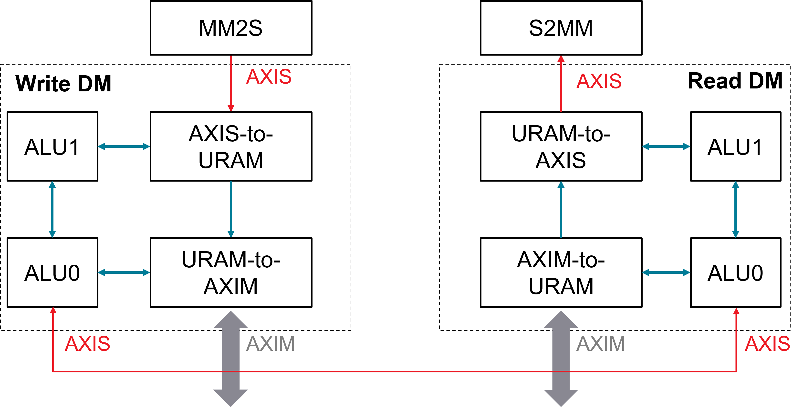

# Demo on enhanced 4D Data-Mover with hardware handshake
## Diagram
For better throughput and higher flexibility, each data mover is enhanced by enabling 4D pattern like `buffer descriptor` in AIE syntax, which also being divided into two components to read/write data from/to URAM/external memory. Each component is controlled by its own programmalbe ALU.

As details, _WRITE_ data-mover receives data sequentially from external AXI-stream interface and store them onto internal URAM by enhanced 4D addressing. Then, URAM-to-AXIM read the data sequentially from URAM and write them into external memory. The two components are handshaked to ping-pong the data movement with program in each ALU.

Similarly, _READ_ data-mover behaves like MM2S which read data from external memory and egress them onto AXI-stream. Internal ALUs are responsible for notifying the complete _ACK_ of 4D pattern each other.


## Stream Connectivity
Each DM has 3 AXI-stream port, one for transferring data, two for synchronization with other kernels. In single DM, there are two internal channels to communicate with each component.

## Synchronization Mechanism
This demo demonstrates a common secnario for high throuthput requirement, which enables the ping-pong data movement inside and outside two DMs.

In single DM, ALU0 is programmed to trigger each 4D pattern and monitor the _ACK_ singal to decide if it requires to move next pattern. The URAM-side component is controlled by ALU1 behaves like the ALU0. For example, ALU1 of _READ_ data-mover could trigger its next pattern once the notifcation from ALU0 arrives. ALU0 of _READ_ data-mover takes the acknowledge from both ALU1 and AXIM-to-URAM to make sure that there is one task at least in-queue of ALU1

Besides of providing handshake within DM kernel, ALU0 in each DM also be responsible for interfacing with external DM kernels by dedicated stream connection, which receives the states from input _SYNC_ AXI-stream interface and forward it to internal synchronization module if the identifier is matched, or the input states would be bypassed to its output _SYNC_ AXI-stream interface. Like the handshake protocol within one DM, in this demo, the _WRITE_ DM would firstly trigger 2 4D patterns and monitor the acknowledge singal from its internal AXIS-to-URAM and  URAM-to-AXIM, as well as _READ_ DM. It will notify the _READ_ DM once each _ACK_ from URAM-to-AXIM arrives. The _READ_ DM will feed 2 first 4D pattern without waiting for ALU1. After that, the ALU0 in _READ_ DM will trigger next pattern only when the acknowledge singal from both ALU1 and _WRITE_ DM arrive.

## Quick Program Guidance
Two standalone 8-bit ALUs are implemented in single DM kernel. Each of ALU owns eight 8-bit registers to execute the fixed-size 32-bit instructions. For simplify, only 5 type of instruction set are supported listed as below:
- MOVE
- POP
- PUSH
- ADD
- JUMP

The POP and PUSH instructions are used to read-from or write-to 3 stream channels to control the execution of 4D patterns and provide the synchronization. MOVE and ADD are general operation on registers. JUMP can be used to change the **PC** value by the comparasion flag or the empty flag of 3 input stream channels.

A detailed program for the 2 DMs could be found in `sw/test.cpp`. One program fragment of ALU1 in _WRITE_ DM can be exampled as below.
```
ptr = 0;
uint32_t TAG_S2U_ACK0, TAG_S2U_ACK1;
uint32_t TAG_S2U_WAIT = 15, TAG_S2U_EXIT = 18;
pm1_vec[ptr++] = MOVE(1, R1, 0);                  // R1=0, pattern_id
pm1_vec[ptr++] = PUSH(0, R1);                     // trigger ptn-0, [ping]
pm1_vec[ptr++] = ADD(1, R1, R1, 1);               // increase ptn-id
pm1_vec[ptr++] = PUSH(0, R1);                     // trigger ptn-1, [pong]
pm1_vec[ptr++] = MOVE(1, R6, num_of_pattern - 1); // LIMIT
pm1_vec[ptr++] = MOVE(1, R7, 0);                  // AXIS-to-URAM own state, count from 0
TAG_S2U_ACK0 = ptr;
pm1_vec[ptr++] = POP(0, R0);                  // [TAG_S2U_ACK0]: wait ack
pm1_vec[ptr++] = ADD(1, R7, R7, 1);           // increase state
pm1_vec[ptr++] = PUSH(1, R7);                 // notify URAM-to-AXIM
pm1_vec[ptr++] = JUMP(0, 0, 0, TAG_S2U_WAIT); // [TAG_S2U_WAIT]
TAG_S2U_ACK1 = ptr;
pm1_vec[ptr++] = POP(1, R0);                    // [TAG_S2U_ACK1]: wait for URAM-to-AXIM ack
pm1_vec[ptr++] = JUMP(3, R0, R6, TAG_S2U_EXIT); // [EXIT] if the end of URAM-to-AXIM
pm1_vec[ptr++] = JUMP(3, R1, R6, TAG_S2U_WAIT); // [TAG_S2U_WAIT] to wait last pattern
pm1_vec[ptr++] = ADD(1, R1, R1, 1);             // move to next pattern
pm1_vec[ptr++] = PUSH(0, R1);                   // trigger
TAG_S2U_WAIT = ptr;
pm1_vec[ptr++] = JUMP(5, 0, 0, TAG_S2U_ACK0); // [TAG_S2U_ACK0]
pm1_vec[ptr++] = JUMP(5, 1, 0, TAG_S2U_ACK1); // [TAG_S2U_ACK1]
pm1_vec[ptr++] = JUMP(0, 0, 0, TAG_S2U_WAIT); // [TAG_S2U_WAIT]
TAG_S2U_EXIT = ptr;
pm1_vec[ptr++] = MOVE(1, R0, 0xFF); // end flag
pm1_vec[ptr++] = PUSH(0, R0);       // finish URAM-to-AXIM
pm1_vec[ptr++] = EXIT();
pm1_sz = ptr;
```
