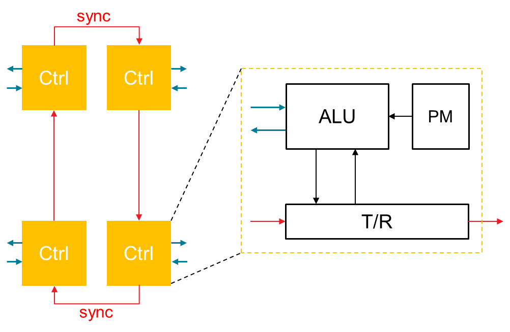

# Demo for Bi-Directional Data-Mover with hardware handshake

## Diagram

For bi-directional data mover, both read&write operations between DDR and AXI-Stream are integrated in one DM. The 4 components of Bi-DM could work simultaneously with a shared on-chip cache, which support multiple data-moving patterns like `DDR-cache-AXIS`, `AXIS-cache-Stream`, `DDR-cache-AXIS/AXIS-cache-Stream` ,`DDR-cache-AXIS-to-cache(with loop)-DDR`, etc. 


## Stream Connectivity

Each Bi-DM has two AXI-Stream ports and two MAXI ports for loading/storing data from/to DDR and AIE. Inpecting into the Bi-DM, 4 components are connected in a _ring_ structure to transfer handshake signals with the guidance of source-id and target-id.

## Synchronization Mechanism

This demo demonstrates a scenario where data inputed from DDR will loop multiple times among on-chip cache and AIE. To be specific, supposing a batch of data is inputed from DDR(described in a 4D BD) and first cached on URAM(on-chip cache), then this batch will be forwarded to one AXI-Stream port to _feed_ AIE. At the same time, new data threw up from AIE will be inputed through the other AXI-Stream port and then cached on URAM for the next round _feed_. Finally, the last round data cached on URAM(from AXI-Stream-_in_) will be written into DDR through a MAXI port.

Inside the Bi-DM, each of the 4 homogeneous components is composed by a local controller and a local ALU as illustrated in the picture bellow. For each ALU, it will parse and execute instuctions from user programmable _PM_(program memory) to transfer signals to local controller or internal controllers.



Let's take unit _axim-to-uram_ as example, the working mechanism of the others are quite similar. The local ALU inside _axim-to-uram_ will load each _pattern-id_ from its _PM_ and then let the parser unit inside the local controller parse the target _pattern_, which is going to trigger the data movement from MAXI port to on-chip cache. Once all the movement of the data described in this pattern is done, an _ACK_ signal will be sent to the local controller and ALU. If this pattern is the last one in pattern buffer, the ALU will exec the _END_ flag `0xFF` to exit itself. At the same time, the local controller is going to enter _idle_ status, which means from now on this controller only bypasses signals from the other controllers and is ready to kill itself once all the other controllers are in _idle_ status. If the pattern is not the last one, the current unit will repeat the behaviours as previous.

Just as the synchronization mechanism discribed above, let's take a brief inspection into this demo. First, unit _axim-to-uram_ will parse one pattern to load data from DDR into on-chip cache and sends out an ACK after all of the data-moving work. Second, once unit _uram_to_axis_ received the _ACK_ signal from unit _axim-to-uram_, it will parse multiple patterns in sequence to forward data from on-chip cache to one AXI-Stream port(In this demo, both two of the AXI-Stream port of Bi-DM are short curcited by a _s2s_bypass_ kernel.) At the same time, unit _axis_to_uram_ is reading data from the other AXI-Stream port into on-chip cache. After several rounds of this kind data-moving loop (cache-axis_A-axis_B-cache), unit _uram_to_axim_ will write the data from on-chip cache into DDR.

## Quick Program Guidance

Four standalone 8-bit ALUs are implemented in the Bi-DM kernel. Each of ALU owns eight 8-bit registers to execute the fixed-size 32-bit instructions. For simplify, only 5 type of instruction set are supported listed as below:
- MOVE
- POP
- PUSH
- ADD
- JUMP

The POP and PUSH instructions are used to read-from or write-to 2 stream channels to control the execution of 4D patterns and provide the synchronization. MOVE and ADD are general operation on registers. JUMP can be used to change the **PC** value by the comparasion flag or the empty flag of 2 input stream channels.

A detailed program for the Bi-DM could be found in `sw/test.cpp`. One program fragment of ALU-0 of _axis-to-uram_ unit can be exampled as below.

```cpp
/* pm0: ALU-0 */
uint32_t ptr = 0;

pm[0][ptr++] = MOVE(1, R0, 0x00 | 0x01);        // set the source-id and target-id
pm[0][ptr++] = PUSH(1, R0);
pm[0][ptr++] = MOVE(1, R1, 0);                  // current pattern-id
pm[0][ptr++] = MOVE(1, R6, num_of_pattern[0]);  // Limit of pattern-id
pm[0][ptr++] = MOVE(1, R5, 0);                  // count of pattern parsed
pm[0][ptr++] = MOVE(1, R7, 0);                  // record the status

TAG_S2U_ACK0 = ptr;
pm[0][ptr++] = PUSH(0, R1);                     // trigger a pattern
pm[0][ptr++] = POP(0, R0);                      // wait ack from previous pattern
pm[0][ptr++] = ADD(1, R7, R7, 1);               // increase status
pm[0][ptr++] = ADD(1, R5, R5, 1);               // increase count of pattern parsed
pm[0][ptr++] = JUMP(3, R5, R6, TAG_S2U_EXIT);   // if #ptn_parsed == limit_of_ptn, PC=TAG_S2U_EXIT
pm[0][ptr++] = ADD(1, R1, R1, 1);               // increase pattern-id 
pm[0][ptr++] = JUMP(0, 0, 0, TAG_S2U_ACK0);     // PC=TAG_S2U_ACK0

TAG_S2U_EXIT = ptr;
pm[0][ptr++] = PUSH(1, R1);                     // notify unit uram-to-axim
pm[0][ptr++] = MOVE(1, R0, 0xFF);               // set END flag 0xFF
pm[0][ptr++] = PUSH(0, R0);                     // exit local ALU
pm[0][ptr++] = PUSH(1, R0);                     // idle local controller
pm[0][ptr++] = EXIT();
pm_sz[0] = ptr;
```

