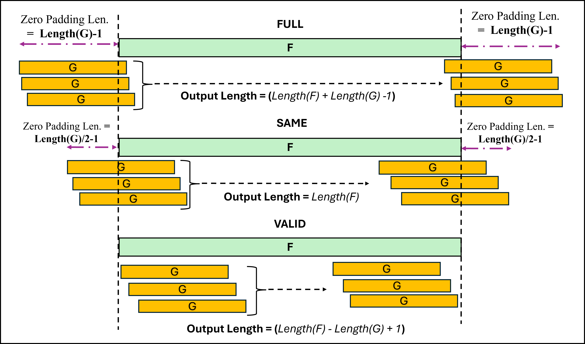

..
   Copyright (C) 2019-2022, Xilinx, Inc.
   Copyright (C) 2022-2025, Advanced Micro Devices, Inc.
   
   `Terms and Conditions <https://www.amd.com/en/corporate/copyright>`_.

.. _CONVOLUTION_CORRELATION:

=======================
Convolution/Correlation
=======================

This library element computes the convolution or correlation of two input vectors depending on the specified function type. The convolution and correlation library element has three modes: FULL, SAME, and VALID.
Template parameters are used to configure the top-level graph of the `conv_corr_graph` class.

Entry Point
===========

The graph entry point is as follows:

.. code-block::

    xf::dsp::aie::conv_corr::conv_corr_graph

Device Support
==============

The Convolution/Correlation library element supports AIE, AIE-ML and AIE-MLv2 devices for all features, with the following differences:

- The available round modes and the enumerated values of round modes are the same for AIE-ML and AIE-MLv2 devices, but differ from those for AIE devices. See :ref:`COMPILING_AND_SIMULATING`.

Supported Input Data Types
==========================

The data type for input ports F and G (`inF` and `inG`) is controlled by `T_DATA_F` and `T_DATA_G`, respectively.
Both **inputs** may take one of the following 8 choices: `int8`, `int16`, `int32`, `cint16`, `cint32`, `float`, `cfloat` and `bfloat16`.
The **output** may take one of the following 6 choices: `int16`, `int32`, `cint16`, `cint32`, `float`, and `cfloat`.
Please see the table :ref:`CONV_CORR_combos` for valid input/output data type combinations.

.. _CONV_CORR_combos:

.. table:: IO-BUFFER INTERFACE: Supported Combinations of Input/Output Data Types
   :align: center

   +------------------+------------------+------------------+------------------+------------------+------------------+
   | InputF Data Type | InputG Data Type | Output Data Type | AIE Valid        | AIE-ML Valid     | AIE-MLv2 Valid   |
   +==================+==================+==================+==================+==================+==================+
   | int8             | int8             | int16            | **no**           | yes              | yes              |
   +------------------+------------------+------------------+------------------+------------------+------------------+
   | int16            | int8             | int16            | yes              | yes              | yes              |
   +------------------+------------------+------------------+------------------+------------------+------------------+
   | int16            | int16            | int32            | yes              | yes              | yes              |
   +------------------+------------------+------------------+------------------+------------------+------------------+
   | int32            | int16            | int32            | yes              | yes              | yes              |
   +------------------+------------------+------------------+------------------+------------------+------------------+
   | cint16           | int16            | cint16           | yes              | yes              | yes              |
   +------------------+------------------+------------------+------------------+------------------+------------------+
   | cint16           | int16            | cint32           | yes              | yes              | yes              |
   +------------------+------------------+------------------+------------------+------------------+------------------+
   | cint16           | int32            | cint32           | yes              | yes              | yes              |
   +------------------+------------------+------------------+------------------+------------------+------------------+
   | cint16           | cint16           | cint32           | yes              | yes              | yes              |
   +------------------+------------------+------------------+------------------+------------------+------------------+
   | cint32           | int16            | cint32           | yes              | yes              | yes              |
   +------------------+------------------+------------------+------------------+------------------+------------------+
   | cint32           | cint16           | cint32           | yes              | yes              | yes              |
   +------------------+------------------+------------------+------------------+------------------+------------------+
   | float            | float            | float            | yes              | yes              | yes              |
   +------------------+------------------+------------------+------------------+------------------+------------------+
   | cfloat           | float            | cfloat           | yes              | **no**           | **no**           |
   +------------------+------------------+------------------+------------------+------------------+------------------+
   | cfloat           | cfloat           | cfloat           | yes              | **no**           | **no**           |
   +------------------+------------------+------------------+------------------+------------------+------------------+
   | bfloat16         | bfloat16         | float            | **no**           | yes              | yes              |
   +------------------+------------------+------------------+------------------+------------------+------------------+
   | 1. A mix of float and integer types is not supported.                                                           |
   | 2. A mix of float data type for the F signal and cfloat data type for the G signal is not supported.            |
   +-----------------------------------------------------------------------------------------------------------------+

.. table:: STREAM INTERFACE : Supported Combinations of Input/Output data types
   :align: center

   +------------------+------------------+------------------+------------------+------------------+
   | InputF Data Type | InputG Data Type | Output Data Type | AIE Valid        | AIE-ML Valid     |
   +==================+==================+==================+==================+==================+
   | cint16           | cint16           | cint16           | yes              | no               |
   +------------------+------------------+------------------+------------------+------------------+
   | cint16           | int16            | cint16           | yes              | no               |
   +------------------+------------------+------------------+------------------+------------------+
   | Note: Stream-based implementation does not support other data types.                         |
   |                                                                                              |
   +----------------------------------------------------------------------------------------------+

Template Parameters
===================

To see details on the template parameters for Convolution/Correlation, see :ref:`API_REFERENCE`.

Access Functions
================

To see details on the access functions for Convolution/Correlation, see :ref:`API_REFERENCE`.

Ports
=====

To see details on the ports for Convolution/Correlation, see :ref:`API_REFERENCE`.

Design Notes
============
The performance of the IP depends on the chosen data type combination :ref:`CONV_CORR_combos`. The number of multiplications per clock cycle will be updated based on the data type combination.
The Convolution/Correlation operation can be processed by both IO Buffer (`TP_API = 0`) and Stream-Based (`TP_API = 1`) interfaces, which are controlled by the parameter named ``TP_API``.

Input Data
----------
Users must ensure that the **input data is padded with zeros** based on the given ``TP_COMPUTE_MODE`` while triggering the kernel. Please refer to the table below for the padding of input data :ref:`LEN. OF PADDED F DATA` and the example.
The template parameter `TP_COMPUTE_MODE` will control the padding of zeros to the input data of "F_Sig" as expected by `conv_corr()` based on the possible modes.
There are three possible `TP_COMPUTE_MODE` values:

  * ``FULL``

      * **Description**: Includes all possible overlaps between the input vectors, including partial overlaps at the edges.
      * **Padding**: The input is padded with zeros on both sides to ensure all overlaps are included.
      * **Use Case**: When you need the complete convolution/correlation result, including edge effects.

  * ``SAME``

      * **Description**: Produces an output of the same length as the input vector F.
      * **Padding**: The input is padded with zeros symmetrically to ensure the output length matches the input length.
      * **Use Case**: When you want the output to have the same size as the input, often used in signal processing or neural networks.

  * ``VALID``

      * **Description**: Only includes the parts of the convolution/correlation where the input vectors fully overlap (no padding).
      * **Padding**: No padding is applied.
      * **Use Case**: When you want to avoid edge effects and focus only on the valid overlaps.

.. _FIGURE_COMPUTE_MODES:

.. table:: LEN. OF PADDED F DATA: F data should be padded with zeros based on the given ``TP_COMPUTE_MODE``
   :align: center

   +-----------------+--------------+----------------------------------------------------+--------------------------------------------------------------------------+
   | TP_COMPUTE_MODE | MODE NAME    | Padding                                            | Formula for PADDED_F_LEN                                                 |
   +=================+==============+====================================================+==========================================================================+
   | 0               | FULL         |  (TP_G_LEN - 1) zeros on both sides of F signal    | ceil(((TP_G_LEN - 1) + (TP_F_LEN) + (TP_G_LEN - 1)), dataLoad)           |
   +-----------------+--------------+----------------------------------------------------+--------------------------------------------------------------------------+
   | 1               | SAME         |  ((TP_G_LEN/2) - 1) zeros on both sides of F sig.  | ceil((((TP_G_LEN/2) - 1) + (TP_F_LEN) + ((TP_G_LEN/2) - 1)), dataLoad)   |
   +-----------------+--------------+----------------------------------------------------+--------------------------------------------------------------------------+
   | 2               | VALID        |   (dataLoad) zeros at the end of F signal          | ceil((TP_F_LEN + dataLoad), dataLoad)                                    |
   +-----------------+--------------+----------------------------------------------------+--------------------------------------------------------------------------+

where:
   **dataLoad** is the number of samples that can be loaded into a 32-byte (256-bit) wide vector based on the data type of F, i.e., ``TT_DATA_F``.

   **dataLoad** = (maxBytesLoadOnAIE / sizeof(``TT_DATA_F``))

      where:
         * **maxBytesLoadOnAIE** = 32 bytes.
         * **sizeof(TT_DATA_F)** is defined in the following table:

.. table:: sizeof(TT_DATA_F)
   :align: center

   +----------------+---------------+
   |  **TT_DATA_F** |  **Bytes**    |
   +================+===============+
   | **int8**       |      1        |
   +----------------+---------------+
   | **int16**      |      2        |
   +----------------+---------------+
   | **int32**      |      4        |
   +----------------+---------------+
   | **cint16**     |      4        |
   +----------------+---------------+
   | **cint32**     |      8        |
   +----------------+---------------+
   | **float**      |      4        |
   +----------------+---------------+
   | **cfloat**     |      8        |
   +----------------+---------------+
   | **bfloat16**   |      2        |
   +----------------+---------------+

Example Config.,
 * ``TT_DATA_F`` - data type, e.g. ``int16``,
 * ``TT_DATA_G`` - data type, e.g. ``int16``,
 * ``TT_DATA_OUT`` - data type, e.g. ``int32``,
 * ``TP_FUNCT_TYPE`` - function type either conv. or corr. , e.g. ``0 - corr`` and ``1 - conv``,
 * ``TP_COMPUTE_MODE`` - compute mode, e.g. `` FULL``,
 * ``TP_F_LEN`` - length of F sig., e.g. ``16``,
 * ``TP_G_LEN`` - length of G sig., e.g. ``16``,

.. code-block::

   in_F[16] = [1, 2, 3, 4, 5, 6, 7, 8, 9, 10, 11, 12, 13, 14, 15, 16],
   in_G[16] = [1, 2, 3, 4, 5, 6, 7, 8, 9, 10, 11, 12, 13, 14, 15, 16],
   Func_Type = 1 (conv) ,
   compute_mode = 0 (FULL),
   F_LEN = 16,
   G_LEN = 16.

Example:
--------

- ``input F Sig:``

.. table:: inDataF
   :align: center

   +---+---+---+---+---+---+---+---+---+----+----+----+----+----+----+----+
   | 1 | 2 | 3 | 4 | 5 | 6 | 7 | 8 | 9 | 10 | 11 | 12 | 13 | 14 | 15 | 16 |
   +---+---+---+---+---+---+---+---+---+----+----+----+----+----+----+----+

- ``input G Sig:``

.. table:: inDataG
   :align: center

   +---+---+---+---+---+---+---+---+---+----+----+----+----+----+----+----+
   | 1 | 2 | 3 | 4 | 5 | 6 | 7 | 8 | 9 | 10 | 11 | 12 | 13 | 14 | 15 | 16 |
   +---+---+---+---+---+---+---+---+---+----+----+----+----+----+----+----+

Padded_input_F:
---------------

   **FULL Mode:**

      - TP_COMPUTE_MODE - compute mode, e.g. `` FULL ``

      * dataLoad = 32/2 -- ``16`` samples can be loaded into a 32-byte (256-bit) wide vector for data type i.e., `TT_DATA_F - int16`
      * Padded_F_Length = ceil(((G_LEN-1) + F_LEN + (G_LEN-1)), dataLoad) -- ``48``

   .. table:: PaddedInDataF[48]
      :align: center

      +---+---+---+---+---+---+---+---+---+---+---+---+---+---+---+---+---+---+---+---+---+---+---+---+----+----+----+----+----+----+----+---+---+---+---+---+---+---+---+---+---+---+---+---+---+---+---+---+
      | 0 | 0 | 0 | 0 | 0 | 0 | 0 | 0 | 0 | 0 | 0 | 0 | 0 | 0 | 0 | 1 | 2 | 3 | 4 | 5 | 6 | 7 | 8 | 9 | 10 | 11 | 12 | 13 | 14 | 15 | 16 | 0 | 0 | 0 | 0 | 0 | 0 | 0 | 0 | 0 | 0 | 0 | 0 | 0 | 0 | 0 | 0 | 0 |
      +---+---+---+---+---+---+---+---+---+---+---+---+---+---+---+---+---+---+---+---+---+---+---+---+----+----+----+----+----+----+----+---+---+---+---+---+---+---+---+---+---+---+---+---+---+---+---+---+

   **SAME Mode:**

      - TP_COMPUTE_MODE - compute mode, e.g. `` SAME ``

      * dataLoad = 32/2 -- ``16`` samples can be loaded into a 32-byte (256-bit) wide vector for data type i.e., `TT_DATA_F - int16`
      * Padded_F_Length = ceil(((G_LEN/2-1) + F_LEN + (G_LEN/2-1)), , dataLoad) -- ``32``

    .. table:: PaddedInDataF[32]
      :align: center

      +---+---+---+---+---+---+---+---+---+---+---+---+---+---+---+---+----+----+----+----+----+----+----+---+---+---+---+---+---+---+---+---+
      | 0 | 0 | 0 | 0 | 0 | 0 | 0 | 1 | 2 | 3 | 4 | 5 | 6 | 7 | 8 | 9 | 10 | 11 | 12 | 13 | 14 | 15 | 16 | 0 | 0 | 0 | 0 | 0 | 0 | 0 | 0 | 0 |
      +---+---+---+---+---+---+---+---+---+---+---+---+---+---+---+---+----+----+----+----+----+----+----+---+---+---+---+---+---+---+---+---+

   **VALID Mode:**

      - TP_COMPUTE_MODE - compute mode, e.g. `` VALID ``

      * dataLoad = 32/2 -- ``16`` samples can be loaded into a 32-byte (256-bit) wide vector for data type i.e., `TT_DATA_F - int16`
      * Padded_F_Length =  ceil((F_LEN + dataLoad), dataLoad) -- ``32``

   .. table:: PaddedInDataF[32]
      :align: center

      +---+---+---+---+---+---+---+---+---+----+----+----+----+----+----+----+---+---+---+---+---+---+---+---+---+---+---+---+---+---+---+---+
      | 1 | 2 | 3 | 4 | 5 | 6 | 7 | 8 | 9 | 10 | 11 | 12 | 13 | 14 | 15 | 16 | 0 | 0 | 0 | 0 | 0 | 0 | 0 | 0 | 0 | 0 | 0 | 0 | 0 | 0 | 0 | 0 |
      +---+---+---+---+---+---+---+---+---+----+----+----+----+----+----+----+---+---+---+---+---+---+---+---+---+---+---+---+---+---+---+---+

   **inDataG**  remains same.

.. note:: **current release expecting the padded input from the user end as shown in above example. Padding of input will taken care in next release i.e., "2025.2"**

Output Data
-----------

.. table:: OUT_DATA_LEN
   :align: center

   +-----------------+--------------+--------------------------------+
   | TP_COMPUTE_MODE | MODE NAME    |      OUT_DATA_LEN              |
   +=================+==============+================================+
   | 0               | FULL         |  (TP_F_LEN + TP_G_LEN - 1)     |
   +-----------------+--------------+--------------------------------+
   | 1               | SAME         |      TP_F_LEN                  |
   +-----------------+--------------+--------------------------------+
   | 2               | VALID        |  (TP_F_LEN - TP_G_LEN + 1)     |
   +-----------------+--------------+--------------------------------+

IO Buffer Interface
-------------------
The Convolution/Correlation operation can be performed via the IO Buffer interface on **AIE**, **AIE-ML** and **AIE-MLv2** devices.

| ``TP_API`` - **0** indicates **IO-BUFFER** interface

The IO Buffer interface supports all data type combinations. See :ref:`CONV_CORR_combos` `table:: IO-BUFFER INTERFACE`.

Streaming Interface
-------------------
The Convolution/Correlation operation via streaming is supported only on AIE devices. Streaming support is **not available** on **AIE-ML** and **AIE-MLv2** devices.

| ``TP_API`` - **1** indicates **STREAM** interface.

* The input F signal is assumed to be streaming on the AXI-Stream interface. As F is consumed on streams, the selection of Length(F) can be higher to achieve higher throughput.
* The input G signal is assumed to be a window on the I/O buffer interface.
* `TP_COMPUTE_MODE` is fixed to VALID since padding is not required for the F signal, as F is always a continuous stream for both convolution and correlation.
* Typical use cases that can benefit from the stream interface kernel involve having a continuous stream of F, for which a convolution or correlation with a known pattern (e.g., G) must be computed.

   **Cascaded Kernels**
    - Number of kernels to be cascaded together to distribute the computation of convolution or corrleation is controlled by ``TP_CASC_LEN`` template parmaeter.
      The library provides access functions to determine the value of ``TP_CASC_LEN`` that gives you the optimum performance, i.e., the minimum number of kernels that can provide the maximum performance. More details can be found in :ref:`API_REFERENCE`.

   **Parallel Input/Output paths**
   - Input/Output samples are distributed over multiple parallel computation paths, which is controlled by ``TP_PHASES`` template parameter.

| Stream Processing: Num of Phases ``TP_PHASES`` can be increased only when each cascade stream has maximum data rate i.e with maximum cascade length (4)
|                    To achieve data rate less than 1GSPS, Cascade length parameter can be decreased in a single phase design.
|                    To achieve data rate more than 1GSPS, NUM_PHASES parameter should be increased by keeping
|                        the ``TP_CASC_LEN`` parameter to its maximum possible value (i.e. the value required to achieve 1GSPS when ``TP_PHASES`` is equal to 1)
|

   **STREAM OUTPUT:**
      - When the user wants to compare the output with reference data, please ensure to discard **M** samples, where **M** is an integer that can be computed as described below based on the user's configuration.
        This discarding of M samples is due to the transpose form of the implementation of Convolution and Correlation, which causes the initial M samples to not match until the steady state is achieved.

Computation of **M** samples to discard from the stream output:
---------------------------------------------------------------

   **M** denotes the number of samples to be discarded from the output stream.

   **For AIE Output:**
      * M = (TP_F_LEN - Delay + Offset)

   **For REF Output:**
      * M = (Offset + 1)

   where:
     * Delay = (  (  (8 * **MacsPerCore** * **Points** / 2 - 3) * floor((``TP_CASC_LEN`` - 1) / **PhaseIncrement**) - (3 * (floor((**TP_CASC_LEN** - 1) / **PhaseIncrement** ) - 1)) * (**PhaseIncrement** - 1) - (3 * ((``TP_CASC_LEN`` - 1) % **PhaseIncrement**))) * **PhaseIncrement** - 1)

     * Offset = (3 * ``TP_PHASES`` * (**PhaseIncrement** - 1))

   where:
      * **MacsPerCore** = ceil(``TP_G_LEN`` / (**Lanes** * **Points** * ``TP_CASC_LEN`` * ``TP_PHASES``)).
      * **PhaseIncrement** = ``TP_PHASES`` / **StreamsPerCore**.

      where:
         * **StreamsPerCore** = 1 when **(TP_G_LEN > ((TP_PHASES * Lanes * Points) / 2))**, otherwise **StreamsPerCore** = 2.
         * **Lanes** and **Points** are parameters related to the computation of convolution/correlation of two vectors F and G. Please refer to the table below for lanes and points for supported data type combinations. See `table:: LANES and POINTS`.

.. table:: LANES and POINTS: Used by the stream-based conv_corr kernel
   :align: center

   +-------------------------+-----------+------------+
   | Data Type Combo         | **Lanes** | **Points** |
   +=========================+===========+============+
   | cint16 (F) x int16 (G)  | 4         |  4         |
   +-------------------------+-----------+------------+
   | cint16 (F) x cint16 (G) | 4         |  2         |
   +-------------------------+-----------+------------+

The streaming interface supports only two data type combinations. See :ref:`CONV_CORR_combos` `table:: STREAM INTERFACE`.

Scaling
-------
Scaling in Convolution/Correlation is controlled by the ``TP_SHIFT`` parameter, which describes the number of bits to shift the output to the right.
Float, cfloat, and bfloat16 implementations do not support scaling. ``TP_SHIFT`` must be set to '0'.

Saturation
----------
Distortion caused by saturation is possible in Convolution/Correlation. Since the input values are provided at construction time, no compile-time error can be issued for this hazard. It is the user's responsibility to ensure that saturation does not occur.

Run Time Parameter (RTP) for vector lengths of F and G
------------------------------------------------------
Vector length of **F** `F_LEN` and **G** `G_LEN` can be available through the use of a runtime programmable (RTP) Asynchronous input port, programmed by the processor subsystem (PS) at runtime.
Current version of **conv_corr** has `F_LEN` as **static** always where as `G_LEN` is **dynamic** since it plays a vital role while computing the number of sample to load into 256-bit wide load/store into buffers.
Dynamic `G_LEN` is is controlled by the ``TP_USE_RTP_VECTOR_LENGTHS`` parameter,

* ``TP_USE_RTP_VECTOR_LENGTHS`` = **0** represents `G_LEN` is **static**.
* ``TP_USE_RTP_VECTOR_LENGTHS`` = **1** represents `G_LEN` is **dynamic**.

.. note:: `F_LEN` is always **static** in the current version`

   +----------------------------+-----------+---------------+
   | TP_USE_RTP_VECTOR_LENGTHS  | **F_LEN** | **G_LEN**     |
   +============================+===========+===============+
   |  0                         | Static    |  Static       |
   +----------------------------+-----------+---------------+
   |  1                         | Static    | **Dynamic**   |
   +----------------------------+-----------+---------------+

Code Example
============

The following code examples shows how conv_corr graph class might be used within a user super-graph.

Convolution
-----------

.. literalinclude:: ../../../../L2/examples/docs_examples/test_conv.hpp
    :language: cpp
    :lines: 17-

Correlation
-----------

.. literalinclude:: ../../../../L2/examples/docs_examples/test_corr.hpp
    :language: cpp
    :lines: 17-

.. |trade|  unicode:: U+02122 .. TRADEMARK SIGN
   :ltrim:
.. |reg|    unicode:: U+000AE .. REGISTERED TRADEMARK SIGN
   :ltrim:

