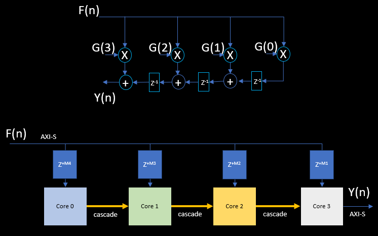

..
   Copyright (C) 2019-2022, Xilinx, Inc.
   Copyright (C) 2022-2025, Advanced Micro Devices, Inc.
   
   `Terms and Conditions <https://www.amd.com/en/corporate/copyright>`_.

.. _DSP_CONVOLUTION_CORRELATION:

=======================
Convolution/Correlation
=======================

This library element computes the convolution or correlation of two input vectors depending on the specified function type. The convolution and correlation library element has three modes: FULL, SAME, and VALID.
Template parameters are used to configure the top-level graph of the ``conv_corr_graph`` class.

Entry Point
===========

The graph entry point is as follows:

.. code-block:: cpp

    xf::dsp::aie::conv_corr::conv_corr_graph

Device Support
==============

The Convolution/Correlation library element supports AIE, AIE-ML and AIE-MLv2 devices for all features, with the following differences:

- The available round modes and the enumerated values of round modes are the same for AIE-ML and AIE-MLv2 devices, but differ from those for AIE devices. See :ref:`DSP_COMPILING_AND_SIMULATING`.

Supported Input Data Types
==========================

The data type for input ports F and G (``inF`` and ``inG``) is controlled by ``T_DATA_F`` and ``T_DATA_G``, respectively.
Both **inputs** may be one of the following eight types: ``int8``, ``int16``, ``int32``, ``cint16``, ``cint32``, ``float``, ``cfloat``, and ``bfloat16``.
The **output** may be one of the following six types: ``int16``, ``int32``, ``cint16``, ``cint32``, ``float``, and ``cfloat``.
Please see the table below for valid input/output data type combinations.

.. _DSP_CONV_CORR_combos:

.. table:: IO-BUFFER INTERFACE: Supported Combinations of Input/Output Data Types
   :align: center

   +------------------+------------------+------------------+------------------+------------------+------------------+
   | InputF Data Type | InputG Data Type | Output Data Type | AIE Valid        | AIE-ML Valid     | AIE-MLv2 Valid   |
   +==================+==================+==================+==================+==================+==================+
   | int8             | int8             | int16            | **no**           | yes              | yes              |
   +------------------+------------------+------------------+------------------+------------------+------------------+
   | int16            | int16            | int32            | yes              | yes              | yes              |
   +------------------+------------------+------------------+------------------+------------------+------------------+
   | int32            | int16            | int32            | yes              | yes              | yes              |
   +------------------+------------------+------------------+------------------+------------------+------------------+
   | cint16           | int16            | cint16           | yes              | yes              | yes              |
   +------------------+------------------+------------------+------------------+------------------+------------------+
   | cint16           | int16            | cint32           | yes              | yes              | yes              |
   +------------------+------------------+------------------+------------------+------------------+------------------+
   | cint16           | int32            | cint32           | yes              | yes              | yes              |
   +------------------+------------------+------------------+------------------+------------------+------------------+
   | cint16           | cint16           | cint32           | yes              | yes              | yes              |
   +------------------+------------------+------------------+------------------+------------------+------------------+
   | cint32           | int16            | cint32           | yes              | yes              | yes              |
   +------------------+------------------+------------------+------------------+------------------+------------------+
   | cint32           | cint16           | cint32           | yes              | yes              | yes              |
   +------------------+------------------+------------------+------------------+------------------+------------------+
   | float            | float            | float            | yes              | yes              | yes              |
   +------------------+------------------+------------------+------------------+------------------+------------------+
   | cfloat           | float            | cfloat           | yes              | **no**           | **no**           |
   +------------------+------------------+------------------+------------------+------------------+------------------+
   | cfloat           | cfloat           | cfloat           | yes              | **no**           | **no**           |
   +------------------+------------------+------------------+------------------+------------------+------------------+
   | bfloat16         | bfloat16         | float            | **no**           | yes              | yes              |
   +------------------+------------------+------------------+------------------+------------------+------------------+
   | 1. A mix of float and integer types is not supported.                                                           |
   | 2. A mix of float data type for the F signal and cfloat data type for the G signal is not supported.            |
   +-----------------------------------------------------------------------------------------------------------------+

.. table:: STREAM INTERFACE : Supported Combinations of Input/Output data types
   :align: center

   +------------------+------------------+------------------+------------------+------------------+------------------+
   | InputF Data Type | InputG Data Type | Output Data Type | AIE Valid        | AIE-ML Valid     | AIE-MLv2 Valid   |
   +==================+==================+==================+==================+==================+==================+
   | cint16           | cint16           | cint16           | yes              | no               | no               |
   +------------------+------------------+------------------+------------------+------------------+------------------+
   | cint16           | int16            | cint16           | yes              | no               | no               |
   +------------------+------------------+------------------+------------------+------------------+------------------+
   | Note: Stream-based implementation does not support other data types.                                            |
   |                                                                                                                 |
   +-----------------------------------------------------------------------------------------------------------------+

Template Parameters
===================

See the API reference for details on the template parameters for Convolution/Correlation.

Access Functions
================

See the API reference for details on the access functions for Convolution/Correlation.

Ports
=====

See the API reference for details on the ports for Convolution/Correlation.

Design Notes
============
Performance depends on the chosen data type combination; see :ref:`DSP_CONV_CORR_combos`. The number of multiplications per clock cycle will be updated based on the data type combination.
The Convolution/Correlation operation can be processed by both IO Buffer (``TP_API = 0``) and Stream-Based (``TP_API = 1``) interfaces, which are controlled by the parameter named ``TP_API``.

Input Buffer Length
-------------------
The input buffer length of F and G is controlled by ``TP_F_LEN`` and  ``TP_G_LEN`` respectively.

Output Buffer Length
--------------------

The output buffer length is calculated using the formula shown in the **OUT_BUFFER_LEN** table: ``ceil((TP_F_LEN + TP_G_LEN - 1), LANES)`` for FULL mode, ``ceil(TP_F_LEN, LANES)`` for SAME mode, and ``ceil((TP_F_LEN - TP_G_LEN + 1), LANES)`` for VALID mode.
Here, ``LANES`` is the number of parallel data lanes available in the AIE hardware, ensuring the buffer is always sized to the next multiple of the hardware lanes for efficient vector processing.

Formula for **ceil**:

.. code-block::

    ceil(a,b) ==> (((a+b-1)/b) * b)

.. _DSP_Out_Buffer_Len_and_Lanes_info:

.. table:: OUT_BUFFER_LEN
   :align: center

   +-----------------+--------------+--------------------------------------------+
   | TP_COMPUTE_MODE | MODE NAME    |      OUT_BUFFER_LEN                        |
   +=================+==============+============================================+
   | 0               | FULL         |  ceil((TP_F_LEN + TP_G_LEN - 1), LANES)    |
   +-----------------+--------------+--------------------------------------------+
   | 1               | SAME         |  ceil(TP_F_LEN, LANES)                     |
   +-----------------+--------------+--------------------------------------------+
   | 2               | VALID        |  ceil((TP_F_LEN - TP_G_LEN + 1), LANES)    |
   +-----------------+--------------+--------------------------------------------+

Where:

* ``TP_F_LEN`` is the length of input F vector.
* ``TP_G_LEN`` is the length of input G vector.
* ``LANES`` is the number of parallel data lanes available in the AIE hardware, which depends on the data type combination used. See :ref:`DSP_LANES`

.. _DSP_LANES:

.. table:: LANES
   :align: center

   +------------------+------------------+------------------+------------------+------------------+--------------------+
   | InputF Data Type | InputG Data Type | Output Data Type | **AIE-1** Lanes  | **AIE-ML** Lanes | **AIE-MLv2** Lanes |
   +==================+==================+==================+==================+==================+====================+
   | int8             | int8             | int16            | **0**            | 32               | 64                 |
   +------------------+------------------+------------------+------------------+------------------+--------------------+
   | int16            | int16            | int32            | 16               | 16               | 32                 |
   +------------------+------------------+------------------+------------------+------------------+--------------------+
   | int32            | int16            | int32            | 8                | 16               | 32                 |
   +------------------+------------------+------------------+------------------+------------------+--------------------+
   | cint16           | int16            | cint16           | 8                | 16               | 32                 |
   +------------------+------------------+------------------+------------------+------------------+--------------------+
   | cint16           | int16            | cint32           | 8                | 16               | 32                 |
   +------------------+------------------+------------------+------------------+------------------+--------------------+
   | cint16           | int32            | cint32           | 8                | 16               | 16                 |
   +------------------+------------------+------------------+------------------+------------------+--------------------+
   | cint16           | cint16           | cint32           | 8                | 16               | 16                 |
   +------------------+------------------+------------------+------------------+------------------+--------------------+
   | cint32           | int16            | cint32           | 4                | 16               | 16                 |
   +------------------+------------------+------------------+------------------+------------------+--------------------+
   | cint32           | cint16           | cint32           | 4                | 8                | 16                 |
   +------------------+------------------+------------------+------------------+------------------+--------------------+
   | float            | float            | float            | 8                | 32               | 16                 |
   +------------------+------------------+------------------+------------------+------------------+--------------------+
   | cfloat           | float            | cfloat           | 4                | **0**            | **0**              |
   +------------------+------------------+------------------+------------------+------------------+--------------------+
   | cfloat           | cfloat           | cfloat           | 4                | **0**            | **0**              |
   +------------------+------------------+------------------+------------------+------------------+--------------------+
   | bfloat16         | bfloat16         | float            | **0**            | 16               | 64                 |
   +------------------+------------------+------------------+------------------+------------------+--------------------+

.. note:: Please refer to `UG1603 Number of Lanes supported by Sliding Multiplication <https://docs.amd.com/r/en-US/ug1603-ai-engine-ml-kernel-graph/Sliding-Multiplication>`_.

Example Config:

.. code-block::

   Data_F - int16,
   Data_G - int16,
   Data_Out - int32,
   Func_Type = 1 (conv),
   compute_mode = 0 (FULL), 1 (SAME), 2 (VALID),
   F_LEN = 64,
   G_LEN = 32.

   in_F[F_LEN] = [1, 2, 3, ..., 64]
   in_G[G_LEN] = [1, 2, 3, ..., 32]

   FULL Mode:
      OUT_DATA_LEN = (TP_F_LEN + TP_G_LEN - 1) --> (64+32-1) --> 95
      LANES = 16 for int16xint16 data combo
      Output_Buffer_len = ceil(95,16) --> (((95+16-1)/16)*16) --> ((110/16)*16) --> (6*16)--> 96
      Therefore, the output buffer has 95 valid output samples and 1 zero sample.

   SAME Mode:
      OUT_DATA_LEN = TP_F_LEN --> 64
      LANES = 16 for int16xint16 data combo
      Output_Buffer_len = ceil(64,16) --> (((64+16-1)/16)*16) --> ((79/16)*16) --> (4*16)--> 64
      Therefore, the output buffer has 64 valid output samples.

   VALID Mode:
      OUT_DATA_LEN = (TP_F_LEN - TP_G_LEN + 1) --> (64-32+1) --> 33
      LANES = 16 for int16xint16 data combo
      Output_Buffer_len = ceil(33,16) --> (((33+16-1)/16)*16) --> ((48/16)*16) --> (3*16)--> 48
      Therefore, the output buffer has 33 valid output samples and 15 zero samples.

IO Buffer Interface
-------------------

The Convolution/Correlation operation can be performed via the IO Buffer interface on ``AIE``, ``AIE-ML`` and ``AIE-MLv2`` devices.

- ``TP_API = 0`` indicates IO-BUFFER interface

The IO Buffer interface supports all data type combinations.

Streaming Interface
-------------------

The Convolution/Correlation operation via streaming is supported only on ``AIE`` devices. Streaming support is not available on ``AIE-ML`` and ``AIE-MLv2`` devices.

- ``TP_API = 1`` indicates STREAM interface.

* The input F signal is assumed to be streaming on the AXI-Stream interface. As F is consumed on streams, the selection of Length(F) can be higher to achieve higher throughput.
* The input G signal is assumed to be a window on the I/O buffer interface.
* ``TP_COMPUTE_MODE`` is fixed to VALID since padding is not required for the F signal, as F is always a continuous stream for both convolution and correlation.
* Typical use cases that can benefit from the stream interface kernel involve having a continuous stream of F, for which a convolution or correlation with a known pattern (e.g., G) must be computed.

Cascaded Kernels
----------------

Number of kernels to be cascaded together to distribute the computation of convolution or correlation is controlled by ``TP_CASC_LEN`` template parameter.
      The library provides access functions to determine the value of ``TP_CASC_LEN`` that gives you the optimum performance, i.e., the minimum number of kernels that can provide the maximum performance. More details can be found in :ref:`DSP_API_REFERENCE`.

Parallel Input/Output Paths
---------------------------

Input/Output samples are distributed over multiple parallel computation paths, which is controlled by ``TP_PHASES`` template parameter.

| Stream Processing: Number of phases ``TP_PHASES`` can be increased only when each cascade stream has maximum data rate, i.e., with maximum cascade length (4)
|                    To achieve data rate less than 1GSPS, Cascade length parameter can be decreased in a single phase design.
|                    To achieve data rate more than 1GSPS, NUM_PHASES parameter should be increased by keeping
|                        the ``TP_CASC_LEN`` parameter to its maximum possible value (i.e. the value required to achieve 1GSPS when ``TP_PHASES`` is equal to 1)
|

Stream Output
-------------

   The stream output operates on instantaneous samples from the continuous input stream without data memory movements or intermediate storage.
   This approach prevents selective sample discarding while maintaining uninterrupted stream flow and continuous throughput performance.
   The figure below shows the transpose-form implementation of the convolution and correlation operations.

.. _DSP_FIGURE_STREAM_IMPL_CONV_CORR:

- The stream output length is independent of the compute mode (VALID).
- When comparing the output with reference data, ensure that the first **M** samples are discarded from the stream output, where **M** is an integer that can be computed based on configuration parameters.

This discarding of M samples is necessary because the transpose-form implementation of convolution and correlation produces initial transient samples that do not represent valid results until the computation reaches steady state.

Computation of M samples to discard from the stream output
----------------------------------------------------------

.. code-block:: text

   For AIE Output:
      M = (TP_G_LEN - Delay + Offset)

   For REF Output:
      M = (Offset + 1)

   where:
     Delay = ( ((8 * MacsPerCore * Points / 2 - 3) * floor((TP_CASC_LEN - 1) / PhaseIncrement) - (3 * (floor((TP_CASC_LEN - 1) / PhaseIncrement ) - 1)) * (PhaseIncrement - 1) - (3 * ((TP_CASC_LEN - 1) % PhaseIncrement))) * PhaseIncrement - 1)

     Offset = (3 * TP_PHASES * (PhaseIncrement - 1))

   where:
      MacsPerCore = ceil(TP_G_LEN / (Lanes * Points * TP_CASC_LEN * TP_PHASES)).
      PhaseIncrement = TP_PHASES / StreamsPerCore.

      where:
         * **StreamsPerCore** = 1 when **(TP_G_LEN > ((TP_PHASES * Lanes * Points) / 2))**, otherwise **StreamsPerCore** = 2.
         * **Lanes** and **Points** are parameters related to the computation of convolution/correlation of two vectors F and G. Please refer to the table below for lanes and points for supported data type combinations.

.. _DSP_LANES_AND_POINTS:

.. table:: LANES and POINTS: Used by the stream-based conv_corr kernel
   :align: center

   +-------------------------+-----------+------------+
   | Data Type Combo         | **Lanes** | **Points** |
   +=========================+===========+============+
   | cint16 (F) x int16 (G)  | 4         |  4         |
   +-------------------------+-----------+------------+
   | cint16 (F) x cint16 (G) | 4         |  2         |
   +-------------------------+-----------+------------+

The streaming interface supports only two data type combinations. See the “STREAM INTERFACE” table in :ref:`DSP_CONV_CORR_combos`.

Scaling
-------

Scaling in Convolution/Correlation is controlled by the ``TP_SHIFT`` parameter, which describes the number of bits to shift the output to the right.
Float, cfloat, and bfloat16 implementations do not support scaling. ``TP_SHIFT`` must be set to '0'.

Saturation
----------

Distortion caused by saturation is possible in Convolution/Correlation. Since the input values are provided at construction time, no compile-time error can be issued for this hazard. It is the user's responsibility to ensure that saturation does not occur.

Run Time Parameter (RTP) for Vector Lengths
-------------------------------------------

Run Time Parameter (RTP) for Vector Lengths is not available at the moment.

Please configure the ``conv_corr_graph`` class with template parameter: ``TP_USE_RTP_VECTOR_LENGTHS`` set to ``0``. In this case, both ``F_LEN`` and ``G_LEN`` are static (RTP port is not present).

Code Example
============

The following code examples show how ``conv_corr_graph`` class might be used within a user super-graph.

Convolution
-----------

.. literalinclude:: ../../../../L2/examples/docs_examples/test_conv.hpp
    :language: cpp
    :lines: 17-

Correlation
-----------

.. literalinclude:: ../../../../L2/examples/docs_examples/test_corr.hpp
    :language: cpp
    :lines: 17-
