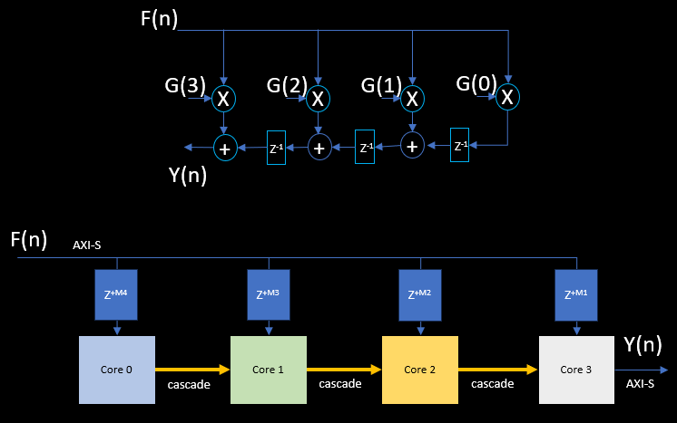

..
   Copyright (C) 2019-2022, Xilinx, Inc.
   Copyright (C) 2022-2026, Advanced Micro Devices, Inc.
   
   `Terms and Conditions <https://www.amd.com/en/corporate/copyright>`_.

.. _DSP_CONVOLUTION_CORRELATION:

=======================
Convolution/Correlation
=======================

This library element computes the convolution or correlation of two input vectors depending on the specified function type. The convolution and correlation library element has three modes: FULL, SAME, and VALID.
Template parameters are used to configure the top-level graph of the ``conv_corr_graph`` class.

Entry Point
===========

The graph entry point is as follows:

.. code-block:: cpp

    xf::dsp::aie::conv_corr::conv_corr_graph

Device Support
==============

The Convolution/Correlation library element supports AIE, AIE-ML and AIE-MLv2 devices for all features, with the following differences:

- The available round modes and the enumerated values of round modes are the same for AIE-ML and AIE-MLv2 devices, but differ from those for AIE devices. See :ref:`DSP_COMPILING_AND_SIMULATING`.

Supported Input Data Types
==========================

The data type for input ports F and G (``inF`` and ``inG``) is controlled by ``TT_DATA_F`` and ``TT_DATA_G``, respectively.
Both **inputs** may be one of the following eight types: ``int8``, ``int16``, ``int32``, ``cint16``, ``cint32``, ``float``, ``cfloat``, and ``bfloat16``.
The **output** may be one of the following six types: ``int16``, ``int32``, ``cint16``, ``cint32``, ``float``, and ``cfloat``.
Please see the table below for valid input/output data type combinations.

.. _DSP_CONV_CORR_combos:

.. table:: IO-BUFFER INTERFACE: Supported Combinations of Input/Output Data Types
   :align: center

   +------------------+------------------+------------------+------------------+------------------+------------------+
   | InputF Data Type | InputG Data Type | Output Data Type | AIE Valid        | AIE-ML Valid     | AIE-MLv2 Valid   |
   +==================+==================+==================+==================+==================+==================+
   | int8             | int8             | int16            | **no**           | yes              | yes              |
   +------------------+------------------+------------------+------------------+------------------+------------------+
   | int16            | int16            | int32            | yes              | yes              | yes              |
   +------------------+------------------+------------------+------------------+------------------+------------------+
   | int32            | int16            | int32            | yes              | yes              | yes              |
   +------------------+------------------+------------------+------------------+------------------+------------------+
   | cint16           | int16            | cint16           | yes              | yes              | yes              |
   +------------------+------------------+------------------+------------------+------------------+------------------+
   | cint16           | int16            | cint32           | yes              | yes              | yes              |
   +------------------+------------------+------------------+------------------+------------------+------------------+
   | cint16           | int32            | cint32           | yes              | yes              | yes              |
   +------------------+------------------+------------------+------------------+------------------+------------------+
   | cint16           | cint16           | cint16           | yes              | yes              | yes              |
   +------------------+------------------+------------------+------------------+------------------+------------------+
   | cint16           | cint16           | cint32           | yes              | yes              | yes              |
   +------------------+------------------+------------------+------------------+------------------+------------------+
   | cint32           | int16            | cint32           | yes              | yes              | yes              |
   +------------------+------------------+------------------+------------------+------------------+------------------+
   | cint32           | cint16           | cint32           | yes              | yes              | yes              |
   +------------------+------------------+------------------+------------------+------------------+------------------+
   | float            | float            | float            | yes              | yes              | yes              |
   +------------------+------------------+------------------+------------------+------------------+------------------+
   | cfloat           | float            | cfloat           | yes              | **no**           | **no**           |
   +------------------+------------------+------------------+------------------+------------------+------------------+
   | cfloat           | cfloat           | cfloat           | yes              | **no**           | **no**           |
   +------------------+------------------+------------------+------------------+------------------+------------------+
   | bfloat16         | bfloat16         | float            | **no**           | yes              | yes              |
   +------------------+------------------+------------------+------------------+------------------+------------------+
   | 1. A mix of float and integer types is not supported.                                                           |
   | 2. A mix of float data type for the F signal and cfloat data type for the G signal is not supported.            |
   +-----------------------------------------------------------------------------------------------------------------+

.. table:: STREAM INTERFACE : Supported Combinations of Input/Output data types
   :align: center

   +------------------+------------------+------------------+------------------+------------------+------------------+
   | InputF Data Type | InputG Data Type | Output Data Type | AIE Valid        | AIE-ML Valid     | AIE-MLv2 Valid   |
   +==================+==================+==================+==================+==================+==================+
   | cint16           | cint16           | cint16           | yes              | no               | no               |
   +------------------+------------------+------------------+------------------+------------------+------------------+
   | cint16           | int16            | cint16           | yes              | no               | no               |
   +------------------+------------------+------------------+------------------+------------------+------------------+
   | Note: Stream-based implementation does not support other data types.                                            |
   |                                                                                                                 |
   +-----------------------------------------------------------------------------------------------------------------+

Template Parameters
===================

To see details on the template parameters for Convolution/Correlation, see :ref:`DSP_API_REFERENCE`.

Access Functions
================

To see details on the access functions for Convolution/Correlation, see :ref:`DSP_API_REFERENCE`.

Ports
=====

To see details on the ports for Convolution/Correlation, see :ref:`DSP_API_REFERENCE`.

Design Notes
============
Performance depends on the chosen data type combination; see :ref:`DSP_CONV_CORR_combos`. The number of multiplications per clock cycle varies based on the data type combination.
The Convolution/Correlation operation can be processed by both IO-buffer (``TP_API = 0``) and Stream-Based (``TP_API = 1``) interfaces, which are controlled by the parameter named ``TP_API``.

Input Buffer Length
-------------------

The input buffer length of F and G is controlled by ``TP_F_LEN`` and ``TP_G_LEN`` respectively.
Both lengths must satisfy alignment and range constraints that depend on the interface type and data type.

**Alignment**: Both ``TP_F_LEN`` and ``TP_G_LEN`` must be a multiple of the base vector load size, which depends on the device:

.. table::
   :align: center

   +--------------+---------------------------------------------+
   | Device       | Formula                                     |
   +==============+=============================================+
   | AIE / AIE-ML | ``base_load = 256 / samplesize(data_type)`` |
   +--------------+---------------------------------------------+
   | AIE-MLv2     | ``base_load = 512 / samplesize(data_type)`` |
   +--------------+---------------------------------------------+

Per-type alignment values:

.. table::
   :align: center

   +----------------------------------+-----------------+-----------------+
   | Data Type                        | AIE / AIE-ML    | AIE-MLv2        |
   +==================================+=================+=================+
   | ``int8``                         | multiples of 32 | multiples of 64 |
   +----------------------------------+-----------------+-----------------+
   | ``int16``, ``bfloat16``          | multiples of 16 | multiples of 32 |
   +----------------------------------+-----------------+-----------------+
   | ``int32``, ``cint16``, ``float`` | multiples of 8  | multiples of 16 |
   +----------------------------------+-----------------+-----------------+
   | ``cint32``, ``cfloat``           | multiples of 4  | multiples of 8  |
   +----------------------------------+-----------------+-----------------+

**IO-Buffer interface** (``TP_API = 0``):

- ``TP_F_LEN`` minimum: ``2 × base_load``.
- ``TP_F_LEN`` maximum: bounded by the AIE tile data memory size (32 KB for AIE; 64 KB for AIE-ML and AIE-MLv2). The effective maximum also depends on the output buffer size for the selected ``TP_COMPUTE_MODE``.
- ``TP_G_LEN`` must satisfy ``2 × base_load ≤ TP_G_LEN ≤ TP_F_LEN``.

**Stream interface** (``TP_API = 1``, AIE only):

- ``TP_F_LEN`` minimum: 512 samples (required to ensure the stream implementation flushes out partial results).
- ``TP_G_LEN`` maximum: 256 samples.
- ``TP_G_LEN`` must also satisfy the cascade/phase alignment: ``TP_G_LEN`` must be a multiple of ``TP_PHASES × Lanes × (Points / StreamsPerCore)``.

Output Buffer Length
--------------------

The output buffer length is calculated using the formula shown in the **OUT_BUFFER_LEN** table: ``ceil((TP_F_LEN + TP_G_LEN - 1), LANES)`` for FULL mode, ``ceil(TP_F_LEN, LANES)`` for SAME mode, and ``ceil((TP_F_LEN - TP_G_LEN + 1), LANES)`` for VALID mode.
Here, ``LANES`` is the number of parallel data lanes available in the AIE hardware, ensuring the buffer is always sized to the next multiple of the hardware lanes for efficient vector processing.

Formula for **ceil**:

.. code-block::

    ceil(a,b) ==> (((a+b-1)/b) * b)

.. _DSP_Out_Buffer_Len_and_Lanes_info:

.. table:: OUT_BUFFER_LEN
   :align: center

   +-----------------+--------------+--------------------------------------------+
   | TP_COMPUTE_MODE | MODE NAME    |      OUT_BUFFER_LEN                        |
   +=================+==============+============================================+
   | 0               | FULL         |  ceil((TP_F_LEN + TP_G_LEN - 1), LANES)    |
   +-----------------+--------------+--------------------------------------------+
   | 1               | SAME         |  ceil(TP_F_LEN, LANES)                     |
   +-----------------+--------------+--------------------------------------------+
   | 2               | VALID        |  ceil((TP_F_LEN - TP_G_LEN + 1), LANES)    |
   +-----------------+--------------+--------------------------------------------+

Where:

* ``TP_F_LEN`` is the length of input F vector.
* ``TP_G_LEN`` is the length of input G vector.
* ``LANES`` is the number of parallel data lanes available in the AIE hardware, which depends on the data type combination used. See :ref:`DSP_LANES`

.. _DSP_LANES:

.. table:: LANES
   :align: center

   +------------------+------------------+------------------+------------------+------------------+--------------------+
   | InputF Data Type | InputG Data Type | Output Data Type | **AIE-1** Lanes  | **AIE-ML** Lanes | **AIE-MLv2** Lanes |
   +==================+==================+==================+==================+==================+====================+
   | int8             | int8             | int16            | **0**            | 32               | 64                 |
   +------------------+------------------+------------------+------------------+------------------+--------------------+
   | int16            | int16            | int32            | 16               | 16               | 32                 |
   +------------------+------------------+------------------+------------------+------------------+--------------------+
   | int32            | int16            | int32            | 8                | 16               | 32                 |
   +------------------+------------------+------------------+------------------+------------------+--------------------+
   | cint16           | int16            | cint16           | 8                | 16               | 32                 |
   +------------------+------------------+------------------+------------------+------------------+--------------------+
   | cint16           | int16            | cint32           | 8                | 16               | 32                 |
   +------------------+------------------+------------------+------------------+------------------+--------------------+
   | cint16           | int32            | cint32           | 8                | 16               | 16                 |
   +------------------+------------------+------------------+------------------+------------------+--------------------+
   | cint16           | cint16           | cint32           | 8                | 16               | 16                 |
   +------------------+------------------+------------------+------------------+------------------+--------------------+
   | cint32           | int16            | cint32           | 4                | 16               | 16                 |
   +------------------+------------------+------------------+------------------+------------------+--------------------+
   | cint32           | cint16           | cint32           | 4                | 8                | 16                 |
   +------------------+------------------+------------------+------------------+------------------+--------------------+
   | float            | float            | float            | 8                | 32               | 16                 |
   +------------------+------------------+------------------+------------------+------------------+--------------------+
   | cfloat           | float            | cfloat           | 4                | **0**            | **0**              |
   +------------------+------------------+------------------+------------------+------------------+--------------------+
   | cfloat           | cfloat           | cfloat           | 4                | **0**            | **0**              |
   +------------------+------------------+------------------+------------------+------------------+--------------------+
   | bfloat16         | bfloat16         | float            | **0**            | 16               | 64                 |
   +------------------+------------------+------------------+------------------+------------------+--------------------+

.. note:: Please refer to `UG1603 Number of Lanes supported by Sliding Multiplication <https://docs.amd.com/r/en-US/ug1603-ai-engine-ml-kernel-graph/Sliding-Multiplication>`_.

Example Config:

.. code-block::

   Data_F - int16,
   Data_G - int16,
   Data_Out - int32,
   Func_Type = 1 (conv),
   compute_mode = 0 (FULL), 1 (SAME), 2 (VALID),
   F_LEN = 64,
   G_LEN = 32.

   in_F[F_LEN] = [1, 2, 3, ..., 64]
   in_G[G_LEN] = [1, 2, 3, ..., 32]

   FULL Mode:
      OUT_DATA_LEN = (TP_F_LEN + TP_G_LEN - 1) --> (64+32-1) --> 95
      LANES = 16 for int16xint16 data combo
      Output_Buffer_len = ceil(95,16) --> (((95+16-1)/16)*16) --> ((110/16)*16) --> (6*16)--> 96
      Therefore, the output buffer has 95 valid output samples and 1 zero sample.

   SAME Mode:
      OUT_DATA_LEN = TP_F_LEN --> 64
      LANES = 16 for int16xint16 data combo
      Output_Buffer_len = ceil(64,16) --> (((64+16-1)/16)*16) --> ((79/16)*16) --> (4*16)--> 64
      Therefore, the output buffer has 64 valid output samples.

   VALID Mode:
      OUT_DATA_LEN = (TP_F_LEN - TP_G_LEN + 1) --> (64-32+1) --> 33
      LANES = 16 for int16xint16 data combo
      Output_Buffer_len = ceil(33,16) --> (((33+16-1)/16)*16) --> ((48/16)*16) --> (3*16)--> 48
      Therefore, the output buffer has 33 valid output samples and 15 zero samples.

IO-Buffer Interface
-------------------

The Convolution/Correlation operation can be performed via the IO-buffer interface on ``AIE``, ``AIE-ML`` and ``AIE-MLv2`` devices.

- ``TP_API = 0`` indicates IO-BUFFER interface

The IO-buffer interface supports all data type combinations.

Streaming Interface
-------------------

The Convolution/Correlation operation via streaming is supported only on ``AIE`` devices. Streaming support is not available on ``AIE-ML`` and ``AIE-MLv2`` devices.

- ``TP_API = 1`` indicates STREAM interface.

* The input F signal is assumed to be streaming on the AXI-Stream interface. As F is consumed on streams, the selection of Length(F) can be higher to achieve higher throughput.
* The input G signal is accessed via an IO-buffer interface.
* ``TP_COMPUTE_MODE`` is fixed to VALID since padding is not required for the F signal, as F is always a continuous stream for both convolution and correlation.
* Typical use cases that can benefit from the stream interface kernel involve having a continuous stream of F, for which a convolution or correlation with a known pattern (e.g., G) must be computed.

Cascaded Kernels
----------------

The number of kernels cascaded together to distribute the computation is controlled by the ``TP_CASC_LEN`` template parameter.

- **IO-Buffer interface** (``TP_API = 0``): ``TP_CASC_LEN`` is fixed to ``1``. Cascading is not applicable.
- **Stream interface** (``TP_API = 1``): ``TP_CASC_LEN`` must equal ``TP_G_LEN / (Lanes × Points)``, ``TP_G_LEN / (Lanes × Points × 2)``, or ``TP_G_LEN / (Lanes × Points × 4)``, corresponding to maximum, half, and quarter throughput respectively. The library provides access functions to determine the value of ``TP_CASC_LEN`` that gives optimum performance (minimum kernels for maximum throughput). More details can be found in :ref:`DSP_API_REFERENCE`.

Parallel Input/Output Paths
---------------------------

Input/Output samples are distributed over multiple parallel computation paths, controlled by the ``TP_PHASES`` template parameter.

- **IO-Buffer interface** (``TP_API = 0``): ``TP_PHASES`` is fixed to ``1``.
- **Stream interface** (``TP_API = 1``): ``TP_PHASES`` must be a power of 2 (1, 2, 4, 8, or 16) and is subject to the following rules:

  - ``TP_PHASES`` can be greater than 1 only when ``TP_CASC_LEN`` equals its maximum value (i.e., ``TP_G_LEN / (Lanes × Points)``), which delivers 1 GSPS per phase.
  - To achieve a data rate below 1 GSPS, reduce ``TP_CASC_LEN`` in a single-phase (``TP_PHASES = 1``) design.
  - To achieve a data rate above 1 GSPS, increase ``TP_PHASES`` while keeping ``TP_CASC_LEN`` at its maximum value.

Stream Output
-------------

The stream output operates on instantaneous samples from the continuous input stream without data memory movements or intermediate storage.
This approach prevents selective sample discarding while maintaining uninterrupted stream flow and continuous throughput performance.
The figure below shows the transpose-form implementation of the convolution and correlation operations.

.. _DSP_FIGURE_STREAM_IMPL_CONV_CORR:

- The stream output length is independent of the compute mode (VALID).
- The transpose-form implementation produces initial startup-transient samples before the computation reaches steady state. These transient samples are **automatically discarded by the IP** before reaching the graph output port. No user-side discarding of AIE output samples is required.

Stream Output Alignment
-----------------------

The AIE stream output is already aligned — the IP discards startup-transient samples internally.
No user-side action is required on the AIE output.

To compare your reference output against the AIE output, compute the valid REF window and
compare it sample-for-sample with the AIE output:

.. code-block:: text

   StreamsPerCore = 1  if TP_G_LEN > (TP_PHASES * Lanes * Points / 2)
                  = 2  otherwise

   PhaseIncrement = TP_PHASES / StreamsPerCore

   startIndex = 3 * TP_PHASES * (PhaseIncrement - 1)
   endIndex   = F_LEN * NITER - TP_G_LEN - startIndex - 1

   Compare REF[startIndex .. endIndex] sample-for-sample with the AIE output.

.. note::
   - ``startIndex`` — Number of REF samples to discard from the head before comparison.
     When ``startIndex = 0``, no head trimming is needed. For configurations with higher
     ``TP_PHASES`` or larger ``TP_G_LEN``, ``startIndex`` will be non-zero and
     ``REF[0 .. startIndex-1]`` must be discarded.

   - ``endIndex`` — Last valid REF sample index to include in the comparison. REF samples
     beyond ``endIndex`` (i.e., ``REF[endIndex+1 ..]``) are boundary-effect samples and
     must not be compared. The total number of valid comparison samples is
     ``endIndex - startIndex + 1``.

.. note::
   Lanes and Points are data-type-dependent. See the table below.

.. _DSP_LANES_AND_POINTS:

.. table:: Stream Interface: Lanes and Points for Supported Data Type Combinations
   :align: center

   +-------------------------+-----------+------------+
   | Data Type Combo         | **Lanes** | **Points** |
   +=========================+===========+============+
   | cint16 (F) x int16 (G)  | 4         |  4         |
   +-------------------------+-----------+------------+
   | cint16 (F) x cint16 (G) | 4         |  2         |
   +-------------------------+-----------+------------+

The streaming interface supports only two data type combinations. See the "STREAM INTERFACE" table in :ref:`DSP_CONV_CORR_combos`.

Scaling
-------

Scaling in Convolution/Correlation is controlled by the ``TP_SHIFT`` parameter, which describes the number of bits to shift the output to the right.
Float, cfloat, and bfloat16 implementations do not support scaling. ``TP_SHIFT`` must be set to '0'.

Saturation
----------

Distortion caused by saturation is possible in Convolution/Correlation. Since the input values are provided at construction time, no compile-time error can be issued for this hazard. It is the user's responsibility to ensure that saturation does not occur.

Number of Frames
----------------

The number of input data frames per window is controlled by ``TP_NUM_FRAMES`` (default: ``1``).
``TP_NUM_FRAMES`` must be set to ``1`` in the current version to maintain optimal performance.

Run Time Parameter (RTP) for Vector Lengths
-------------------------------------------

The ``conv_corr_graph`` class supports runtime-configurable vector lengths via the ``TP_USE_RTP_VECTOR_LENGTHS`` template parameter:

- ``TP_USE_RTP_VECTOR_LENGTHS = 0`` (default): Static vector lengths. Both ``TP_F_LEN`` and ``TP_G_LEN`` are fixed at compile time through class template parameters, and no RTP port is present.
- ``TP_USE_RTP_VECTOR_LENGTHS = 1``: Runtime-configurable vector lengths. An asynchronous input port ``rtpVecLen`` is added to the graph. The single RTP port carries both F and G vector lengths as a 2-element ``int32`` array: ``inVecLen[0]`` = runtime ``F_LEN``, ``inVecLen[1]`` = runtime ``G_LEN``.

Constraints for ``TP_USE_RTP_VECTOR_LENGTHS = 1``:

- **IO-Buffer only**: Not supported on the Stream interface (``TP_API = 1``).
- **Availability**: At least one of ``TP_F_LEN`` or ``TP_G_LEN`` must be strictly greater than its compile-time minimum. When both are at their minimum values, ``TP_USE_RTP_VECTOR_LENGTHS = 1`` is not available.

The following constraints must be satisfied for valid RTP operation:

.. table::
   :align: center

   +-------+--------------------------------+-----------------------------------------------------------------------------------------+
   | S.No  | Constraint                     | Description                                                                             |
   +=======+================================+=========================================================================================+
   | 1     | ``RTP_F_LEN ≤ TP_F_LEN``       | Runtime length cannot exceed the compile-time maximum for F.                            |
   +-------+--------------------------------+-----------------------------------------------------------------------------------------+
   | 2     | ``RTP_G_LEN ≤ TP_G_LEN``       | Runtime length cannot exceed the compile-time maximum for G.                            |
   +-------+--------------------------------+-----------------------------------------------------------------------------------------+
   | 3     | ``RTP_F_LEN ≥ RTP_G_LEN``      | Base requirement for all compute modes.                                                 |
   +-------+--------------------------------+-----------------------------------------------------------------------------------------+
   | 4     | ``RTP_F_LEN % base_load = 0``  | Must be an integer multiple of the vector size for ``TT_DATA_F`` (data-type dependent). |
   +-------+--------------------------------+-----------------------------------------------------------------------------------------+
   | 5     | ``RTP_G_LEN % base_load = 0``  | Must be an integer multiple of the vector size for ``TT_DATA_G`` (data-type dependent). |
   +-------+--------------------------------+-----------------------------------------------------------------------------------------+

- **VALID mode output port sizing**: When ``TP_COMPUTE_MODE = VALID`` and ``TP_USE_RTP_VECTOR_LENGTHS = 1``, the output port is sized for the worst-case (largest) output, which corresponds to the smallest possible G_LEN (i.e., the compile-time minimum G_LEN). This ensures the output buffer is always large enough regardless of the runtime G_LEN passed via RTP.

Code Example
============

The following code examples show how ``conv_corr_graph`` class might be used within a user super-graph.

Convolution
-----------

.. literalinclude:: ../../../../L2/examples/docs_examples/test_conv.hpp
    :language: cpp
    :lines: 17-

Correlation
-----------

.. literalinclude:: ../../../../L2/examples/docs_examples/test_corr.hpp
    :language: cpp
    :lines: 17-
