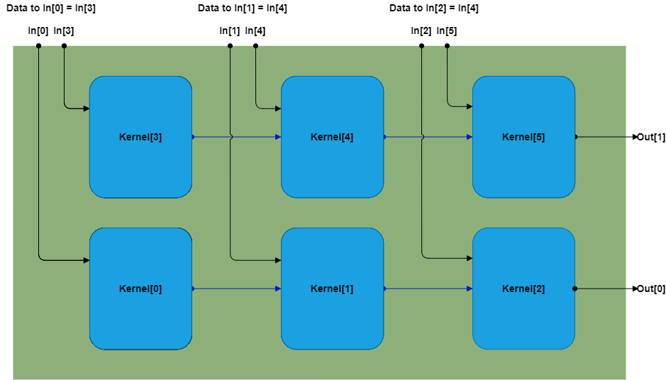

..
   Copyright © 2019–2024 Advanced Micro Devices, Inc
   
   `Terms and Conditions <https://www.amd.com/en/corporate/copyright>`_.

.. _DFT:

===
DFT
===

The DSPLib contains a solution for the discrete Fourier transform (DFT). It has a configurable point size, data type, cascade length, ssr, and the ability to perform the DFT on multiple frames of data per iteration.

Entry Point
===========

The graph entry point is the following:

.. code-block::

    xf::dsp::aie::fft::dft_graph

Device Support
==============

The DFT supports both AIE and AIE-ML devices for all features with the following exception

- cfloat is not supported for ``TT_DATA`` on AIE-ML.

Supported Types
===============

The data type of the DFT is controlled by the ``TT_DATA`` template parameter.

The DFT on AIE supports the following types for ``TT_DATA``: cint16, cint32 or cfloat. On AIE-ML the data must be of an integer type as floats are not supported; ``TT_DATA`` can be cint16 or cint32. The data type of the output will be equal to that of ``TT_DATA``.

The data type of the DFT coefficients is specified by the template parameter ``TT_TWIDDLE``. However, this is currently determined by the input data type. If ``TT_DATA`` is an integer type (cint16 or cint32), ``TT_TWIDDLE`` must be set to cint16. If ``TT_DATA`` is set to cfloat then ``TT_TWIDDLE`` must also be cfloat.

Template Parameters
===================

To see details on the template parameters for the DFT, see :ref:`API_REFERENCE`.

Access Functions
================

To see details on the access functions for the DFT, see :ref:`API_REFERENCE`.

Ports
=====

To see details on the ports for the DFT, see :ref:`API_REFERENCE`.

Design Notes
============

The library element can perform the forward or inverse Discrete Fourier Transform, as specified by the ``TP_FFT_NIFFT`` template parameter.

Scaling
-------

The scaling of the DFT is controlled by the ``TP_SHIFT`` parameter, which describes how many binary places by which to shift the result to the right, i.e., only power-of-2 scaling values are supported. Shifting can only be applied when ``TT_DATA`` is an integer type. Setting ``TP_SHIFT`` to a non-zero value with floating-point ``TT_DATA`` will result in an error.

Batch Processing
----------------

The ``TP_NUM_FRAMES`` template parameter can be used to drive the kernel to operate on multiple frames on a given iteration. When ``TP_NUM_FRAMES`` is set to 1, the kernel will operate on a single frame with FRAME_SIZE (``TP_POINT_SIZE`` zero-padded for alignment). However, when the number of frames is greater than one, the input buffer of data will contain ``TP_NUM_FRAMES`` batches of FRAME_SIZE input data for kernel to operate on. Processing larger buffers reduces kernel execution overheads and therefore can increase the throughput of such design. On the other hand, processing larger amounts of data in a single kernel execution iteration leads to increased latency.

Cascaded Kernels
----------------

The DFT library element is able to split the workload into multiple kernels connected in a chain with the use of the ``TP_CASC_LEN`` template parameter. The required computation, as well as input data buffer and twiddle values, will be split and distributed between the number of kernels determined by ``TP_CASC_LEN``. Using multiple kernels, support for ``TP_POINT_SIZE`` is extended beyond what can be stored on a single kernel. The data must be split in a "card-dealing" manner across the kernels in cascade. This is necessary as the generated twiddles for the DFT are also split this way.

SSR
---

The DFT supports an SSR, using the ``TP_SSR`` template parameter, which allows for multiple cascaded kernel paths to operate in parallel. Kernels in one SSR rank should receive same input data as all other SSR ranks, however, each rank of SSR will produce an equal split of the DFT output. The outputs for each SSR should be interleaved back together to produce the final output of the DFT.

:ref:`FIGURE_DFT_SSR_CASC` shows the input and output graph port connects for a cascaded SSR DFT.

.. _FIGURE_DFT_SSR_CASC:

    **DFT Kernel Connections with TP_SSR=2 and TP_CASC_LEN=3**

Maximum Point Size
------------------

.. note:: The maximum ``TP_POINT_SIZE`` that can be used depends on the data type, the number of kernels in cascade, and the available data memory per kernel. Each frame of data in the IO-buffer should be zero-padded for alignment.

The DFT on AIE supports values of ``TP_POINT_SIZE`` from 4 to 88 (4 to 60 for cfloat ``TP_DATA_TYPE``) for a single kernel.

On AIE-ML, the larger data memory per kernel allows for ``TP_POINT_SIZE`` support from 4 up to 120.

This can be exceeded by using a number of kernels in cascade via the ``TP_CASC_LEN`` template parameter or by using multiple SSR paths ``TP_SSR``. The memory required for each frame of input and output data, and coefficient matrix will be divided across the kernels ``TP_CASC_LEN * TP_SSR`` kernels.

For example, a ``TP_POINT_SIZE`` of 128 can be achieved using a ``TP_CASC_LEN`` of 2, as each kernel will only require a half the size of the input buffer that equivalent single kernel configuration would require, as well as half the memory needed for twiddle table.

The DFT has optimal throughput performance with a low point size and a higher number of frames per IO-buffer.

Zero Padding Data for Alignment
-------------------------------

It is important to note that the DFT for AIE requires that each frame of input data to aligned to 256-bits, i.e., zero-padded to be a multiple of 8 for cint16 and 4 for cint32 and cfloats. Zero-padding will have no impact on the final result of the transform.

This is also a requirement when using the cascading feature of the DFT for AIE. As mentioned, each frame of data is to be split across each of the kernels. Each cascaded kernel should receive a split of the frame that has a size that is a multiple of 8 for cint16, or 4 for cint32 and cfloats. The data should be dealt out sample-by-sample among each kernel in a round-robin fashion.

The padding requirements for AIE-ML devices are similar to that of AIE except that input data with a cint32 or cfloat ``TT_DATA_TYPE`` should be zero-padded, for alignment, to be a multiple of 512-bits (8-samples) instead of 256-bits (4-samples) for AIE. This is required to increase the performance on AIE-ML.

For example, if ``TP_POINT_SIZE = 20`` and ``TP_CASC_LEN = 3``, this should be padded into a frame with a size that is a multiple of ``8 * TP_CASC_LEN`` for cint16, and ``4 * TP_CASC_LEN`` for cint32 and cfloats:

20-point data for transform:

.. code-block::

    1 2 3 4 5 6 7 8 9 10 11 12 13 14 15 16 17 18 19 20

20-point data padded up to a frame of 24 elements:

.. code-block::

    1 2 3 4 5 6 7 8 9 10 11 12 13 14 15 16 17 18 19 20 0 0 0 0

The frame is then dealt sample-by-sample to each kernel in cascade.

Kernel 1:

.. code-block::

    1 4 7 10 13 16 19 0

Kernel 2:

.. code-block::

    2 5 8 11 14 17 20 0

Kernel 3:

.. code-block::

    3 6 9 12 15 18 0 0

If there are multiple frames used for batch processing ``TP_NUM_FRAMES > 1``, the padding is required at the end of each individual frame.

Code Example
============

The following code example shows how the dft_graph class can be used within a user super-graph. This example shows a DFT with a point size of 16 with 8-frames of data being processed per iteration (an input window size of 256).

.. literalinclude:: ../../../../L2/examples/docs_examples/test_dft.hpp
    :language: cpp
    :lines: 17-

.. |image1| image:: ./media/image1.png
.. |image2| image:: ./media/image2.png
.. |image3| image:: ./media/image4.png
.. |image4| image:: ./media/image2.png
.. |image6| image:: ./media/image2.png
.. |image7| image:: ./media/image5.png
.. |image8| image:: ./media/image6.png
.. |image9| image:: ./media/image7.png
.. |image10| image:: ./media/image2.png
.. |image11| image:: ./media/image2.png
.. |image12| image:: ./media/image2.png
.. |image13| image:: ./media/image2.png
.. |trade|  unicode:: U+02122 .. TRADEMARK SIGN
   :ltrim:
.. |reg|    unicode:: U+000AE .. REGISTERED TRADEMARK SIGN
   :ltrim:
