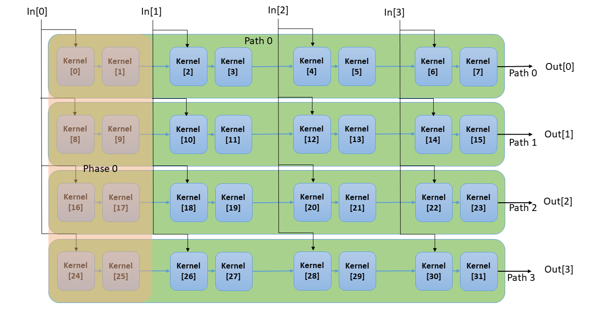

..
   Copyright 2022 Xilinx, Inc.

   Licensed under the Apache License, Version 2.0 (the "License");
   you may not use this file except in compliance with the License.
   You may obtain a copy of the License at

       http://www.apache.org/licenses/LICENSE-2.0

   Unless required by applicable law or agreed to in writing, software
   distributed under the License is distributed on an "AS IS" BASIS,
   WITHOUT WARRANTIES OR CONDITIONS OF ANY KIND, either express or implied.
   See the License for the specific language governing permissions and
   limitations under the License.

.. _FILTERS:

=======
Filters
=======

The DSPLib contains several variants of Finite Impulse Response (FIR) filters.
These include single-rate FIRs, half-band interpolation/decimation FIRs, as well as integer and fractional interpolation/decimation FIRs. More details in the :ref:`FILTER_ENTRY`.

.. _FILTER_ENTRY:

~~~~~~~~~~~
Entry Point
~~~~~~~~~~~

FIR filters have been categorized into classes and placed in a distinct namespace scope: ``xf::dsp::aie::fir``, to prevent name collision in the global scope. Namespace aliasing can be utilized to shorten instantiations:

.. code-block::

    namespace dsplib = xf::dsp::aie;

Additionally, each FIR filter has been placed in its unique FIR type namespace. The available FIR filter classes and the corresponding graph entry point are listed below:

.. _tab-fir-filter-classes:

.. table:: FIR Filter Classes
   :align: center

   +----------------------------------+-----------------------------------------------------------+
   |    **Function**                  | **Namespace and class name**                              |
   +==================================+===========================================================+
   | Single rate, asymmetrical        | dsplib::fir::sr_asym::fir_sr_asym_graph                   |
   +----------------------------------+-----------------------------------------------------------+
   | Single rate, symmetrical         | dsplib::fir::sr_sym::fir_sr_sym_graph                     |
   +----------------------------------+-----------------------------------------------------------+
   | Interpolation asymmetrical       | dsplib::fir::interpolate_asym::fir_interpolate_asym_graph |
   +----------------------------------+-----------------------------------------------------------+
   | Decimation, halfband             | dsplib::fir::decimate_hb::fir_decimate_hb_graph           |
   +----------------------------------+-----------------------------------------------------------+
   | Interpolation, halfband          | dsplib::fir::interpolate_hb::fir_interpolate_hb_graph     |
   +----------------------------------+-----------------------------------------------------------+
   | Decimation, asymmetric           | dsplib::fir::decimate_asym::fir_decimate_asym_graph       |
   +----------------------------------+-----------------------------------------------------------+
   | Interpolation or decimation,     | dsplib::fir::resampler::fir_resampler_graph               |
   | fractional, asymmetric           |                                                           |
   +----------------------------------+-----------------------------------------------------------+
   | Decimation, symmetric            | dsplib::fir::decimate_sym::fir_decimate_sym_graph         |
   +----------------------------------+-----------------------------------------------------------+

~~~~~~~~~~~~~~~
Supported Types
~~~~~~~~~~~~~~~

All FIR filters can be configured for various types of data and coefficients. These types can be int16, int32, or float, and also real or complex.
Certain combinations of data and coefficient type are not supported.

The following table lists the supported combinations of data type and coefficient type with notes for those combinations not supported.

.. _tab_supported_combos:

.. table:: Supported Combinations of Data Type and Coefficient Type
   :align: center

   +-------------------------------+--------------------------------------------------------------------------+
   |                               |                                 **Data Type**                            |
   |                               +-----------+------------+-----------+------------+-----------+------------+
   |                               | **Int16** | **Cint16** | **Int32** | **Cint32** | **Float** | **Cfloat** |
   +----------------------+--------+-----------+------------+-----------+------------+-----------+------------+
   | **Coefficient type** | Int16  | Supported | Supported  | Supported | Supported  | note 3    | note 3     |
   |                      |        | (note 4)  |            |           |            |           |            |
   |                      +--------+-----------+------------+-----------+------------+-----------+------------+
   |                      | Cint16 | note 1    | Supported  | note 1    | Supported  | note 3    | note 3     |
   |                      +--------+-----------+------------+-----------+------------+-----------+------------+
   |                      | Int32  | note 2    | note 2     | Supported | Supported  | note 3    | note 3     |
   |                      +--------+-----------+------------+-----------+------------+-----------+------------+
   |                      | Cint32 | notes 1&2 | note 2     | note 1    | Supported  | note 3    | note 3     |
   |                      +--------+-----------+------------+-----------+------------+-----------+------------+
   |                      | Float  | note 3    | note 3     | note 3    | note 3     | Supported | Supported  |
   |                      +--------+-----------+------------+-----------+------------+-----------+------------+
   |                      | Cfloat | note 3    | note 3     | note 3    | note 3     | note 3    | Supported  |
   +----------------------+--------+-----------+------------+-----------+------------+-----------+------------+
   | 1. Complex coefficients are not supported for real-only data types.                                      |
   | 2. Coefficient type of higher precision than data type is not supported.                                 |
   | 3. A mix of float and integer types is not supported.                                                    |
   | 4. The fir_interpolate_asym and fir_decimate_asym variants do not support int16/int16.                   |
   +----------------------------------------------------------------------------------------------------------+

~~~~~~~~~~~~~~~~~~~
Template Parameters
~~~~~~~~~~~~~~~~~~~

The following table lists parameters for all the FIR filters.
Note that some parameters are not present on certain variants of FIR where the parameter is not applicable to that variant:

.. _fir_supported_params:

.. table:: Parameters Supported by FIR Filters
   :align: center

   +------------------------+----------------+-----------------+---------------------------------+
   | Parameter Name         |    Type        |  Description    |    Range                        |
   +========================+================+=================+=================================+
   |    TT_DATA             |    Typename    | Data Type       |    int16,                       |
   |                        |                |                 |    cint16,                      |
   |                        |                |                 |    int32,                       |
   |                        |                |                 |    cint32,                      |
   |                        |                |                 |    float,                       |
   |                        |                |                 |    cfloat                       |
   +------------------------+----------------+-----------------+---------------------------------+
   |    TT_COEFF            |    Typename    | Coefficient     |    int16,                       |
   |                        |                | type            |    cint16,                      |
   |                        |                |                 |    int32,                       |
   |                        |                |                 |    cint32,                      |
   |                        |                |                 |    float,                       |
   |                        |                |                 |    cfloat                       |
   +------------------------+----------------+-----------------+---------------------------------+
   |    TP_FIR_LEN          |    Unsigned    | The number of   | Min - 4,                        |
   |                        |    int         | taps            |                                 |
   |                        |                |                 | Max - see :ref:`MAX_FIR_LENGTH` |
   +------------------------+----------------+-----------------+---------------------------------+
   |   TP_INTERPOLATE_FACTOR|    Unsigned    | Ratio of output |   1 (default) to 7              |
   |                        |    int         | samples to input|   (interpolating variants only) |
   |                        |                | samples         |                                 |
   +------------------------+----------------+-----------------+---------------------------------+
   |   TP_DECIMATE_FACTOR   |    Unsigned    | Ratio of input  |   1 (default) to 7              |
   |                        |    int         | samples to      |   (decimating variants only)    |
   |                        |                | output samples  |                                 |
   +------------------------+----------------+-----------------+---------------------------------+
   |    TP_SHIFT            |    Unsigned    | The number of   |    0 to 61                      |
   |                        |    int         | bits to shift   |                                 |
   |                        |                | unscaled        |                                 |
   |                        |                | result          |                                 |
   |                        |                | down by before  |                                 |
   |                        |                | output.         |                                 |
   +------------------------+----------------+-----------------+---------------------------------+
   |    TP_RND              |    Unsigned    | Round mode      |    0 =                          |
   |                        |    int         |                 |    truncate or                  |
   |                        |                |                 |    floor                        |
   |                        |                |                 |                                 |
   |                        |                |                 |    1 =                          |
   |                        |                |                 |    ceiling                      |
   |                        |                |                 |                                 |
   |                        |                |                 |    2 =                          |
   |                        |                |                 |    positive                     |
   |                        |                |                 |    infinity                     |
   |                        |                |                 |                                 |
   |                        |                |                 |    3 =                          |
   |                        |                |                 |    negative                     |
   |                        |                |                 |    infinity                     |
   |                        |                |                 |                                 |
   |                        |                |                 |    4 =                          |
   |                        |                |                 |    symmetrical                  |
   |                        |                |                 |    to infinity                  |
   |                        |                |                 |                                 |
   |                        |                |                 |    5 =                          |
   |                        |                |                 |    symmetrical                  |
   |                        |                |                 |    to zero                      |
   |                        |                |                 |                                 |
   |                        |                |                 |    6 =                          |
   |                        |                |                 |    convergent                   |
   |                        |                |                 |    to even                      |
   |                        |                |                 |                                 |
   |                        |                |                 |    7 =                          |
   |                        |                |                 |    convergent                   |
   |                        |                |                 |    to odd                       |
   +------------------------+----------------+-----------------+---------------------------------+
   | TP_INPUT_WINDOW_VSIZE  |    Unsigned    | The number      |  Must be a                      |
   |                        |    int         | of samples      |  multiple of                    |
   |                        |                | processed by    |  the 256-bits                   |
   |                        |                | the graph in a  |  In addition, must by           |
   |                        |                | single          |  divisible by:                  |
   |                        |                | iteration run.  |  ``TP_SSR`` and                 |
   |                        |                | For windows,    |  ``TP_DECIMATE_FACTOR``.        |
   |                        |                | defines the     |                                 |
   |                        |                | size of input   |  No                             |
   |                        |                | window. For     |  enforced                       |
   |                        |                | streams, it     |  range, but                     |
   |                        |                | impacts the     |  large                          |
   |                        |                | number of input |  windows                        |
   |                        |                | samples operated|  will result                    |
   |                        |                | on in a single  |  in mapper                      |
   |                        |                | iteration       |  errors due                     |
   |                        |                | of the kernel.  |  to                             |
   |                        |                |                 |  excessive                      |
   |                        |                |                 |  RAM use, for windowed          |
   |                        |                |                 |  API implementations.           |
   |                        |                |                 |                                 |
   +------------------------+----------------+-----------------+---------------------------------+
   |    TP_CASC_LEN         |    Unsigned    | The number      |    1 to 9.                      |
   |                        |    int         | of cascaded     |                                 |
   |                        |                | kernels to      |    Defaults to                  |
   |                        |                | use for         |    1 if not                     |
   |                        |                | this FIR.       |    set.                         |
   |                        |                |                 |                                 |
   +------------------------+----------------+-----------------+---------------------------------+
   |    TP_DUAL_IP          |    Unsigned    | Use dual        |    Range 0                      |
   |                        |    int         | inputs ports.   |    (single                      |
   |                        |                |                 |    input), 1                    |
   |                        |                | An additional   |    (dual                        |
   |                        |                | 'in2' input     |    input).                      |
   |                        |                | port will       |                                 |
   |                        |                | appear on       |    Defaults to                  |
   |                        |                | the graph       |    0 if not                     |
   |                        |                | when set to 1.  |    set.                         |
   |                        |                |                 |                                 |
   |                        |                |                 |                                 |
   +------------------------+----------------+-----------------+---------------------------------+
   | TP_USE_COEFF_RELOAD    |    Unsigned    | Enable          |    0 (no                        |
   |                        |    int         | reloadable      |    reload), 1                   |
   |                        |                | coefficient     |    (use                         |
   |                        |                | feature.        |    reloads).                    |
   |                        |                |                 |                                 |
   |                        |                | An additional   |    Defaults to                  |
   |                        |                | 'coeff'         |    0 if not                     |
   |                        |                | port will       |    set.                         |
   |                        |                | appear on       |                                 |
   |                        |                | the graph.      |                                 |
   +------------------------+----------------+-----------------+---------------------------------+
   | TP_NUM_OUTPUTS         |    Unsigned    | Number of       |                                 |
   |                        |    int         | FIR output      |    1 to 2                       |
   |                        |                | ports           |                                 |
   |                        |                |                 |                                 |
   |                        |                | An additional   |    Defaults to                  |
   |                        |                | 'out2' output   |    1 if not                     |
   |                        |                | port will       |    set.                         |
   |                        |                | appear on       |                                 |
   |                        |                | the graph       |                                 |
   |                        |                | when set to 2.  |                                 |
   +------------------------+----------------+-----------------+---------------------------------+
   |  TP_UPSHIFT_CT         |    Unsigned    | Center tap coeff|  0 = center tap operates like   |
   |                        |    int         | form            |      all other coefficients     |
   |                        |                |                 |  1 = center tap coeff is a      |
   |                        |                |                 |      power of 2 shift.          |
   |                        |                |                 |      (interpolate halfband only)|
   +------------------------+----------------+-----------------+---------------------------------+
   |  TP_API                |    Unsigned    | I/O interface   |  0 = Window                     |
   |                        |    int         | port type       |                                 |
   |                        |                |                 |  1 = Stream                     |
   +------------------------+----------------+-----------------+---------------------------------+
   |  TP_SSR                |    Unsigned    | Parallelism     |  min=1                          |
   |                        |    int         | factor          |                                 |
   |                        |                |                 |  Defaults to                    |
   |                        |                |                 |  1 if not                       |
   |                        |                |                 |  set.                           |
   |                        |                |                 |                                 |
   |                        |                |                 |  Max = limited by resource      |
   |                        |                |                 |  availability                   |
   +------------------------+----------------+-----------------+---------------------------------+
   | TP_PARA_INTERP_POLY    | Unsigned int   | Number of       | min = 1                         |
   |                        |                | interpolation   | max = ``TP_INTERPOLATE_FACTOR`` |
   |                        |                | polyphases that |                                 |
   |                        |                | produce output  | must be a factor of             |
   |                        |                | data in         | interpolate factor              |
   |                        |                | parallel        |                                 |
   +------------------------+----------------+-----------------+---------------------------------+
   | TP_PARA_DECI_POLY      | Unsigned int   | Number of       | min = 1                         |
   |                        |                | decimation      | max = ``TP_DECIMATE_FACTOR``    |
   |                        |                | polyphases into |                                 |
   |                        |                | which data is   | must be a factor of             |
   |                        |                | split into for  | decimation factor               |
   |                        |                | parallel        |                                 |
   |                        |                | computation     |                                 |
   +------------------------+----------------+-----------------+---------------------------------+

For a list of template parameters for each FIR variant, see :ref:`API_REFERENCE`.

**TP_CASC_LEN** describes the number of AIE processors to split the operation over, which allows resources to be traded for higher performance. TP_CASC_LEN must be in the range 1 (default) to 9.
FIR graph instance creates TP_CASC_LEN kernels. Computation workload of the FIR (defined by its length parameter TP_FIR_LEN) is divided and each kernel in the graph is then assigned a fraction of the workload, i.e. each kernel performs TP_FIR_LEN / TP_CASC_LEN.
Kernels are connected with cascade ports, which pass partial accumulation products downstream until last kernel in chain produces the output.

**TP_DUAL_IP** is an implementation trade-off between performance and resource utilization.
Symmetric FIRs may be instanced with 2 input ports to alleviate the potential for memory read contention, which would otherwise result in stall cycles and therefore lower throughput.
In addition, FIRs with streaming interface may utilize the second input port to maximize the available throughput.

* When set to 0, the FIR is created with a single input port.

* When set to 1, two input ports will be created.

  .. note:: When used, port ``port<input> in2;`` will be added to the FIR.

**TP_USE_COEFF_RELOAD**  allows the user to select if runtime coefficient reloading should be used.
When defining the parameter:

* 0 = static coefficients, defined in filter constructor

* 1 = reloadable coefficients, passed as argument to runtime function.

  .. note:: When used, port ``port<input> coeff;`` will be added to the FIR.

**TP_NUM_OUTPUTS** sets the number of output ports to send the output data to. Supported range: 1 to 2.

For Windows API, additional output provides flexibility in connecting FIR output with multiple destinations.
Additional output ``out2`` is an exact copy of the data of the output port ``out``.

Stream API uses the additional output port to increase the FIR's throughput. Please refer to :ref:`FIR_STREAM_OUTPUT` for more details.

.. note:: When used, port ``port<output> out2;`` will be added to the FIR.

.. _SSR_PORTS_EXPLANATION:

**TP_SSR** sets a parallelism factor. SSR stands for Super Sample Rate. This setting allows for higher throughput at the expense of more tiles or kernels.

For more details about the internals of the graph with SSR operation, refer to :ref:`SSR_OPERATION`.

| **TP_PARA_INTERP_POLY** sets the number of interpolator polyphases which are executed in parallel with output data produced by each polyphase output directly its own output port (or ports when TP_SSR>1).
| TP_PARA_INTERP_POLY does not affect the number of input data ports.
| TP_PARA_INTERP_POLY can be used in combination with TP_SSR.
| The number of AIEs used is given by ``TP_PARA_INTERP_POLY * TP_SSR^2 * TP_CASC_LEN``.

For more details about the internals of the graph with SSR operation, refer to :ref:`SSR_OPERATION`.

| **TP_PARA_DECI_POLY** specifies the number of distinct input data polyphases over which the input stream will be split.
| The polyphase computations are performed in a series and the outputs are combined into a single output stream.
| TP_PARA_DECI_POLY does not affect the number of output data ports.
| The number of AIEs used is given by ``TP_PARA_DECI_POLY * TP_SSR^2 * TP_CASC_LEN``.

For more details about how to configure the various parameters to meet various performance metrics, refer to  see :ref:`SSR_OPERATION_MODES`

~~~~~~~~~~~~~~~~
Access functions
~~~~~~~~~~~~~~~~

For the access functions for each FIR variant, see :ref:`API_REFERENCE`.

~~~~~
Ports
~~~~~

To see the ports for each FIR variants, see :ref:`API_REFERENCE`. Note that some ports are present only for certain configurations of template parameters.

~~~~~~~~~~~~
Design Notes
~~~~~~~~~~~~

Coefficient array for Filters
-------------------------------

Static coefficients
///////////////////

For all non-reloadable filter configurations, the coefficient values are passed as an array argument to the constructor as either std::array or std::vector.

Static Coefficients - array size
////////////////////////////////

Asymmetrical filters expect the port to contain the full array of coefficients, i.e. coefficient array size is equal to the ``TP_FIR_LEN``.

| In the case of symmetrical filters, only the first half (plus any odd centre tap) need be passed, as the remaining may be derived by symmetry.
| The length of the array expected will therefore be ``(TP_FIR_LEN+1)/2``, e.g. for a filter of length 7, where coeffs are ``int16``: ``{1, 2, 3, 5, 3, 2, 1}``, 4 non-zero tap values, including the centre tap, are expected, i.e. constructor expects an argument: ``std::array<int16, 4> tapsIn =  {1, 2, 3, 5}``.

| For halfband filters, only the non-zero coefficients should be entered, with the centre tap last in the array.
| The length of the array expected will therefore be ``(TP_FIR_LEN+1)/4+1``, e.g. for a halfband filter of length 7, where coeffs are: ``{1, 0, 2, 5, 2, 0, 1}``, 3 non-zero tap values, including the centre tap, are expected, i.e. constructor expects an argument: ``std::array<int16, 3> tapsIn =  {1, 2, 5}``.

Reloadable coefficients
///////////////////////

Reloadable coefficients are available through the use of run-time programmable (RTP) input port, programmed by Processor Subsystem (PS) at run-time.
Reloadable configurations do not require the coefficient array to be passed to the constructor at compile time.
Instead, the graph's `update()` (refer to `UG1076 Run-Time Parameter Update/Read Mechanisms <https://docs.xilinx.com/r/en-US/ug1076-ai-engine-environment/Run-Time-Parameter-Update/Read-Mechanisms>`_ for usage instructions) method is used to input the coefficient array.
Graph's `update()` method takes an argument of either scalar or an array type. Please refer to `UG1076 Run-Time Parameter Support Summary <https://docs.xilinx.com/r/en-US/ug1076-ai-engine-environment/Run-Time-Parameter-Support-Summary>`_.

.. note:: Graph's `update()` method must be called after graph has been initialized, but before kernel starts operation on data samples.

Reloadable Coefficients - array size for non-SSR cases
//////////////////////////////////////////////////////

Array size of an argument passed to the graphs `update()` method depends on the FIR variant type, as well as operational mode the FIR is configured to run.

| In case the FIR is configured in a non-SSR mode, i.e. ``TP_SSR`` is set to 1, the reloadable coefficient array size is similar to static coefficient variant.
| Asymmetrical filters expect the port to contain the full array of coefficients, i.e. coefficient array size is equal to the ``TP_FIR_LEN``r.

| In the case of symmetrical (non-halfband) filters, only the first half (plus any odd centre tap) need be passed, as the remaining may be derived by symmetry.
| The length of the array expected will therefore be ``(TP_FIR_LEN+1)/2``,
| e.g. for a filter of length 7, where ``int16`` type coefficient's values are:
|  ``{1, 2, 3, 5, 3, 2, 1}``,
| 4 non-zero tap values, including the centre tap, are expected, i.e. constructor expects an argument:
| ``int16 tapsIn[4] =  {1, 2, 3, 5}``.

| For halfband filters, only the non-zero coefficients should be entered, with the centre tap last in the array.
| The length of the array expected will therefore be ``(TP_FIR_LEN+1)/4+1``,
| e.g. for a halfband filter of length 7, where ``int16`` type coefficient's values are:
| ``{1, 0, 2, 5, 2, 0, 1}``,
| 3 non-zero tap values, including the centre tap, are expected, i.e. constructor expects an argument:
| ``int16 tapsIn[3] =  {1, 2, 5}``.

Reloadable Coefficients - array dimensions for SSR cases
////////////////////////////////////////////////////////

Reloadable coefficients are also availble for Super Sample Rate (SSR) modes of operation, please refer to: :ref:`SSR_OPERATION` for more details on SSR.
When the FIR is configured in an SSR mode that creates multiple parallel computation paths, i.e. ``TP_SSR`` or ``TP_PARA_INTERP_POLY`` is greater than 1, the graph will be created with an array of RTP input ports.

.. note:: The size of the RTP input port array is equal to the total number of parallel computation paths, defined by: ``TP_SSR * TP_PARA_INTERP_POLY``.

| Each port should contain the same taps array content, i.e. each additional port must be a duplicate of the complete coefficient array.
| This is a neccessary step to connect an RTP port to each of otherwise unrelated output computation paths.

.. note:: For example, an interpolation FIR is configured with: ``TP_SSR = 2`` and ``TP_PARA_INTERP_POLY = 3``. Such configuration will result in ``2 * 3 = 6`` distinct computation paths, which all require an RTP port duplicate.

As mentioned above, asymmetrical filters expect the port to contain the full array of coefficients, i.e. coefficient array size is equal to the ``TP_FIR_LEN``.

| In the case of symmetrical filters, the size of each port will be dependent on the underlying kernel structure, which for SSR cases is based on an Asymmetric FIR variant.
| As a results, deriving symmetric coeffs from the argument passed to graph's `update()` method is not available.
| The length of the array expected will therefore be ``(TP_FIR_LEN)``,
| e.g. for a filter of length 7, where ``int16`` type coefficient's values are:
| ``{1, 2, 3, 5, 3, 2, 1}``,
| 7 non-zero tap values, including the centre tap, are expected, i.e. `update()` method should get an argument:
| ``int16 tapsIn[7] =  {1, 2, 3, 5, 3, 2, 1}``.

| A helper function: ``convert_sym_taps_to_asym`` is provided in the `Graph utils <../../rst/group_graph_utils.html>`_ to ease converiting taps array to the required format.

| For halfband filters, similarly, the size of each port will be dependent on the underlying kernel structure, which for SSR cases is based on an Asymmetric FIR variant.
| As a results, deriving symmetric coeffs from the argument passed to graph's `update()` method is not available. However, only the non-zero coefficients should be entered, with the centre tap last in the array.
| The length of the array expected will therefore be ``(TP_FIR_LEN+1)/2+1``,
| e.g. for a halfband filter of length 7, where ``int16`` type coefficient's values are:
| ``{1, 0, 2, 5, 2, 0, 1}``,
| 3 non-zero tap values, including the centre tap, are expected, i.e.  `update()` method should get an argument:
| ``int16 tapsIn[5] =  {1, 2, 2, 1, 5}``.

| A helper function: ``convert_hb_taps_to_asym`` is provided in the `Graph utils <../../rst/group_graph_utils.html>`_ to ease converiting taps array to the required format.

Window interface for Filters
-------------------------------

On the AI Engine processor, data may be packetized into window buffers, which are mapped to local memory.

Window buffers can be accessed with 256-bit wide load/store operation, hence offering a throughput of up to 256 Gbps (based on 1 GHz AIE clock).

In the case of FIRs, each window is extended by a margin so that the state of the filter at the end of the previous iteration of the window may be restored before new computations begin.

Window buffers are implemented using a `ping-pong` mechanism, where the consumer kernel would read the `ping` portion of the buffer while the producer would fill the `pong` portion of the buffer that would be consumed in the next iteration.

In each iteration run, the kernel operates on a set number of samples from the window buffer - defined by the template parameter ``TP_INPUT_WINDOW_VSIZE``. To allow the kernel to safely operate on buffered data a mechanism of lock acquires and releases is implemented.

.. note::  Window interface is not available in Super Sample Rate modes.

**Maximizing Throughput**

The above requirements introduce a fixed overhead when a kernel is triggered.
Therefore, to maximize throughput, the window size should be set to the maximum that the system will allow.

For example, a 4 tap single-rate symmetric FIR with a `2560` sample input/output window operating on ``int32`` data with ``int16`` can produce an output window buffer in `357` clock cycles, which - taking into account kernel's startup overhead (`40` lock cycles) - equates to throughput of up to `6448 MSPS` (based on 1 GHz AIE clock).

.. note:: To achieve maximum performance, producer and consumer kernels should be placed in adjacent AIE tiles, so the window buffers can be accessed without a requirement for MM2S/S2MM DMA stream conversions.

**Latency**

Latency of a window-based FIR is predominantly due to the buffering in the input and output windows. Other factors which affect latency are data and type and FIR length, though these tend to have a lesser effect.

For example, a 16 tap single-rate symmetric FIR with a `512` sample input/output window operating on ``cint16`` data with ``int16`` coefficients will need around `2.56 us` (based on 1 GHz AIE clock) before a full window of output samples is available for the consumer to read.

Maximum Window size
///////////////////

| Window buffer is mapped into a local memory in the area surrounding the kernel that accesses it.
| A local memory storage is 32 kB, and the maximum size of the `ping-pong` window buffer should not exceed this limit.

.. _SINGLE_BUFFER_CONSTRAINT:

Single buffer constraint
////////////////////////

| It is possible to disable the `ping-pong` mechanism, so that the entire available data memory is available to the kernel for computation. However, the single-buffered window can be accessed only by one agent at a time, and it comes with a performance penalty.
| This can be achieved by using the `single_buffer()` constraint that is applied to an input or output port of each kernel.

.. code-block::

    single_buffer(firGraph.getKernels()[0].in[0]);

Streaming interface for Filters
-------------------------------

Streaming interfaces are now supported by all FIRs. Streaming interfaces are based on 32-bit AXI4-Stream and offer throughput of upto 32 Gbps (based on 1 GHz AIE) per stream used.

When ``TP_API = 1`` the FIR will have stream API input and output ports, allowing greater interoperability and flexibility in placement of the design.
Streaming interfaces may be configured to connect a single or dual stream inputs (driven by ``TP_DUAL_IP``) or one or two stream outputs (driven by ``TP_NUM_OUTPUTS``).

In general, stream based filters require less ot no data buffering and therefore have lesser memory requirements and lower latency than window API filters.

**Asymmetric FIRs**

Asymmetric FIRs (single-rate, as well as rate-changing FIRs) will use input and output streams directly.
As a result, there is no need for input/output buffering, hence Asymmetric FIRs offer offer very low latency and very low memory footprint.
In addition, due to the lack of memory requirements, such designs may operate on very large number of samples within each kernel iteration (``TP_INPUT_WINDOW_VSIZE`` is limited to ``2^31 - 1``  achieving maximum performance and maximum throughput.

For example, a single kernel (``TP_CASC_LEN = 1``), 16 tap single-rate asymmetric FIR, using ``cint16`` data with frame size of `25600` and ``int16`` coefficients, is offering throughput of `998 MSPS` (based on 1 GHz AIE clock) and latency as low as tens of nanoseconds.

**Hybrid Streaming interface for Symmetric and Half-band FIRs in non-SSR mode**

Symmetric FIRs including half-band FIRs, cannot take full advantage of input streams, when operating in a non-SSR mode, i.e. ``TP_SSR``, ``TP_PARA_INTERP_POLY`` and ``TP_PARA_DECI_POLY`` are all set to 1.
Instead, the input stream will be converted to a window buffer and the FIR kernels will operate in a windowed based architecture.
Output data will be sent directly out through a stream port.
Such designs allow a more flexible connection and mapping onto AIE tiles.
Latency is reduced, when compared to a window based equivalent, but is much greater than compared with an asymmetric design. Lack of an output buffer also reduces the memory requirements.

For example, a 16 tap single-rate symmetric FIR with a `512` sample input/output window operating on ``cint16`` data and ``int16`` coefficients achieves throughput of `978 MSPS` (based on 1 GHz AIE clock) and will need around `1.4 us` before a full window of output samples is available for the consumer to read.

**Symmetric and Half-band FIRs in SSR mode**

When operating in an SSR mode, i.e. ``TP_SSR``, ``TP_PARA_INTERP_POLY`` or ``TP_PARA_DECI_POLY`` are greater than 1, all Symmetric and Half-band FIRs, in addition to all Asymmetric FIRs, will operate on input and output streams directly, offering very low latency and minimal memory footprint.

For example, a 32 tap, single-rate symmetric FIR with a SSR set to 2 (``TP_SSR = 2``), using ``cint16`` data with frame size of `25600` and ``int16`` coefficients achieves throughput of `1998 MSPS` (based on 1 GHz AIE clock) and latency as low as tens of nanoseconds.

.. _FIR_STREAM_OUTPUT:

Stream Output
/////////////

Stream output allows computed data samples to be sent directly over the stream without the requirement for a ping-pong window buffer.
As a result, memory use and latency are reduced.
Furthermore, the streaming output allows data samples to be broadcast to multiple destinations.

To maximize the throughput, FIRs can be configured with 2 output stream ports. However, this may not improve performance if the throughput is bottlenecked by other factors, i.e., the input stream bandwidth or the vector processor.
Set ``TP_NUM_OUTPUTS`` template parameter to 2, to create a FIR kernel with 2 output stream ports.
In this scenario, the output data from the two streams is split into chunks of 128 bits. E.g.:

* samples 0-3 to be sent over output stream 0 for cint16 data type,

* samples 4-7 to be sent over output stream 1 for cint16 data type.

Stream Input for Asymmetric FIRs
////////////////////////////////

Stream input allows data samples to be written directly from the input stream to one of the Input Vector Registers without the requirement for a ping-pong window buffer.
As a result, memory requirements and latency are reduced.

To maximize the throughput, FIRs can be configured with 2 input stream ports. Although this may not improve performance if the throughput is bottlenecked by other factors, i.e., the output stream bandwidth or the vector processor.
Set ``TP_DUAL_IP`` to 1, to create a FIR instance with 2 input stream ports.
In such a case the input data will be merged from the two ports in 128 bit chunks, onto one data stream internally, e.g.:

* samples 0-3 to be received on input stream 0 for cint16 data type,

* samples 4-7 to be received on input stream 1 for cint16 data type.

.. note::  For the single rate asymmetric option dual input streams offer no throughput gain if only single output stream would be used. Therefore, dual input streams are only supported with 2 output streams.

Stream Input for Symmetric FIRs
///////////////////////////////

Symmetric FIRs require access to data from 2 distinctive areas of the data stream and therefore require memory storage.
In symmetric FIRs the stream input is connected to an input ping-pong window buffer through a DMA port of a Memory Module.

.. _MAX_FIR_LENGTH:

Maximum FIR Length
------------------

| The maximum FIR length which can be supported is limited by a variety of factors.
| Each of these factors, if exceeded, will result in a compile time failure with some indication of the nature of the limitation.

Maximum Window based FIRs Length
////////////////////////////////

When using window-API for instance, the window buffer must fit into a 32kByte memory bank and since this includes the margin, it limits the maximum window size. Therefore, it also indirectly sets an upper limit on TP_FIR_LEN.

In addition, the `single_buffer()` constraint is needed to implement window buffers of > 16kB. Please refer to: :ref:`SINGLE_BUFFER_CONSTRAINT` for more details.

As a guide, a single rate symmetric FIR can support up to:

- 8k for 16-bit data, i.e. int16 data

- 4k for 32-bit data, i.e. cint16, int32, float

- 2k for 64-bit data, i.e. cint32, cfloat

| Another limiting factor when considering implementation of high order FIRs is the Program Memory and sysmem requirements.
| Increasing FIR length requires greater amounts of heap and stack memory to store coefficients. Program Memory footprint also increases, as the number of instructions grows.
| As a result, a single FIR kernel can only support a limited amount of coefficents. Longer FIRs have to be split up into a design consisting of multiple FIR kernels using `TP_CASC_LEN` parameter.

Maximum Stream based FIRs Length
////////////////////////////////

| When using stream based API, the architecture uses internal vector registers to store data samples, instead of window buffers, which removes the limiting factors of the window-based equivalent arhchitecture.
| However, the internal vector register is only 1024-bits wide, which greatly limits the amount of data samples each FIR kernel can operate on.
| In addition, data registers storage capacity will be affected by decimation factors, when a Decimation FIR is used.
| As a result, number of taps each AIE kernel can process, limited by the capacity of the input vector register, depends on a variety of factors, like data type, coefficient type and decimation factor.

To help find the number of FIR kernels required (or desired) to implement requested FIR length, please refer to helper functions: :ref:`MINIUM_CASC_LEN`, :ref:`OPTIMUM_CASC_LEN` described below.

.. _MINIUM_CASC_LEN:

Minimum Cascade Length
----------------------

| To help find the minimum supported TP_CASC_LEN value for a given configuration, the following utility functions have been created in each FIR's graph file.
| The function signature for the single rate asymmetric filter is shown below:

.. code-block::

   template<int T_FIR_LEN, int T_API, typename T_D, typename T_C, unsigned int SSR>
   static constexpr unsigned int getMinCascLen();

where T_FIR_LEN is the tap length of the fir, T_API refers to thee type of port interface : 0 for window API and 1 for stream API, T_D and T_C are the data type and coeff type respectively. SSR is the parallelism factor set for super sample rate operation.

.. code-block::

      using fir_graph = xf::dsp::aie::fir::sr_sym::fir_sr_asym_graph<DATA_TYPE, COEFF_TYPE, FIR_LEN, SHIFT, RND, INPUT_WINDOW_VSIZE>;

      static constexpr int kMinLen = fir_graph::getMinCascLen<FIR_LEN, API, DATA_TYPE, COEFF_TYPE, TP_SSR>();

      xf::dsp::aie::fir::sr_sym::fir_sr_asym_graph<DATA_TYPE, COEFF_TYPE, FIR_LEN, SHIFT, RND, INPUT_WINDOW_VSIZE,
                                                   kMinLen, USE_COEFF_RELOAD, NUM_OUTPUTS, API, SSR> firGraphWithMinLen;

More details are provided in the  :ref:`API_REFERENCE`.

.. _OPTIMUM_CASC_LEN:

Optimum Cascade Length
----------------------

| For FIR variants configured to use streaming interfaces, i.e. TP_API=1, the optimum TP_CASC_LEN for a given configuration of the other parameters is a complicated equation. Here, the optimum value of TP_CASC_LEN refers to the least number of kernels that the overall calculations can be divided, when the interface bandwidth limits the maximum performance.
| To aid in this determination, utility functions have been created for FIR variants in their respective graph files.
| The function signature for the single rate asymmetric filter is shown below, as an example:

.. code-block::

   template<int T_FIR_LEN, typename T_D, typename T_C, int T_PORTS, unsigned int SSR>
   static constexpr unsigned int getOptCascLen();

where T_FIR_LEN is the tap length of the fir, T_D and T_C are the data type and coeff type respectively, T_PORTS refers to single/dual ports. SSR is the parallelism factor set for super sample rate operation.

An example use of the getOptCascLen and getMinCascLen is shown below. You can first declare a dummy graph of the fir type you need, and use the dummy graph to call the static functions with the actual parameters with which you want the configure the graph.

.. code-block::

      using fir_graph = xf::dsp::aie::fir::sr_sym::fir_sr_asym_graph<DATA_TYPE, COEFF_TYPE, FIR_LEN, SHIFT, RND, INPUT_WINDOW_VSIZE>;

      static constexpr int kOptLen = fir_graph::getOptCascLen<FIR_LEN, DATA_TYPE, COEFF_TYPE, NUM_OUTPUTS, TP_SSR>();

      xf::dsp::aie::fir::sr_sym::fir_sr_asym_graph<DATA_TYPE, COEFF_TYPE, FIR_LEN, SHIFT, RND, INPUT_WINDOW_VSIZE,
                                                   kOptLen, USE_COEFF_RELOAD, NUM_OUTPUTS, API, SSR> firGraphWithOptLen;

More details are provided in the  :ref:`API_REFERENCE`.

.. _SSR_OPERATION:

Super Sample Rate
-----------------

The term Super Sample Rate strictly means the processing of more than one sample per clock cycle. Since the AIE is a vector processor, almost every operation is SSR by this definition making it superfluous. Therefore in the AIE context SSR is taken to mean an implementation using multiple computation paths to improve performance at the expense of additional resource use.

.. _SSR_OPERATION_MODES:

Super Sample Rate - Operation Modes
///////////////////////////////////

In the FIR, SSR operation can be achieved using one of the following modes:

- :ref:`SSR_OPERATION_COEFF_DATA_DISTRO` - driven by template parameter: ``TP_SSR``. Mode will create an array of ``TP_SSR^2`` kernels and create ``TP_SSR`` amount of **input** and **output** ports.
- :ref:`SSR_OPERATION_PARA_DECI_POLY` - driven by template parameter: ``TP_PARA_DECI_POLY``. Mode will create an array of ``TP_PARA_DECI_POLY`` kernels and create ``TP_PARA_DECI_POLY`` amount of **input** ports.
- :ref:`SSR_OPERATION_PARA_INTERP_POLY` - driven by template parameter: ``TP_PARA_INTERP_POLY``. Mode will create an array of ``TP_PARA_INTERP_POLY`` kernels and create data ``TP_PARA_INTERP_POLY`` amount of **output** ports.

.. _SSR_OPERATION_RESOURCE_UTILIZATION:

Super Sample Rate - Resource Utilization
////////////////////////////////////////

The number of AIE tiles used by a FIR will be given by the formula:

.. code-block::

  NUMBER_OF_AIE_TILES = TP_CASC_LEN * TP_SSR * TP_SSR * TP_PARA_INTERP_POLY * TP_PARA_DECI_POLY

Examples of this formula are given in the below table.

.. _SSR_OPERATION_RESOURCE_TABLE:

.. table:: FIR SSR Resource Usage Examples
   :align: center

   +---------+------------------------+-------------------------+--------------+-------------------+
   | TP_SSR  | TP_PARA_INTERP_POLY    | TP_PARA_DECI_POLY       | TP_CASC_LEN  |  Number of tiles  |
   +=========+========================+=========================+==============+===================+
   |    1    |            1           |           1             |      3       |         3         |
   +---------+------------------------+-------------------------+--------------+-------------------+
   |    1    |            1           |           2             |      3       |         6         |
   +---------+------------------------+-------------------------+--------------+-------------------+
   |    1    |            2           |           1             |      3       |         6         |
   +---------+------------------------+-------------------------+--------------+-------------------+
   |    1    |            3           |           1             |      3       |         9         |
   +---------+------------------------+-------------------------+--------------+-------------------+
   |    2    |            1           |           1             |      1       |         4         |
   +---------+------------------------+-------------------------+--------------+-------------------+
   |    2    |            1           |           2             |      1       |         8         |
   +---------+------------------------+-------------------------+--------------+-------------------+
   |    2    |            1           |           1             |      2       |         8         |
   +---------+------------------------+-------------------------+--------------+-------------------+
   |    2    |            2           |           1             |      2       |        16         |
   +---------+------------------------+-------------------------+--------------+-------------------+
   |    3    |            1           |           1             |      2       |        18         |
   +---------+------------------------+-------------------------+--------------+-------------------+
   |    4    |            1           |           1             |      2       |        32         |
   +---------+------------------------+-------------------------+--------------+-------------------+
   |    4    |            1           |           1             |      3       |        48         |
   +---------+------------------------+-------------------------+--------------+-------------------+
   |    4    |            2           |           1             |      3       |        96         |
   +---------+------------------------+-------------------------+--------------+-------------------+

.. _SSR_OPERATION_PORT_UTILIZATION:

Super Sample Rate - Port Utilization & Throughput
/////////////////////////////////////////////////

The number of input/output ports created by a FIR will be given by the formula:

* Number of input ports: ``NUM_INPUT_PORTS  = TP_PARA_DECI_POLY x TP_SSR x (TP_DUAL_IP + 1)``

* Number of output ports: ``NUM_OUTPUT_PORTS  = TP_PARA_INTERP_POLY x TP_SSR x TP_NUM_OUTPUTS``

Therefore, the maximum throughput achievable for a given data type, e.g. cint16, can be estimated with:

* maximum theoretical sample rate at input: ``THROUGHPUT_IN  = NUM_INPUT_PORTS x 1 GSa/s``,

* maximum theoretical sample rate at output = ``THROUGHPUT_OUT  = NUM_OUTPUT_PORTS x 1 GSa/s``.

.. _SSR_OPERATION_COEFF_DATA_DISTRO:

Super Sample Rate - Coefficient & Data distribution
///////////////////////////////////////////////////

The base mode of SSR is driven by the use of template parameter ``TP_SSR``.
The parameter TP_SSR allows a trade of performance for resource use in the form of tiles used.

When used, a number of ``TP_SSR`` input phases and a number of output paths will be created.
An array of FIR kernels will be created to connect input phases and output paths.
In addition, each FIR kernel can be further split into multiple FIR kernels with the use of cascade interface, which is driven by template parameter: ``TP_CASC_LEN``.

In SSR mode, coefficients and data will be distributed to each kernel in such a way that each input phase processes a fraction of the input samples, i.e.: ``TP_INPUT_WINDOW_VSIZE / TP_SSR``. At the same time, each of the output paths produces a fraction of the output sample set, i.e. ``TP_FIR_LEN / TP_SSR``.
As a result, each FIR kernel operates on a fraction of coefficients and a fraction of the data, giving an overall increased performance.

For example, a FIR with ``TP_SSR=4`` and ``TP_CASC_LEN=2`` will create a kernel structure presented below, in :ref:`FIGURE_FIR_SSR`.

.. _FIGURE_FIR_SSR:

   **Internal structure of FIR with TP_SSR=4 and TP_CASC_LEN=2**

Super Sample Rate - Sample to Port Mapping
//////////////////////////////////////////

| When Super Sample Rate operation is used, data is input and output using multiple ports. These multiple ports on input or output act as one channel.

| The input data channel must be split over multiple ports where each successive input sample is sent to a different input port in a round-robin fashion, i.e. sample 0 goes to input port :code:`in[0]`, sample 1 to :code:`in[1]`, etc up to N-1 where N=TP_SSR, then sample N goes to :code:`in[0]`, sample N+1 goes to :code:`in[1]` and so on.
| Output samples are output from the multiple output ports in the same fashion.

| In addition, where ``TP_DUAL_IP`` is also enabled, there will be two sets of SSR input ports, :code:`in` and :code:`in2`, where data must organized in 128-bit interleaved pattern.
| Allocate samples to ports 0 to N-1 of port :code:`in` in the round robin fashion above until each port has 128-bits of data, then allocate the next samples in a round robin fashion to ports 0 through N-1 of port :code:`in2` until these too have 128-bits of data, then return to allocating samples to ports 0 through N-1 of :code:`in`, and repeat.

For example, if we have a data stream like :code:`int32 x = 0, 1, 2, 3, 4, 5, 6, 7, 8, 9, ...`, then an SSR of 3 with dual input ports would look like the below:

.. code-block::

  in[0] = 0, 3, 6, 9, 24, 27, 30, 33, ...
  in[1] = 1, 4, 7, 10, 25, 28, 31, 34, ...
  in[2] = 2, 5, 8, 11, 26, 29, 32, 35, ...
  in2[0] = 12, 15, 18, 21, 36, 39, 42, 45, ...
  in2[1] = 13, 16, 19, 22, 37, 40, 43, 46, ...
  in2[2] = 14, 17, 20, 23, 38, 41, 44, 47, ...

| For rate changers, the bandwidth of either the input or output port, depending on whether it is an decimator or interpolator, bottlenecks the operation of the filter.
| For example, an interpolator with interpolation factor of 3 produces three times the number of outputs as inputs. However, the AIE bandwidth is the same for input and output data.
| Hence, if the output runs at maximum bandwidth, the input would need to run at 1/3rd its maximum bandwidth and we are forced to underutilise the input stream of the filter at only 33 percent efficiency.
| However, if we are able to split the operation of the interpolator over 3 kernels, broadcast the input stream to their inputs, and operate the kernels at maximum performance, it will be possible to use both the input and output bandwidths at their maximum bandwidths.

| The output data will be produced in a similar method.
| Samples will be send to each port in a round-robin fashion, in addition being organized in 128-bit inverleaved patterns when 2 output ports are in use, i.e. when ``TP_NUM_OUTPUTS`` is set to 2.

.. _SSR_OPERATION_PARA_INTERP_POLY:

Super Sample Rate - Interpolation polyphases
///////////////////////////////////////////

In addition to the method described above,  :ref:`SSR_OPERATION`, FIR can decompose the interpolation process into multiple parallel polyphases using template parameter: ``TP_PARA_INTERP_POLY``.

When used a ``TP_PARA_INTERP_POLY`` number of output paths will be created.

.. note:: Total number of output paths will be the result of multiplication of: ``NUM_OUTPUT_PORTS  = TP_PARA_INTERP_POLY x TP_SSR``.

The polyphases are executed in parallel and output data produced by each polyphase directly becomes the filter's output.
``TP_PARA_INTERP_POLY`` does not affect the number of input data paths. It is only useful when the filter has an interpolation factor greater than 1.

For example, when ``TP_SSR = 1``, and ``TP_PARA_INTERP_POLY = 3``, the input stream would look like this:

.. code-block::

   in[0] = i0, i1, i2, i3, i4, i5, i6, i7, i8, ...

And the output stream would look like this :

.. code-block::

   out[0] = o0, o3, o6, o9, o12, o15, ...
   out[1] = o1, o4, o7, o10, o13, o16, ...
   out[2] = o2, o5, o8, o11, o14, o17, ...

When ``TP_SSR = 1``, ``TP_PARA_INTERP_POLY = 4``, the input stream would still be the same as before, because ``TP_PARA_INTERP_POLY`` only affects the number of output streams.
The output stream would look like:

.. code-block::

   out[0] = o0, o4, o8, o12, ...
   out[1] = o1, o5, o9, o13, ...
   out[2] = o2, o6, o10, o14, ...
   out[3] = o3, o7, o11, o15, ...

And when ``TP_SSR = 2``, ``TP_PARA_INTERP_POLY = 3``, the input stream would need to look like this:

.. code-block::

   in[0] = i0, i2, i4, i6, i8, i10, ...
   in[1] = i1, i3, i5, i7, i9, i11, ...

The output stream would produce data in this form:

.. code-block::

   out[0] = o0, 06, o12, o18, o24, ...
   out[1] = o1, o7, o13, o19, o25, ...
   out[2] = o2, o8, o14, o20, o26, ...
   out[3] = o3, o9, o15, o21, o27, ...
   out[4] = o4, o10, o16, o22, o28, ...
   out[5] = o5, o11, o17, o23, o29, ...

We see that we can think of TP_SSR x TP_PARA_INTERP_POLY as an effective ``OUT_SSR`` which gives us the maximum output sample rate of the filter.

.. _SSR_OPERATION_PARA_DECI_POLY:

Super Sample Rate - Decimation polyphases
//////////////////////////////////////////////////

In addition to the methods described above, FIR can decompose the decimation process into multiple polyphases using template parameter: ``TP_PARA_DECI_POLY``.

| The effect of ``TP_PARA_DECI_POLY`` is to remove the bottleneck posed by the input bandwidth on the overall throughput of the FIR filter.
| In decimators, every DECIMATE_FACTOR number of inputs produce one more output. So, when the input streams are utilised at their maximum bandwidth, the output stream can only be utilised at 1/DECIMATE_FACTOR of their maximum bandwidth. With ``TP_PARA_DECI_POLY > 1``, we use `TP_PARA_DECI_POLY` number of input phases to provide extra input stream bandwidth.
| The input data stream is split into `TP_PARA_DECI_POLY` input data phases. Outputs from these input phases are then added together to produce the overall filter's output.

.. note:: Total number of input phases will be the result of multiplication of: ``NUM_INPUT_PORTS  = TP_PARA_DECI_POLY x TP_SSR``.

For example, when ``TP_SSR = 1``, and ``TP_PARA_DECI_POLY = 3``, the input stream would look like this:

.. code-block::

   in[0] = i0, i3, i6, i9, ...
   in[1] = i1, i4, i7, i10, ...
   in[2] = i2, i5, i8, i11, ...

The output stream would have SSR output paths and look like this :

.. code-block::

   out[0] = o0, o1, o2, o3, o4, ...

For ``TP_SSR = 1``, ``TP_PARA_DECI_POLY = 4``, the input stream would look like :

.. code-block::

   in[0] = i0, i4, i8, ...
   in[1] = i1, i5, i9, ...
   in[2] = i2, i6, i10, ...
   in[3] = i3, i7, i11, ...

The output stream would look the same as in the previous configuration as ``TP_PARA_DECI_POLY`` only affects the number of input streams.

When ``TP_SSR = 2``, ``TP_PARA_DECI_POLY = 3``, the input stream would look like:

.. code-block::

   in[0] = i0, i6, i12, i18, i24, ...
   in[1] = i1, i7, i13, i19, i25, ...
   in[2] = i2, i8, i14, i20, i26, ...
   in[3] = i3, i9, i15, i21, i27, ...
   in[4] = i4, i10, i16, i22, i28, ...
   in[5] = i5, i11, i17, i23, i29, ...

the output stream would look like :

.. code-block::

   out[0] = o0, o2, o4, o6, o8, o10, ...
   out[1] = o1, o3, o5, o7, o9, o11, ...

For more details about how to configure the various parameters to meet various performance metrics, refer to  see :ref:`FIR_CONFIGURATION_NOTES`

.. _FIR_CONSTRAINTS:

Constraints
-----------

Should it be necessary to apply constraints within the FIR instance to achieve successful mapping of the design, you need to know the internal instance names for graph and kernel names. See :ref:`FIGURE_FIR_SSR`.

Each FIR variant has a variety of access methods to help assign a constraint on a kernel and/or a net, e.g.:

- `get_kernels()` which returns a pointer to an array of kernel pointers, or

- `getInNet()` which returns a pointer to a net indexed by method's argument(s).

More details are provided in the  :ref:`API_REFERENCE`.

An example of how to use this is given in the section :ref:`FIR_CODE_EXAMPLE`.
When configured for SSR operation, the FIR as a two-dimensional array (paths x phases) of units which are themselves FIRs, though each atomic FIR in this structure may itself be a series of kernels as described by TP_CASC_LEN. The access function `get_kernels()` returns a pointer to the array of kernels within the SSR FIR. This array will have TP_SSR * TP_SSR * TP_CASC_LEN members. The index in the array is determined by its path number, phase number and cascade position as shown in the following equation.

.. code-block::

   Kernel Index = Kernel Path * TP_SSR * TP_CASC_LEN + Kernel Phase * TP_CASC_LEN + Kernel Cascade index

For example, in a design with TP_CASC_LEN=2 and TP_SSR=3, the first kernel of the last path would have index 12.

The nets returned by the getInNet() function can be assigned custom fifo_depths values to override the defaults.

.. _FIR_CODE_EXAMPLE:

~~~~~~~~~~~~~~~~~~~~~~~~~~~~~~~~~~
Code Example including constraints
~~~~~~~~~~~~~~~~~~~~~~~~~~~~~~~~~~

The following code example shows how an FIR graph class may be used within a user super-graph, including example code to set the runtime ratio of kernels within the FIR graph class.

.. literalinclude:: ../../../../L2/examples/docs_examples/test_fir.hpp
    :language: cpp
    :lines: 15-

.. _FIR_CONFIGURATION_NOTES:

~~~~~~~~~~~~~~~~~~~
Configuration Notes
~~~~~~~~~~~~~~~~~~~

This section is intended to provide guidance for the user on how best to configure the FIRs in some typical scenarios, or when designing with one particular metric in mind, such as resource use or performance.

**Configuring for requirements based on performance vs resource use**

The least resource-expensive method to obtain higher performance is to use the dual ports features, i.e. ``TP_DUAL_IP`` = 1 and/or ``TP_NUM_OUTPUTS`` = 2.

| The next method that offers higher performances at lower resource costs is the ``TP_PARA_{INTERP/DECI}_POLY`` parameter.
| ``TP_PARA_X_POLY`` can take a minimum value of 1 and a maximum value equal to the interpolation factor or the decimation factor. It can increase in steps of the integer factors of the interpolation or decimation factor.
| It is important to note that, the advantage of higher throughputs comes at the cost of additional AIE tiles. When we set the ``TP_PARA_X_POLY`` parameter, the graph creates a number of ``TP_PARA_X_POLY`` polyphase paths. Each path contains ``TP_CASC_LEN`` kernels. The number of tils used will be ``TP_PARA_X_POLY * TP_CASC_LEN``, i.e. ``TP_PARA_X_POLY`` is a single dimensional expansion.

| TP_SSR is the parameter that enables finer control over the throughput and AIE tiles use.
| The number of tiles used will be ``TP_CASC_LEN * TP_SSR * TP_SSR``, i.e. SSR is a 2-dimesional expansion. Both methods may work in addition to the TP_CASC_LEN parameter which also increases the number of tiles. TP_SSR can take any positive integer value and its maximum is only limited by the number of AIE tiles available. This can be used to prevent over-utilisation of kernels if the throughput requirement is not as high as the one offered by the ``TP_PARA_X_POLY``.

``TP_CASC_LEN`` indicates the number of kernels to be cascaded together to distribute the calculation of the TP_FIR_LEN parameter. It works in addition to ``TP_SSR`` and ``TP_PARA_X_POLY`` to overcome any bottlenecks posed by the vector processor. The library provides access functions to determine the value of ``TP_CASC_LEN`` that gives us the optimum performance, i.e., the minimum number of kernels that can provide the maximum performance. These are documented here (insert link here to API reference docs here).

If there is no constraint on the number of AIE tiles, the easiest way to get the required performance is to set the ``TP_PARA_X_POLY`` to the closest factor of the interpolation/decimation rate that is higher than the throughput needed. If, however, the goal is to obtain a performance using the least number of tiles, ``TP_SSR`` may need to be used as a finer tuning parameter to get the throughput we want.

**SCENARIO 1:**

| For a 64 tap interpolate by 5 filter that needs 4GSa/s at output:
| ``TP_PARA_INTERP_POLY`` can only be set to 5, this would need at least 5 AIE tiles. The optimum cascade length is 2. This would use 10 AIE tiles and give us 10GSa/s at the output.
| On the other hand, setting ``TP_SSR = 2`` and ``TP_PARA_INTERP_POLY = 1 ``will be able to do that in 4 AIE tiles and the maximum throughput at the output would be 4GSa/s.

**SCENARIO 2:**

| For a 32 tap interpolate by 2 filter that needs 4GSa/s at output:
| ``TP_PARA_INTERP_POLY`` can be set to 2. This would create 2 output paths and so, at least 2 AIE tiles. Let's say that the optimum cascade length for the data_type/coeff_type combination is 2, Set TP_CASC_LEN = 2.
| Note that the optimum cascade lengths for the various parameters can be obtained using the helper functions in :ref:`API_REFERENCE`. With these 2 output paths, it is possible to obtain the required sample rate of 4GSa/s.

**SCENARIO 3:**

| For a 32 tap interpolate by 2 filter that needs 8GSa/s at output:
| ``TP_PARA_INTERP_POLY`` can be set to 2 (which is the maximum value). This would create a maximum of 2 output paths which can only have a maximum throughput of 4GSa/s.
| Since ``TP_PARA_INTERP_POLY`` cannot be increased further, we use the ``TP_SSR`` parameter to increase the throughput available. Setting ``TP_SSR = 2`` will double the total available throughput by doubling the input and output paths.
| Note that the optimum cascade length in this case would be different.

.. |image1| image:: ./media/image1.png
.. |image2| image:: ./media/image2.png
.. |image3| image:: ./media/image4.png
.. |image4| image:: ./media/image2.png
.. |image6| image:: ./media/image2.png
.. |image7| image:: ./media/image5.png
.. |image8| image:: ./media/image6.png
.. |image9| image:: ./media/image7.png
.. |image10| image:: ./media/image2.png
.. |image11| image:: ./media/image2.png
.. |image12| image:: ./media/image2.png
.. |image13| image:: ./media/image2.png
.. |trade|  unicode:: U+02122 .. TRADEMARK SIGN
   :ltrim:
.. |reg|    unicode:: U+000AE .. REGISTERED TRADEMARK SIGN
   :ltrim:

