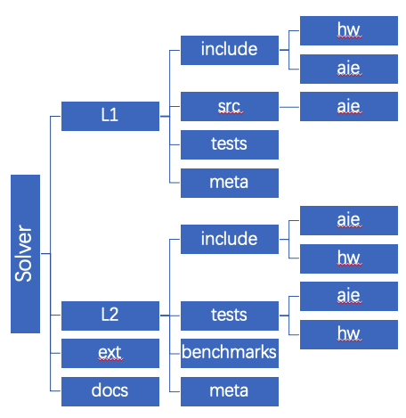

.. 
   
.. Copyright © 2019–2023 Advanced Micro Devices, Inc

`Terms and Conditions <https://www.amd.com/en/corporate/copyright>`_.
.. meta::
   :keywords: AIE, Cholesky, QRD, LeastSquaresSolution
   :description: Vitis Solver Library provides a collection of matrix decomposition operations on AIE.
   :xlnxdocumentclass: Document
   :xlnxdocumenttype: Tutorials

.. _overview:

.. toctree::
      :hidden:

Introduction
=================

The Solver Library for AIE provides a collection of matrix decomposition elements. Each element consists of a main graph class and corresponding AIE kernel implementation.
 
This documentation covers the following sections:

-  :ref:`Code Organization`
-  :ref:`Using Library Elements within Defined Graphs`
-  :ref:`Compiling and Simulation Using the Makefile`
-  :ref:`AIE Elements`
-  :ref:`AIE APIs Overview`

.. _Code Organization:

Code Organization
------------------
The following figure shows the Solver Library code organization.

.. _FIGURE_Solver_ORG:

 
    **Solver Library code Organization**

The directories L1 and L2 correspond to AIE kernels and AIE graphs for each library element, respectively. 
Graph class declarations are constants that allow you to include the AIE kernel in your design are located in the `L2/include/aie/`. 
AIE Kernels, the `.cpp` files and corresponding `.hpp` files are located in the `L1/src/aie` and `L1/include/aie` subdirectories, respectively.
The test harness that demonstrate the use of the library element are located in `L2/tests/aie`.

.. _Using Library Elements within Defined Graphs:

Using Library Elements within Defined Graphs
-------------------------------------------------

The user entry point for each library element is a graph class(L2 level). The entry point graph class contains one or more L1 level kernels and might contain one or more graph objects. 
For instance, to use library element of cholesky decomposition, include `cholesky_complex_decomposition_graph.hpp` from the `L2/include/aie/` folder. The test harness can be used as a reference example of how to instantiate a parameterized graph. For example, see `L2/tests/aie/<library_element>/test.hpp` and `test.cpp`.

.. _Compiling and Simulation Using the Makefile:

Compiling and Simulation Using the Makefile
-------------------------------------------------
A Makefile is included within each library element. It is located in the `L2/tests/aie/<library_element>` directory.

* Prerequisites:

.. code-block::

        source <your-Vitis-install-path>/lin64/Vitis/HEAD/settings64.sh
        source <your-XRT-install-path>/xbb/xrt/packages/setup.sh
        export PLATFORM=<your-platform-repo-install-path>

* Environment Variables:

For embedded devices like vck190, env variable SYSROOT, EDGE_COMMON_SW and PERL need to be set first. For example,
 
.. code-block::

        export SYSROOT=< path-to-platform-sysroot >
        export EDGE_COMMON_SW=< path-to-rootfs-and-Image-files >
        export PERL=<path-to-perl-installation-location >
 

To perform a x86 compilation/simulation, run:

.. code-block::
 
     make run TARGET=x86sim

To perform a aiesim compilation/simulation, run:

.. code-block::

     make run TARGET=aiesim

List of all makefile targets:

.. code-block::

	  make all TARGET=<x86sim/aiesim/> PLATFORM=<FPGA platform>
	      Command to generate the design for specified Target and Shell.

	  make run TARGET=<x86sim/aiesim/> PLATFORM=<FPGA platform>
	      Command to run application in emulation.

	  make xclbin TARGET=<x86sim/aiesim/> PLATFORM=<FPGA platform>
	      Command to build xclbin application.

	  make host TARGET=<x86sim/aiesim/>
	      Command to build host application.
          
	  make clean 
	      Command to remove the generated non-hardware files.

	  make cleanall TARGET=<x86sim/aiesim/>
	      Command to remove all the generated files.

