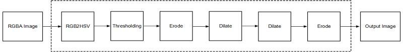

.. _design-example:

Design Examples Using xfOpenCV Library
======================================

All the hardware functions in the library have their own respective
examples that are available in the github. This section provides details
of image processing functions and pipelines implemented using a
combination of various functions in xfOpenCV. They illustrate how to
best implement various functionalities using the capabilities of both
the processor and the programmable logic. These examples also illustrate
different ways to implement complex dataflow paths. The following
examples are described in this section:

-  Iterative Pyramidal Dense Optical
   Flow <design-examples.html#jcr1510602888334>__
-  Corner Tracking Using Sparse Optical
   Flow <design-examples.html#ypx1510602888667>__
-  Color Detection <design-examples.html#dyn1510602889272>__
-  Difference of Gaussian
   Filter <design-examples.html#fmq1510602889620>__
-  Stereo Vision Pipeline <design-examples.html#pmt1510602889961>__

.. _interative-pyramidal:

Iterative Pyramidal Dense Optical Flow
--------------------------------------

The Dense Pyramidal Optical Flow example uses the ``xf::pyrDown`` and
``xf::densePyrOpticalFlow`` hardware functions from the xfOpenCV
library, to create an image pyramid, iterate over it and compute the
Optical Flow between two input images. The example uses two hardware
instances of the ``xf::pyrDown`` function to compute the image pyramids
of the two input images in parallel. The two image pyramids are
processed by one hardware instance of the ``xf::densePyrOpticalFlow``
function, starting from the smallest image size going up to the largest
image size. The output flow vectors of each iteration are fed back to
the hardware kernel as input to the hardware function. The output of the
last iteration on the largest image size is treated as the output of the
dense pyramidal optical flow example.

.. figure:: ./images/bui1554997287170.png
   :alt: 
   :figclass: image
   :name: jcr1510602888334__image_jh4_sq2_bcb

Specific details of the implementation of the example on the host follow
to help understand the process in which the claimed throughput is
achieved.

.. _ariaid-title3:

pyrof_hw()
~~~~~~~~~~

The ``pyrof_hw()`` is the host function that computes the dense optical
flow.

API Syntax
^^^^^^^^^^

.. code:: pre

   void pyrof_hw(cv::Mat im0, cv::Mat im1, cv::Mat flowUmat, cv::Mat flowVmat, xf::Mat<XF_32UC1,HEIGHT,WIDTH,XF_NPPC1> & flow, xf::Mat<XF_32UC1,HEIGHT,WIDTH,XF_NPPC1> & flow_iter, xf::Mat<XF_8UC1,HEIGHT,WIDTH,XF_NPPC1> mat_imagepyr1[NUM_LEVELS] , xf::Mat<XF_8UC1,HEIGHT,WIDTH,XF_NPPC1> mat_imagepyr2[NUM_LEVELS] , int pyr_h[NUM_LEVELS], int pyr_w[NUM_LEVELS])

Parameter Descriptions
^^^^^^^^^^^^^^^^^^^^^^

The table below describes the template and the function parameters.

+--------------+-------------------------------------------------------+
| Parameter    | Description                                           |
+==============+=======================================================+
| im0          | First input image in cv::Mat                          |
+--------------+-------------------------------------------------------+
| im1          | Second input image in cv::Mat                         |
+--------------+-------------------------------------------------------+
| flowUmat     | Allocated cv::Mat to store the horizontal component   |
|              | of the output flow vector                             |
+--------------+-------------------------------------------------------+
| flowVmat     | Allocated cv::Mat to store the vertical component of  |
|              | the output flow vector                                |
+--------------+-------------------------------------------------------+
| flow         | Allocated xf::Mat to temporarily store the packed     |
|              | flow vectors, during the iterative computation using  |
|              | the hardware function                                 |
+--------------+-------------------------------------------------------+
| flow_iter    | Allocated xf::Mat to temporarily store the packed     |
|              | flow vectors, during the iterative computation using  |
|              | the hardware function                                 |
+--------------+-------------------------------------------------------+
| mat_imagepyr | An array, of size equal to the number of image        |
| 1            | pyramid levels, of xf::Mat to store the image pyramid |
|              | of the first image                                    |
+--------------+-------------------------------------------------------+
| mat_imagepyr | An array, of size equal to the number of image        |
| 2            | pyramid levels, of xf::Mat to store the image pyramid |
|              | of the second image                                   |
+--------------+-------------------------------------------------------+
| pyr_h        | An array of integers which includes the size of       |
|              | number of image pyramid levels, to store the height   |
|              | of the image at each pyramid level                    |
+--------------+-------------------------------------------------------+
| pyr_w        | An array of integers which includes the size of the   |
|              | number of image pyramid levels, to store the width of |
|              | the image at each pyramid level                       |
+--------------+-------------------------------------------------------+

Dataflow
^^^^^^^^

The ``pyrof_hw()`` function performs the following:

#. Set the sizes of the images in various levels of the image pyramid
#. Copy input images from cv::Mat format to the xf::Mat object allocated
   to contain the largest image pyramid level
#. Create the image pyramid calling the
   ``pyr_dense_optical_flow_pyr_down_accel()`` function
#. Use the ``pyr_dense_optical_flow_accel()`` function to compute the
   optical flow output by iterating over the pyramid levels as input by
   the user
#. Unpack the flow vectors and convert them to the floating point, and
   return

The important steps 3 and 4 in the above processes will be explained in
detail.

.. _ariaid-title4:

pyr_dense_optical_flow_pyr_down_accel()
~~~~~~~~~~~~~~~~~~~~~~~~~~~~~~~~~~~~~~~

.. _api-syntax-1:

API Syntax
^^^^^^^^^^

.. code:: pre

   void pyr_dense_optical_flow_pyr_down_accel(xf::Mat<XF_8UC1,HEIGHT,WIDTH,XF_NPPC1> mat_imagepyr1[NUM_LEVELS], xf::Mat<XF_8UC1,HEIGHT,WIDTH,XF_NPPC1> mat_imagepyr2[NUM_LEVELS])

.. _parameter-descriptions-1:

Parameter Descriptions
^^^^^^^^^^^^^^^^^^^^^^

The table below describes the template and the function parameters.

+--------------+-------------------------------------------------------+
| Parameter    | Description                                           |
+==============+=======================================================+
| mat_imagepyr | An array, of size equal to the number of image        |
| 1            | pyramid levels, of xf::Mat to store the image pyramid |
|              | of the first image. The memory location corresponding |
|              | to the highest pyramid level [0] in this allocated    |
|              | memory must contain the first input image.            |
+--------------+-------------------------------------------------------+
| mat_imagepyr | An array, of size equal to the number of image        |
| 2            | pyramid levels, of xf::Mat to store the image pyramid |
|              | of the second image. The memory location              |
|              | corresponding to the highest pyramid level [0] in     |
|              | this allocated memory must contain the second input   |
|              | image.                                                |
+--------------+-------------------------------------------------------+

The ``pyr_dense_optical_flow_pyr_down_accel()`` just runs one for loop
calling the ``xf::pyrDown`` hardware function as follows:

.. code:: pre

   for(int pyr_comp=0;pyr_comp<NUM_LEVELS-1; pyr_comp++)
       {
       #pragma SDS async(1)
       #pragma SDS resource(1)
           xf::pyrDown<XF_8UC1,HEIGHT,WIDTH,XF_NPPC1,XF_USE_URAM>(mat_imagepyr1[pyr_comp], mat_imagepyr1[pyr_comp+1]);
       #pragma SDS async(2)
       #pragma SDS resource(2)
           xf::pyrDown<XF_8UC1,HEIGHT,WIDTH,XF_NPPC1,XF_USE_URAM>(mat_imagepyr2[pyr_comp], mat_imagepyr2[pyr_comp+1]);
       #pragma SDS wait(1)
       #pragma SDS wait(2) 
       }

The code is straightforward without the pragmas, and the ``xf::pyrDown``
function is being called twice every iteration. First with the first
image and then with the second image. Note that the input to the next
iteration is the output of the current iteration. The pragma #pragma SDS
async(ID) makes the Arm® processor call the hardware function and not
wait for the hardware function to return. The Arm processor takes some
cycles to call the function, which includes programming the DMA. The
pragma #pragma SDS wait(ID) makes the Arm processor wait for the
hardware function called with the async(ID) pragma to finish processing.
The pragma #pragma SDS resource(ID) creates a separate hardware instance
each time the hardware function is called with a different ID. With this
new information it is easy to assimilate that the loop in the above host
function calls the two hardware instances of ``xf::pyrDown`` functions
in parallel, waits until both the functions return and proceed to the
next iteration.

Dense Pyramidal Optical Flow Computation
^^^^^^^^^^^^^^^^^^^^^^^^^^^^^^^^^^^^^^^^

.. code:: pre

   for (int l=NUM_LEVELS-1; l>=0; l--) {
           //compute current level height
           int curr_height = pyr_h[l];
           int curr_width = pyr_w[l];
           
           //compute the flow vectors for the current pyramid level iteratively
           for(int iterations=0;iterations<NUM_ITERATIONS; iterations++)
           {
               bool scale_up_flag = (iterations==0)&&(l != NUM_LEVELS-1);
               int next_height = (scale_up_flag==1)?pyr_h[l+1]:pyr_h[l]; 
               int next_width  = (scale_up_flag==1)?pyr_w[l+1]:pyr_w[l]; 
               float scale_in = (next_height - 1)*1.0/(curr_height - 1);
               ap_uint<1> init_flag = ((iterations==0) && (l==NUM_LEVELS-1))? 1 : 0;
               if(flag_flowin)
               {
                   flow.rows = pyr_h[l];
                   flow.cols = pyr_w[l];
                   flow.size = pyr_h[l]*pyr_w[l];
                   pyr_dense_optical_flow_accel(mat_imagepyr1[l], mat_imagepyr2[l], flow_iter, flow, l, scale_up_flag, scale_in, init_flag);
                   flag_flowin = 0;
               }
               else
               {
                   flow_iter.rows = pyr_h[l];
                   flow_iter.cols = pyr_w[l];
                   flow_iter.size = pyr_h[l]*pyr_w[l];
                   pyr_dense_optical_flow_accel(mat_imagepyr1[l], mat_imagepyr2[l], flow, flow_iter, l, scale_up_flag, scale_in, init_flag);
                   flag_flowin = 1;
               }
           }//end iterative coptical flow computation
       } // end pyramidal iterative optical flow HLS computation

The Iterative Pyramidal Dense Optical Flow is computed in a nested for
loop which runs for iterations*pyramid levels number of iterations. The
main loop starts from the smallest image size and iterates up to the
largest image size. Before the loop iterates in one pyramid level, it
sets the current pyramid level’s height and width, in curr_height and
current_width variables. In the nested loop, the next_height variable is
set to the previous image height if scaling up is necessary, that is, in
the first iterations. As divisions are costly and one time divisions can
be avoided in hardware, the scale factor is computed in the host and
passed as an argument to the hardware kernel. After each pyramid level,
in the first iteration, the scale-up flag is set to let the hardware
function know that the input flow vectors need to be scaled up to the
next higher image size. Scaling up is done using bilinear interpolation
in the hardware kernel.

After all the input data is prepared, and the flags are set, the host
processor calls the hardware function. Please note that the host
function swaps the flow vector inputs and outputs to the hardware
function to iteratively solve the optimization problem. Also note that
the ``pyr_dense_optical_flow_accel()`` function is just a wrapper to the
hardware function ``xf::densePyrOpticalFlow``. Template parameters to
the hardware function are passed inside this wrapper function.

.. _ariaid-title5:

Corner Tracking Using Sparse Optical Flow
-----------------------------------------

This example illustrates how to detect and track the characteristic
feature points in a set of successive frames of video. A Harris corner
detector is used as the feature detector, and a modified version of
Lucas Kanade optical flow is used for tracking. The core part of the
algorithm takes in current and next frame as the inputs and outputs the
list of tracked corners. The current image is the first frame in the
set, then corner detection is performed to detect the features to track.
The number of frames in which the points need to be tracked is also
provided as the input.

Corner tracking example uses five hardware functions from the xfOpenCV
library ``xf::cornerHarris``, ``xf:: cornersImgToList``,
``xf::cornerUpdate``, ``xf::pyrDown``, and ``xf::densePyrOpticalFlow``.

.. figure:: ./images/tpr1554997250097.png
   :alt: 
   :figclass: image
   :name: ypx1510602888667__image_dmv_5cv_hdb

A new hardware function, ``xf::cornerUpdate``, has been added to ensure
that the dense flow vectors from the output of
the\ ``xf::densePyrOpticalFlow`` function are sparsely picked and stored
in a new memory location as a sparse array. This was done to ensure that
the next function in the pipeline would not have to surf through the
memory by random accesses. The function takes corners from Harris corner
detector and dense optical flow vectors from the dense pyramidal optical
flow function and outputs the updated corner locations, tracking the
input corners using the dense flow vectors, thereby imitating the sparse
optical flow behavior. This hardware function runs at 300 MHz for 10,000
corners on a 720p image, adding very minimal latency to the pipeline.

.. _ariaid-title6:

cornerUpdate()
~~~~~~~~~~~~~~

.. _api-syntax-2:

API Syntax
^^^^^^^^^^

.. code:: pre

   template <unsigned int MAXCORNERSNO, unsigned int TYPE, unsigned int ROWS, unsigned int COLS, unsigned int NPC>
   void cornerUpdate(ap_uint<64> *list_fix, unsigned int *list, uint32_t nCorners, xf::Mat<TYPE,ROWS,COLS,NPC> &flow_vectors, ap_uint<1> harris_flag)

.. _parameter-descriptions-2:

Parameter Descriptions
^^^^^^^^^^^^^^^^^^^^^^

The following table describes the template and the function parameters.

.. table:: Table 1. CornerUpdate Function Parameter Descriptions

   +----------+-----------------------------------------------------------+
   | Paramete | Description                                               |
   | r        |                                                           |
   +==========+===========================================================+
   | MAXCORNE | Maximum number of corners that the function needs to work |
   | RSNO     | on                                                        |
   +----------+-----------------------------------------------------------+
   | TYPE     | Input Pixel Type. Only 8-bit, unsigned, 1 channel is      |
   |          | supported (XF_8UC1)                                       |
   +----------+-----------------------------------------------------------+
   | ROWS     | Maximum height of input and output image (Must be         |
   |          | multiple of 8)                                            |
   +----------+-----------------------------------------------------------+
   | COLS     | Maximum width of input and output image (Must be multiple |
   |          | of 8)                                                     |
   +----------+-----------------------------------------------------------+
   | NPC      | Number of pixels to be processed per cycle. This function |
   |          | supports only XF_NPPC1 or 1-pixel per cycle operations.   |
   +----------+-----------------------------------------------------------+
   | list_fix | A list of packed fixed point coordinates of the corner    |
   |          | locations in 16, 5 (16 integer bits and 5 fractional      |
   |          | bits) format. Bits from 20 to 0 represent the column      |
   |          | number, while the bits 41 to 21 represent the row number. |
   |          | The rest of the bits are used for flag, this flag is set  |
   |          | when the tracked corner is valid.                         |
   +----------+-----------------------------------------------------------+
   | list     | A list of packed positive short integer coordinates of    |
   |          | the corner locations in unsigned short format. Bits from  |
   |          | 15 to 0 represent the column number, while the bits 31 to |
   |          | 16 represent the row number. This list is same as the     |
   |          | list output by Harris Corner Detector.                    |
   +----------+-----------------------------------------------------------+
   | nCorners | Number of corners to track                                |
   +----------+-----------------------------------------------------------+
   | flow_vec | Packed flow vectors as in xf::DensePyrOpticalFlow         |
   | tors     | function                                                  |
   +----------+-----------------------------------------------------------+
   | harris_f | If set to 1, the function takes input corners from list.  |
   | lag      |                                                           |
   |          | if set to 0, the function takes input corners from        |
   |          | list_fix.                                                 |
   +----------+-----------------------------------------------------------+

The example codeworks on an input video which is read and processed
using the xfOpenCV library. The core processing and tracking is done by
the ``xf_corner_tracker_accel()`` function at the host.

.. _ariaid-title7:

cornersImgToList()
~~~~~~~~~~~~~~~~~~

.. _api-syntax-3:

API Syntax
^^^^^^^^^^

.. code:: pre

   template <unsigned int MAXCORNERSNO, unsigned int TYPE, unsigned int ROWS, unsigned int COLS, unsigned int NPC>
   void cornersImgToList(xf::Mat<TYPE,ROWS,COLS,NPC> &_src, unsigned int list[MAXCORNERSNO], unsigned int *ncorners)

.. _parameter-descriptions-3:

Parameter Descriptions
^^^^^^^^^^^^^^^^^^^^^^

The following table describes the template and theKintex® UltraScale+™
function parameters.

.. table:: Table 2. CornerImgToList Function Parameter Descriptions

   +----------+-----------------------------------------------------------+
   | Paramete | Description                                               |
   | r        |                                                           |
   +==========+===========================================================+
   | \_src    | The output image of harris corner detector. The size of   |
   |          | this xf::Mat object is the size of the input image to     |
   |          | Harris corner detector. The value of each pixel is 255 if |
   |          | a corner is present in the location, 0 otherwise.         |
   +----------+-----------------------------------------------------------+
   | list     | A 32 bit memory allocated, the size of MAXCORNERS, to     |
   |          | store the corners detected by Harris Detector             |
   +----------+-----------------------------------------------------------+
   | ncorners | Total number of corners detected by Harris, that is, the  |
   |          | number of corners in the list                             |
   +----------+-----------------------------------------------------------+

.. _ariaid-title8:

cornerTracker()
~~~~~~~~~~~~~~~

The ``xf_corner_tracker_accel()`` function does the core procesing and
tracking at the host.

.. _api-syntax-4:

API Syntax
^^^^^^^^^^

.. code:: pre

   void cornerTracker(xf::Mat<XF_32UC1,HEIGHT,WIDTH,XF_NPPC1> & flow, xf::Mat<XF_32UC1,HEIGHT,WIDTH,XF_NPPC1> & flow_iter, xf::Mat<XF_8UC1,HEIGHT,WIDTH,XF_NPPC1> mat_imagepyr1[NUM_LEVELS] , xf::Mat<XF_8UC1,HEIGHT,WIDTH,XF_NPPC1> mat_imagepyr2[NUM_LEVELS] , xf::Mat<XF_8UC1, HEIGHT, WIDTH, XF_NPPC1> &inHarris, xf::Mat<XF_8UC1, HEIGHT, WIDTH, XF_NPPC1> &outHarris, unsigned int *list, ap_uint<64> *listfixed, int pyr_h[NUM_LEVELS], int pyr_w[NUM_LEVELS], unsigned int *num_corners, unsigned int harrisThresh, bool *harris_flag)

.. _parameter-descriptions-4:

Parameter Descriptions
^^^^^^^^^^^^^^^^^^^^^^

The table below describes the template and the function parameters.

+--------------+-------------------------------------------------------+
| Parameter    | Description                                           |
+==============+=======================================================+
| flow         | Allocated xf::Mat to temporarily store the packed     |
|              | flow vectors during the iterative computation using   |
|              | the hardware function                                 |
+--------------+-------------------------------------------------------+
| flow_iter    | Allocated xf::Mat to temporarily store the packed     |
|              | flow vectors during the iterative computation using   |
|              | the hardware function                                 |
+--------------+-------------------------------------------------------+
| mat_imagepyr | An array, of size equal to the number of image        |
| 1            | pyramid levels, of xf::Mat to store the image pyramid |
|              | of the first image                                    |
+--------------+-------------------------------------------------------+
| mat_imagepyr | An array, of size equal to the number of image        |
| 2            | pyramid levels, of xf::Mat to store the image pyramid |
|              | of the second image                                   |
+--------------+-------------------------------------------------------+
| inHarris     | Input image to Harris Corner Detector in xf::Mat      |
+--------------+-------------------------------------------------------+
| outHarris    | Output image from Harris detector. Image has 255 if a |
|              | corner is present in the location and 0 otherwise     |
+--------------+-------------------------------------------------------+
| list         | A 32 bit memory allocated, the size of MAXCORNERS, to |
|              | store the corners detected by Harris Detector         |
+--------------+-------------------------------------------------------+
| listfixed    | A 64 bit memory allocated, the size of MAXCORNERS, to |
|              | store the corners tracked by xf::cornerUpdate         |
+--------------+-------------------------------------------------------+
| pyr_h        | An array of integers the size of number of image      |
|              | pyramid levels to store the height of the image at    |
|              | each pyramid level                                    |
+--------------+-------------------------------------------------------+
| pyr_w        | An array of integers the size of number of image      |
|              | pyramid levels to store the width of the image at     |
|              | each pyramid level                                    |
+--------------+-------------------------------------------------------+
| num_corners  | An array, of size equal to the number ofNumber of     |
|              | corners detected by Harris Corner Detector            |
+--------------+-------------------------------------------------------+
| harrisThresh | Threshold input to the Harris Corner Detector,        |
|              | xf::harris                                            |
+--------------+-------------------------------------------------------+
| harris_flag  | Flag used by the caller of this function to use the   |
|              | corners detected by xf::harris for the set of input   |
|              | images                                                |
+--------------+-------------------------------------------------------+

Image Processing
^^^^^^^^^^^^^^^^

The following steps demonstrate the Image Processing procedure in the
hardware pipeline

#. ``xf::cornerharris`` is called to start processing the first input
   image
#. The output of\ ``xf::cornerHarris`` is pipelined by SDSoC™ on
   hardware to\ ``xf::cornersImgToList``. This function takes in an
   image with corners marked as 255 and 0 elsewhere, and converts them
   to a list of corners.
#. Simultaneously,\ ``xf::pyrDown`` creates the two image pyramids and
   Dense Optical Flow is computed using the two image pyramids as
   described in the Iterative Pyramidal Dense Optical Flow example.
#. ``xf::densePyrOpticalFlow`` is called with the two image pyramids as
   inputs.
#. ``xf::cornerUpdate`` function is called to track the corner locations
   in the second image. If harris_flag is enabled, the ``cornerUpdate``
   tracks corners from the output of the list, else it tracks the
   previously tracked corners.

.. code:: pre

   if(*harris_flag == true)
       {
       #pragma SDS async(1)
           xf::cornerHarris<FILTER_WIDTH,BLOCK_WIDTH,NMS_RADIUS,XF_8UC1,HEIGHT,WIDTH,XF_NPPC1,XF_USE_URAM>(inHarris, outHarris, Thresh, k);
       #pragma SDS async(2)
           xf::cornersImgToList<MAXCORNERS,XF_8UC1,HEIGHT,WIDTH,XF_NPPC1>(outHarris, list, &nCorners);
       }
       //Code to compute Iterative Pyramidal Dense Optical Flow
       if(*harris_flag == true)
       {
       #pragma SDS wait(1) 
       #pragma SDS wait(2) 
           *num_corners = nCorners;
       }
       if(flag_flowin)
       {
           xf::cornerUpdate<MAXCORNERS,XF_32UC1,HEIGHT,WIDTH,XF_NPPC1>(listfixed, list, *num_corners, flow_iter, (ap_uint<1>)(*harris_flag));
       }                                                                                
       else                                                                             
       {                                                                                
           xf::cornerUpdate<MAXCORNERS,XF_32UC1,HEIGHT,WIDTH,XF_NPPC1>(listfixed, list, *num_corners, flow, (ap_uint<1>)(*harris_flag));
       }
       if(*harris_flag == true)
       {
           *harris_flag = false;
       }

The ``xf_corner_tracker_accel()`` function takes a flag called
harris_flag which is set during the first frame or when the corners need
to be redetected. The ``xf::cornerUpdate`` function outputs the updated
corners to the same memory location as the output corners list of
``xf::cornerImgToList``. This means that when harris_flag is unset, the
corners input to the ``xf::cornerUpdate`` are the corners tracked in the
previous cycle, that is, the corners in the first frame of the current
input frames.

After the Dense Optical Flow is computed, if harris_flag is set, the
number of corners that ``xf::cornerharris`` has detected and
``xf::cornersImgToList`` has updated is copied to num_corners variable
which is one of the outputs of the ``xf_corner_tracker_accel()``
function. The other being the tracked corners list, listfixed. If
harris_flag is set, ``xf::cornerUpdate`` tracks the corners in ‘list’
memory location, otherwise it tracks the corners in ‘listfixed’ memory
location.

.. _ariaid-title9:

Color Detection
---------------

The Color Detection algorithm is basically used for color object
tracking and object detection, based on the color of the object. The
color based methods are very useful for object detection and
segmentation, when the object and the background have a significant
difference in color.

The Color Detection example uses four hardware functions from the
xfOpenCV library. They are:

-  xf::RGB2HSV
-  xf::colorthresholding
-  xf:: erode
-  xf:: dilate

In the Color Detection example, the color space of the original BGR
image is converted into an HSV color space. Because HSV color space is
the most suitable color space for color based image segmentation. Later,
based on the H (hue), S (saturation) and V (value) values, apply the
thresholding operation on the HSV image and return either 255 or 0.
After thresholding the image, apply erode (morphological opening) and
dilate (morphological opening) functions to reduce unnecessary white
patches (noise) in the image. Here, the example uses two hardware
instances of erode and dilate functions. The erode followed by dilate
and once again applying dilate followed by erode.

The following example demonstrates the Color Detection algorithm.

.. code:: pre

   void colordetect_accel(xf::Mat<XF_8UC3, HEIGHT, WIDTH, XF_NPPC1> &_src,
           xf::Mat<XF_8UC3, HEIGHT, WIDTH, XF_NPPC1> &_rgb2hsv,
           xf::Mat<XF_8UC1, HEIGHT, WIDTH, XF_NPPC1> &_thresholdedimg,
           xf::Mat<XF_8UC1, HEIGHT, WIDTH, XF_NPPC1> &_erodeimage1,
           xf::Mat<XF_8UC1, HEIGHT, WIDTH, XF_NPPC1> &_dilateimage1,
           xf::Mat<XF_8UC1, HEIGHT, WIDTH, XF_NPPC1> &_dilateimage2,
           xf::Mat<XF_8UC1, HEIGHT, WIDTH, XF_NPPC1> &_dst,
           unsigned char *low_thresh, unsigned char *high_thresh){

   xf::RGB2HSV< XF_8UC3,HEIGHT, WIDTH, XF_NPPC1>(_src, _rgb2hsv);
   xf::colorthresholding<XF_8UC3,XF_8UC1,MAXCOLORS,HEIGHT,WIDTH, XF_NPPC1>(_rgb2hsv,_  thresholdedimage, low_thresh, high_thresh);
   xf::erode<XF_BORDER_CONSTANT,XF_8UC1,HEIGHT, WIDTH, XF_NPPC1>(_thresholdedimg, _      erodeimage1);
       xf::dilate<XF_BORDER_CONSTANT,XF_8UC1,HEIGHT, WIDTH, XF_NPPC1>(_ erodeimage1, _ dilateimage1);
       xf::dilate<XF_BORDER_CONSTANT,XF_8UC1,HEIGHT, WIDTH, XF_NPPC1>(_ dilateimage1, _ dilateimage2);
       xf::erode<XF_BORDER_CONSTANT,XF_8UC1,HEIGHT, WIDTH, XF_NPPC1>(_ dilateimage2, _dst);

   }

In the given example, the source image is passed to the ``xf::RGB2HSV``
function, the output of that function is passed to the
``xf::colorthresholding`` module, the thresholded image is passed to the
``xf::erode`` function and, the ``xf::dilate`` functions and the final
output image are returned.

.. _ariaid-title10:

Difference of Gaussian Filter
-----------------------------

The Difference of Gaussian Filter example uses four hardware functions
from the xfOpenCV library. They are:

-  xf::GaussianBlur
-  xf::duplicateMat
-  xf::delayMat
-  xf::subtract

The Difference of Gaussian Filter function can be implemented by
applying Gaussian Filter on the original source image, and that Gaussian
blurred image is duplicated as two images. The Gaussian blur function is
applied to one of the duplicated images, whereas the other one is stored
as it is. Later, perform the Subtraction function on, two times Gaussian
applied image and one of the duplicated image. Here, the duplicated
image has to wait until the Gaussian applied for other one generates at
least for one pixel output. Therefore, here xf::delayMat function is
used to add delay.

.. figure:: ./images/crx1554997276344.png
   :alt: 
   :figclass: image
   :name: fmq1510602889620__image_lgr_1xf_bcb

The following example demonstrates the Difference of Gaussian Filter
example.

.. code:: pre

   void gaussian_diff_accel(xf::Mat<XF_8UC1,HEIGHT,WIDTH,NPC1> &imgInput,
           xf::Mat<XF_8UC1,HEIGHT,WIDTH,XF_NPPC1> &imgin1,
           xf::Mat<XF_8UC1,HEIGHT,WIDTH, XF_NPPC1> &imgin2,
           xf::Mat<XF_8UC1,HEIGHT,WIDTH, XF_NPPC1> &imgin3,
           xf::Mat<XF_8UC1,HEIGHT,WIDTH, XF_NPPC1> &imgin4,
           xf::Mat<XF_8UC1,HEIGHT,WIDTH, XF_NPPC1> &imgin5,
           xf::Mat<XF_8UC1,HEIGHT,WIDTH, XF_NPPC1>&imgOutput,
   float sigma)
   {

       xf::GaussianBlur<FILTER_WIDTH, XF_BORDER_CONSTANT, XF_8UC1, HEIGHT, WIDTH, XF_NPPC1>
   (imgInput, imgin1, sigma);
       xf::duplicateMat<XF_8UC1, HEIGHT, WIDTH, XF_NPPC1>(imgin1,imgin2,imgin3);
       xf::delayMat<MAXDELAY, XF_8UC1, HEIGHT, WIDTH, XF_NPPC1>(imgin3,imgin5);
       xf::GaussianBlur<FILTER_WIDTH, XF_BORDER_CONSTANT, XF_8UC1, HEIGHT, WIDTH, XF_NPPC1>
   (imgin2, imgin4, sigma);
   xf::subtract<XF_CONVERT_POLICY_SATURATE, XF_8UC1, HEIGHT, WIDTH, XF_NPPC1>(imgin5,imgin4,imgOutput);

   }

In the given example, the Gaussain Blur function is applied for source
image imginput, and resultant image imgin1 is passed to
xf::duplicateMat. The imgin2 and imgin3 are the duplicate images of
Gaussian applied image. Again gaussian blur is applied to imgin2 and the
result is stored in imgin4. Now, perform the subtraction between imgin4
and imgin3, but here imgin3 has to wait up to at least one pixel of
imgin4 generation. So, delay has applied for imgin3 and stored in
imgin5. Finally the subtraction performed on imgin4 and imgin5.

.. _ariaid-title11:

Stereo Vision Pipeline
----------------------

Disparity map generation is one of the first steps in creating a three
dimensional map of the environment. The xfOpenCV library has components
to build an image processing pipeline to compute a disparity map given
the camera parameters and inputs from a stereo camera setup.

The two main components involved in the pipeline are stereo
rectification and disparity estimation using local block matching
method. While disparity estimation using local block matching is a
discrete component in xfOpenCV, rectification block can be constructed
using ``xf::InitUndistortRectifyMapInverse()`` and ``xf::Remap()``. The
dataflow pipeline is shown below. The camera parameters are an
additional input to the pipeline.

.. figure:: ./images/qlb1554997048260.png
   :alt: 
   :figclass: image
   :width: 560px
   :height: 240px

The following code is for the pipeline.

.. code:: pre

   void stereopipeline_accel(xf::Mat<XF_8UC1, XF_HEIGHT, XF_WIDTH, XF_NPPC1> &leftMat, xf::Mat<XF_8UC1, XF_HEIGHT, XF_WIDTH, XF_NPPC1> &rightMat, xf::Mat<XF_16UC1, XF_HEIGHT, XF_WIDTH, XF_NPPC1> &dispMat,
       xf::Mat<XF_32FC1, XF_HEIGHT, XF_WIDTH, XF_NPPC1> &mapxLMat, xf::Mat<XF_32FC1, XF_HEIGHT, XF_WIDTH, XF_NPPC1> &mapyLMat, xf::Mat<XF_32FC1, XF_HEIGHT, XF_WIDTH, XF_NPPC1> &mapxRMat, 
       xf::Mat<XF_32FC1, XF_HEIGHT, XF_WIDTH, XF_NPPC1> &mapyRMat, xf::Mat<XF_8UC1, XF_HEIGHT, XF_WIDTH, XF_NPPC1> &leftRemappedMat, xf::Mat<XF_8UC1, XF_HEIGHT, XF_WIDTH, XF_NPPC1> &rightRemappedMat,
       xf::xFSBMState<SAD_WINDOW_SIZE,NO_OF_DISPARITIES,PARALLEL_UNITS> &bm_state, ap_fixed<32,12> *cameraMA_l_fix, ap_fixed<32,12> *cameraMA_r_fix, ap_fixed<32,12> *distC_l_fix, ap_fixed<32,12> *distC_r_fix, 
       ap_fixed<32,12> *irA_l_fix, ap_fixed<32,12> *irA_r_fix, int _cm_size, int _dc_size)
   {
       xf::InitUndistortRectifyMapInverse<XF_CAMERA_MATRIX_SIZE,XF_DIST_COEFF_SIZE,XF_32FC1,XF_HEIGHT,XF_WIDTH,XF_NPPC1>(cameraMA_l_fix,distC_l_fix,irA_l_fix,mapxLMat,mapyLMat,_cm_size,_dc_size);
       xf::remap<XF_REMAP_BUFSIZE,XF_INTERPOLATION_BILINEAR,XF_8UC1,XF_32FC1,XF_8UC1,XF_HEIGHT,XF_WIDTH,XF_NPPC1,XF_USE_URAM>(leftMat,leftRemappedMat,mapxLMat,mapyLMat);

       xf::InitUndistortRectifyMapInverse<XF_CAMERA_MATRIX_SIZE,XF_DIST_COEFF_SIZE,XF_32FC1,XF_HEIGHT,XF_WIDTH,XF_NPPC1>(cameraMA_r_fix,distC_r_fix,irA_r_fix,mapxRMat,mapyRMat,_cm_size,_dc_size);
       xf::remap<XF_REMAP_BUFSIZE,XF_INTERPOLATION_BILINEAR,XF_8UC1,XF_32FC1,XF_8UC1,XF_HEIGHT,XF_WIDTH,XF_NPPC1,XF_USE_URAM>(rightMat,rightRemappedMat,mapxRMat,mapyRMat);

       xf::StereoBM<SAD_WINDOW_SIZE,NO_OF_DISPARITIES,PARALLEL_UNITS,XF_8UC1,XF_16UC1,XF_HEIGHT,XF_WIDTH,XF_NPPC1,XF_USE_URAM>(leftRemappedMat, rightRemappedMat, dispMat, bm_state);
   }
