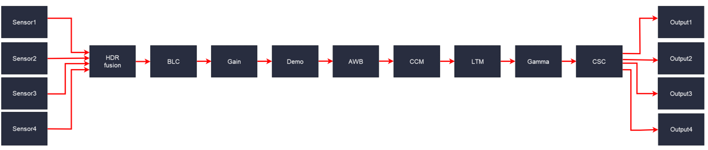

.. meta::
   :keywords: Vision, Library, Vitis Vision Library, Iterative Pyramidal, Corner Tracking, cornerUpdate, cornersImgToList, 
   :description: Design examples Using Vitis Vision library.
   :xlnxdocumentclass: Document
   :xlnxdocumenttype: Tutorials

.. _design-example:

Design Examples Using Vitis Vision Library
###########################################

All the hardware functions in the library have their own respective
examples that are available in the github. This section provides details
of image processing functions and pipelines implemented using a
combination of various functions in Vitis vision. They illustrate how to
best implement various functionalities using the capabilities of both
the processor and the programmable logic. These examples also illustrate
different ways to implement complex dataflow paths. The following
examples are described in this section:

-  `Iterative Pyramidal Dense Optical Flow <#iterative-pyramidal>`_
-  `Corner Tracking Using Optical Flow <#corner-tracking>`_
-  `Color Detection <#color-detection>`_
-  `Defect Detection <#defect-detection-pipeline>`_
-  `Difference of Gaussian Filter <#difference-gaussian-filter>`_
-  `Stereo Vision Pipeline <#stereo-vision>`_
-  `Blob From Image <#x-mlpipeline>`_
-  `Letterbox <#letter-box>`_
-  `Image Sensor Processing pipeline <#isp>`_
-  `Image Sensor Processing pipeline - 2020.2 version <#isp-202>`_
-  `Image Sensor Processing pipeline - 2021.1 version <#isp-201>`_
-  `Image Sensor Processing pipeline with HDR <#isp-201hdr>`_
-  `Image Sensor Processing pipeline with GTM <#isp-201gtm>`_
-  `Mono image Sensor Processing pipeline <#isp-201mono>`_
-  `RGB-IR image Sensor Processing pipeline <#isp_201rgbir>`_
-  `Image Sensor Processing multistream pipeline - 2022.2 version <#isp-201multistream>`_
-  `Image Sensor Processing All-in-one pipeline <#isp-aio>`_

.. Important::
   **All the functions in the library are implemented in streaming model except 7. Crop, EdgeTracing, MeanShiftTracking, Rotate are memory mapped implemenations. These functions need to have the flag __SDA_MEM_MAP__ set for compiling correctly**

.. Important::
   **Default depth value for all the memory mapped implemenations(Crop, EdgeTracing, MeanShiftTracking, Rotate) is "_XFCVDEPTH_DEFAULT = -1". 
   Default depth value for all the streaming model implemenations is "_XFCVDEPTH_DEFAULT = 2".**

.. _iterative-pyramidal:

Iterative Pyramidal Dense Optical Flow
======================================

The Dense Pyramidal Optical Flow example uses the ``xf::cv::pyrDown`` and
``xf::cv::densePyrOpticalFlow`` hardware functions from the Vitis vision
library, to create an image pyramid, iterate over it and compute the
Optical Flow between two input images. The example uses ``xf::cv::pyrDown`` function to compute the image pyramids
of the two input images. The two image pyramids are
processed by ``xf::cv::densePyrOpticalFlow``
function, starting from the smallest image size going up to the largest
image size. The output flow vectors of each iteration are fed back to
the hardware kernel as input to the hardware function. The output of the
last iteration on the largest image size is treated as the output of the
dense pyramidal optical flow example.

.. figure:: ./images/bui1554997287170.png
   :alt: 
   :figclass: image
   :name: jcr1510602888334__image_jh4_sq2_bcb

The Iterative Pyramidal Dense Optical Flow is computed in a nested for
loop which runs for iterations*pyramid levels number of iterations. The
main loop starts from the smallest image size and iterates up to the
largest image size. Before the loop iterates in one pyramid level, it
sets the current pyramid level’s height and width, in curr_height and
current_width variables. In the nested loop, the next_height variable is
set to the previous image height if scaling up is necessary, that is, in
the first iterations. As divisions are costly and one time divisions can
be avoided in hardware, the scale factor is computed in the host and
passed as an argument to the hardware kernel. After each pyramid level,
in the first iteration, the scale-up flag is set to let the hardware
function know that the input flow vectors need to be scaled up to the
next higher image size. Scaling up is done using bilinear interpolation
in the hardware kernel.

After all the input data is prepared, and the flags are set, the host
processor calls the hardware function. Please note that the host
function swaps the flow vector inputs and outputs to the hardware
function to iteratively solve the optimization problem. 

.. _corner-tracking:

Corner Tracking Using Optical Flow
===================================

This example illustrates how to detect and track the characteristic
feature points in a set of successive frames of video. A Harris corner
detector is used as the feature detector, and a modified version of
Lucas Kanade optical flow is used for tracking. The core part of the
algorithm takes in current and next frame as the inputs and outputs the
list of tracked corners. The current image is the first frame in the
set, then corner detection is performed to detect the features to track.
The number of frames in which the points need to be tracked is also
provided as the input.

Corner tracking example uses five hardware functions from the Vitis vision
library ``xf::cv::cornerHarris``, ``xf::cv:: cornersImgToList``,
``xf::cv::cornerUpdate``, ``xf::cv::pyrDown``, and ``xf::cv::densePyrOpticalFlow``.

.. figure:: ./images/tpr1554997250097.png
   :alt: 
   :figclass: image
   :name: ypx1510602888667__image_dmv_5cv_hdb

The function, ``xf::cv::cornerUpdate``, has been added to ensure
that the dense flow vectors from the output of
the\ ``xf::cv::densePyrOpticalFlow`` function are sparsely picked and stored
in a new memory location as a sparse array. This was done to ensure that
the next function in the pipeline would not have to surf through the
memory by random accesses. The function takes corners from Harris corner
detector and dense optical flow vectors from the dense pyramidal optical
flow function and outputs the updated corner locations, tracking the
input corners using the dense flow vectors, thereby imitating the sparse
optical flow behavior. This hardware function runs at 300 MHz for 10,000
corners on a 720p image, adding very minimal latency to the pipeline.

cornerUpdate()
---------------

.. rubric:: API Syntax

.. code:: c

   template <unsigned int MAXCORNERSNO, unsigned int TYPE, unsigned int ROWS, unsigned int COLS, unsigned int NPC, int XFCVDEPTH_IN = _XFCVDEPTH_DEFAULT>
   void cornerUpdate(ap_uint<64> *list_fix, unsigned int *list, uint32_t nCorners, xf::cv::Mat<TYPE,ROWS,COLS,NPC, XFCVDEPTH_IN> &flow_vectors, ap_uint<1> harris_flag)

.. rubric:: Parameter Descriptions

The following table describes the template and the function parameters.

.. table:: Table: CornerUpdate Function Parameter Descriptions

   +------------------+-----------------------------------------------------------+
   | Paramete         | Description                                               |
   | r                |                                                           |
   +==================+===========================================================+
   | MAXCORNE         | Maximum number of corners that the function needs to work |
   | RSNO             | on                                                        |
   +------------------+-----------------------------------------------------------+
   | TYPE             | Input Pixel Type. Only 8-bit, unsigned, 1 channel is      |
   |                  | supported (XF_8UC1)                                       |
   +------------------+-----------------------------------------------------------+
   | ROWS             | Maximum height of input and output image (Must be         |
   |                  | multiple of 8)                                            |
   +------------------+-----------------------------------------------------------+
   | COLS             | Maximum width of input and output image (Must be multiple |
   |                  | of 8)                                                     |
   +------------------+-----------------------------------------------------------+
   | NPC              | Number of pixels to be processed per cycle. This function |
   |                  | supports only XF_NPPC1 or 1-pixel per cycle operations.   |
   +------------------+-----------------------------------------------------------+
   | XFCVDEPTH_IN     | Depth of input image                                      |
   +------------------+-----------------------------------------------------------+
   | list_fix         | A list of packed fixed point coordinates of the corner    |
   |                  | locations in 16, 5 (16 integer bits and 5 fractional      |
   |                  | bits) format. Bits from 20 to 0 represent the column      |
   |                  | number, while the bits 41 to 21 represent the row number. |
   |                  | The rest of the bits are used for flag, this flag is set  |
   |                  | when the tracked corner is valid.                         |
   +------------------+-----------------------------------------------------------+
   | list             | A list of packed positive short integer coordinates of    |
   |                  | the corner locations in unsigned short format. Bits from  |
   |                  | 15 to 0 represent the column number, while the bits 31 to |
   |                  | 16 represent the row number. This list is same as the     |
   |                  | list output by Harris Corner Detector.                    |
   +------------------+-----------------------------------------------------------+
   | nCorners         | Number of corners to track                                |
   +------------------+-----------------------------------------------------------+
   | flow_vec         | Packed flow vectors as in xf::cv::DensePyrOpticalFlow     |
   | tors             | function                                                  |
   +------------------+-----------------------------------------------------------+
   | harris_f         | If set to 1, the function takes input corners from list.  |
   | lag              |                                                           |
   |                  | if set to 0, the function takes input corners from        |
   |                  | list_fix.                                                 |
   +------------------+-----------------------------------------------------------+

The example codeworks on an input video which is read and processed
using the Vitis vision library. 

cornersImgToList()
--------------------

.. rubric:: API Syntax

.. code:: c

   template <unsigned int MAXCORNERSNO, unsigned int TYPE, unsigned int ROWS, unsigned int COLS, unsigned int NPC, int XFCVDEPTH_IN = _XFCVDEPTH_DEFAULT>
   void cornersImgToList(xf::cv::Mat<TYPE,ROWS,COLS,NPC, XFCVDEPTH_IN> &_src, unsigned int list[MAXCORNERSNO], unsigned int *ncorners)

.. rubric:: Parameter Descriptions

The following table describes the function parameters.

.. table:: Table: CornerImgToList Function Parameter Descriptions

   +------------------+-----------------------------------------------------------+
   | Paramete         | Description                                               |
   | r                |                                                           |
   +==================+===========================================================+
   | MAXCORNE         | Maximum number of corners that the function needs to work |
   | RSNO             | on                                                        |
   +------------------+-----------------------------------------------------------+
   | TYPE             | Input Pixel Type. Only 8-bit, unsigned, 1 channel is      |
   |                  | supported (XF_8UC1)                                       |
   +------------------+-----------------------------------------------------------+
   | ROWS             | Maximum height of input and output image (Must be         |
   |                  | multiple of 8)                                            |
   +------------------+-----------------------------------------------------------+
   | COLS             | Maximum width of input and output image (Must be multiple |
   |                  | of 8)                                                     |
   +------------------+-----------------------------------------------------------+
   | NPC              | Number of pixels to be processed per cycle. This function |
   |                  | supports only XF_NPPC1 or 1-pixel per cycle operations.   |
   +------------------+-----------------------------------------------------------+
   | XFCVDEPTH_IN     | Depth of input image                                      |
   +------------------+-----------------------------------------------------------+
   | \_src            | The output image of harris corner detector. The size of   |
   |                  | this xf::cv::Mat object is the size of the input image to |
   |                  | Harris corner detector. The value of each pixel is 255 if |
   |                  | a corner is present in the location, 0 otherwise.         |
   +------------------+-----------------------------------------------------------+
   | list             | A 32 bit memory allocated, the size of MAXCORNERS, to     |
   |                  | store the corners detected by Harris Detector             |
   +------------------+-----------------------------------------------------------+
   | ncorners         | Total number of corners detected by Harris, that is, the  |
   |                  | number of corners in the list                             |
   +------------------+-----------------------------------------------------------+

Image Processing
~~~~~~~~~~~~~~~~~

The following steps demonstrate the Image Processing procedure in the
hardware pipeline

#. ``xf::cv::cornerharris`` is called to start processing the first input
   image
#. The output of\ ``xf::cv::cornerHarris`` is fed to\ ``xf::cv::cornersImgToList``. This function takes in an
   image with corners (marked as 255 and 0 elsewhere), and converts them
   to a list of corners.
#. \ ``xf::cv::pyrDown`` creates the two image pyramids and
   Dense Optical Flow is computed using the two image pyramids as
   described in the Iterative Pyramidal Dense Optical Flow example.
#. ``xf::cv::densePyrOpticalFlow`` is called with the two image pyramids as
   inputs.
#. ``xf::cv::cornerUpdate`` function is called to track the corner locations
   in the second image. If harris_flag is enabled, the ``cornerUpdate``
   tracks corners from the output of the list, else it tracks the
   previously tracked corners.

The ``HarrisImg()`` function takes a flag called
harris_flag which is set during the first frame or when the corners need
to be redetected. The ``xf::cv::cornerUpdate`` function outputs the updated
corners to the same memory location as the output corners list of
``xf::cv::cornerImgToList``. This means that when harris_flag is unset, the
corners input to the ``xf::cv::cornerUpdate`` are the corners tracked in the
previous cycle, that is, the corners in the first frame of the current
input frames.

After the Dense Optical Flow is computed, if harris_flag is set, the
number of corners that ``xf::cv::cornerharris`` has detected and
``xf::cv::cornersImgToList`` has updated is copied to num_corners variable
. The other being the tracked corners list, listfixed. If
harris_flag is set, ``xf::cv::cornerUpdate`` tracks the corners in ‘list’
memory location, otherwise it tracks the corners in ‘listfixed’ memory
location.

.. _color-detection: 

Color Detection
================

The Color Detection algorithm is basically used for color object
tracking and object detection, based on the color of the object. The
color based methods are very useful for object detection and
segmentation, when the object and the background have a significant
difference in color.

The Color Detection example uses four hardware functions from the
Vitis vision library. They are:

-  xf::cv::BGR2HSV
-  xf::cv::colorthresholding
-  xf::cv::erode
-  xf::cv::dilate

In the Color Detection example, the color space of the original BGR
image is converted into an HSV color space. Because HSV color space is
the most suitable color space for color based image segmentation. Later,
based on the H (hue), S (saturation) and V (value) values, apply the
thresholding operation on the HSV image and return either 255 or 0.
After thresholding the image, apply erode (morphological opening) and
dilate (morphological opening) functions to reduce unnecessary white
patches (noise) in the image. Here, the example uses two hardware
instances of erode and dilate functions. The erode followed by dilate
and once again applying dilate followed by erode.

.. figure:: ./images/ntl1554997353703.png
   :alt: 
   :figclass: image
   :name: dyn1510602889272__image_dzq_ys2_bcb

The following example demonstrates the Color Detection algorithm.

.. code:: c

	void color_detect(ap_uint<PTR_IN_WIDTH>* img_in,
                  unsigned char* low_thresh,
                  unsigned char* high_thresh,
                  unsigned char* process_shape,
                  ap_uint<PTR_OUT_WIDTH>* img_out,
                  int rows,
                  int cols) {

    #pragma HLS INTERFACE m_axi      port=img_in        offset=slave  bundle=gmem0
    #pragma HLS INTERFACE m_axi      port=low_thresh    offset=slave  bundle=gmem1
    #pragma HLS INTERFACE s_axilite  port=low_thresh 			     
    #pragma HLS INTERFACE m_axi      port=high_thresh   offset=slave  bundle=gmem2
    #pragma HLS INTERFACE s_axilite  port=high_thresh 			      
    #pragma HLS INTERFACE s_axilite  port=rows 			      
    #pragma HLS INTERFACE s_axilite  port=cols 			      
    #pragma HLS INTERFACE m_axi      port=process_shape offset=slave  bundle=gmem3
    #pragma HLS INTERFACE s_axilite  port=process_shape			      
    #pragma HLS INTERFACE m_axi      port=img_out       offset=slave  bundle=gmem4
    #pragma HLS INTERFACE s_axilite  port=return

		xf::cv::Mat<IN_TYPE, HEIGHT, WIDTH, NPC1, XF_CV_DEPTH_imgInput> imgInput(rows, cols);
		xf::cv::Mat<IN_TYPE, HEIGHT, WIDTH, NPC1, XF_CV_DEPTH_rgb2hsv> rgb2hsv(rows, cols);
		xf::cv::Mat<OUT_TYPE, HEIGHT, WIDTH, NPC1, XF_CV_DEPTH_imgHelper1> imgHelper1(rows, cols);
		xf::cv::Mat<OUT_TYPE, HEIGHT, WIDTH, NPC1, XF_CV_DEPTH_imgHelper2> imgHelper2(rows, cols);
		xf::cv::Mat<OUT_TYPE, HEIGHT, WIDTH, NPC1, XF_CV_DEPTH_imgHelper3> imgHelper3(rows, cols);
		xf::cv::Mat<OUT_TYPE, HEIGHT, WIDTH, NPC1, XF_CV_DEPTH_imgHelper4> imgHelper4(rows, cols);
		xf::cv::Mat<OUT_TYPE, HEIGHT, WIDTH, NPC1, XF_CV_DEPTH_imgOutput> imgOutput(rows, cols);

		// Copy the shape data:
		unsigned char _kernel[FILTER_SIZE * FILTER_SIZE];
		for (unsigned int i = 0; i < FILTER_SIZE * FILTER_SIZE; ++i) {

			#pragma HLS PIPELINE
			// clang-format on
			_kernel[i] = process_shape[i];
		}

	#pragma HLS DATAFLOW
		// clang-format on
		// Retrieve xf::cv::Mat objects from img_in data:
		xf::cv::Array2xfMat<PTR_IN_WIDTH, IN_TYPE, HEIGHT, WIDTH, NPC1, XF_CV_DEPTH_imgInput>(img_in, imgInput);

		// Convert RGBA to HSV:
		xf::cv::bgr2hsv<IN_TYPE, HEIGHT, WIDTH, NPC1, XF_CV_DEPTH_imgInput, XF_CV_DEPTH_rgb2hsv>(imgInput, rgb2hsv);

		// Do the color thresholding:
		xf::cv::colorthresholding<IN_TYPE, OUT_TYPE, MAXCOLORS, HEIGHT, WIDTH, NPC1, XF_CV_DEPTH_rgb2hsv, XF_CV_DEPTH_imgHelper1>(rgb2hsv, imgHelper1, low_thresh,
																					 high_thresh);

		// Use erode and dilate to fully mark color areas:
		xf::cv::erode<XF_BORDER_CONSTANT, OUT_TYPE, HEIGHT, WIDTH, XF_KERNEL_SHAPE, FILTER_SIZE, FILTER_SIZE, ITERATIONS,
					  NPC1, XF_CV_DEPTH_imgHelper1, XF_CV_DEPTH_imgHelper2>(imgHelper1, imgHelper2, _kernel);
		xf::cv::dilate<XF_BORDER_CONSTANT, OUT_TYPE, HEIGHT, WIDTH, XF_KERNEL_SHAPE, FILTER_SIZE, FILTER_SIZE, ITERATIONS,
					   NPC1, XF_CV_DEPTH_imgHelper2, XF_CV_DEPTH_imgHelper3>(imgHelper2, imgHelper3, _kernel);
		xf::cv::dilate<XF_BORDER_CONSTANT, OUT_TYPE, HEIGHT, WIDTH, XF_KERNEL_SHAPE, FILTER_SIZE, FILTER_SIZE, ITERATIONS,
					   NPC1, XF_CV_DEPTH_imgHelper3, XF_CV_DEPTH_imgHelper4>(imgHelper3, imgHelper4, _kernel);
		xf::cv::erode<XF_BORDER_CONSTANT, OUT_TYPE, HEIGHT, WIDTH, XF_KERNEL_SHAPE, FILTER_SIZE, FILTER_SIZE, ITERATIONS,
					  NPC1, XF_CV_DEPTH_imgHelper4, XF_CV_DEPTH_imgOutput>(imgHelper4, imgOutput, _kernel);

		// Convert _dst xf::cv::Mat object to output array:
		xf::cv::xfMat2Array<PTR_OUT_WIDTH, OUT_TYPE, HEIGHT, WIDTH, NPC1, XF_CV_DEPTH_imgOutput>(imgOutput, img_out);

		return;

	} // End of kernel

In the given example, the source image is passed to the ``xf::cv::BGR2HSV``
function, the output of that function is passed to the
``xf::cv::colorthresholding`` module, the thresholded image is passed to the
``xf::cv::erode`` function and, the ``xf::cv::dilate`` functions and the final
output image are returned.

.. include:: include/defect_detection_de.rst

.. _difference-gaussian-filter: 

Difference of Gaussian Filter
==============================

The Difference of Gaussian Filter example uses four hardware functions
from the Vitis vision library. They are:

-  xf::cv::GaussianBlur
-  xf::cv::duplicateMat
-  xf::cv::subtract

The Difference of Gaussian Filter function can be implemented by
applying Gaussian Filter on the original source image, and that Gaussian
blurred image is duplicated as two images. The Gaussian blur function is
applied to one of the duplicated images, whereas the other one is stored
as it is. Later, perform the Subtraction function on, two times Gaussian
applied image and one of the duplicated image. 

.. figure:: ./images/crx1554997276344.png
   :alt: 
   :figclass: image
   :name: fmq1510602889620__image_lgr_1xf_bcb

The following example demonstrates the Difference of Gaussian Filter
example.

.. code:: c

	void gaussiandiference(ap_uint<PTR_WIDTH>* img_in, float sigma, ap_uint<PTR_WIDTH>* img_out, int rows, int cols) {

    #pragma HLS INTERFACE m_axi      port=img_in        offset=slave  bundle=gmem0
    #pragma HLS INTERFACE m_axi      port=img_out       offset=slave  bundle=gmem1  
    #pragma HLS INTERFACE s_axilite  port=sigma 			          
	#pragma HLS INTERFACE s_axilite  port=rows 			          
	#pragma HLS INTERFACE s_axilite  port=cols 			          
    #pragma HLS INTERFACE s_axilite  port=return

		xf::cv::Mat<TYPE, HEIGHT, WIDTH, NPC1> imgInput(rows, cols);
		xf::cv::Mat<TYPE, HEIGHT, WIDTH, NPC1> imgin1(rows, cols);
		xf::cv::Mat<TYPE, HEIGHT, WIDTH, NPC1> imgin2(rows, cols);
		xf::cv::Mat<TYPE, HEIGHT, WIDTH, NPC1, 15360> imgin3(rows, cols);
		xf::cv::Mat<TYPE, HEIGHT, WIDTH, NPC1> imgin4(rows, cols);
		xf::cv::Mat<TYPE, HEIGHT, WIDTH, NPC1> imgOutput(rows, cols);

	#pragma HLS DATAFLOW

		// Retrieve xf::cv::Mat objects from img_in data:
		xf::cv::Array2xfMat<PTR_WIDTH, TYPE, HEIGHT, WIDTH, NPC1>(img_in, imgInput);

		// Run xfOpenCV kernel:
		xf::cv::GaussianBlur<FILTER_WIDTH, XF_BORDER_CONSTANT, TYPE, HEIGHT, WIDTH, NPC1>(imgInput, imgin1, sigma);
		xf::cv::duplicateMat<TYPE, HEIGHT, WIDTH, NPC1, 15360>(imgin1, imgin2, imgin3);
		xf::cv::GaussianBlur<FILTER_WIDTH, XF_BORDER_CONSTANT, TYPE, HEIGHT, WIDTH, NPC1>(imgin2, imgin4, sigma);
		xf::cv::subtract<XF_CONVERT_POLICY_SATURATE, TYPE, HEIGHT, WIDTH, NPC1, 15360>(imgin3, imgin4, imgOutput);

		// Convert output xf::cv::Mat object to output array:
		xf::cv::xfMat2Array<PTR_WIDTH, TYPE, HEIGHT, WIDTH, NPC1>(imgOutput, img_out);

		return;
	} // End of kernel

In the given example, the Gaussain Blur function is applied for source
image imginput, and resultant image imgin1 is passed to
xf::cv::duplicateMat. The imgin2 and imgin3 are the duplicate images of
Gaussian applied image. Again gaussian blur is applied to imgin2 and the
result is stored in imgin4. Now, perform the subtraction between imgin4
and imgin3, but here imgin3 has to wait up to at least one pixel of
imgin4 generation. Finally the subtraction performed on imgin3 and imgin4.

.. _stereo-vision: 

Stereo Vision Pipeline
========================

Disparity map generation is one of the first steps in creating a three
dimensional map of the environment. The Vitis vision library has components
to build an image processing pipeline to compute a disparity map given
the camera parameters and inputs from a stereo camera setup.

The two main components involved in the pipeline are stereo
rectification and disparity estimation using local block matching
method. While disparity estimation using local block matching is a
discrete component in Vitis vision, rectification block can be constructed
using ``xf::cv::InitUndistortRectifyMapInverse()`` and ``xf::cv::Remap()``. The
dataflow pipeline is shown below. The camera parameters are an
additional input to the pipeline.

.. figure:: ./images/qlb1554997048260.png
   :alt: 
   :figclass: image
   :width: 560px
   :height: 240px

The following code is for the pipeline.

.. code:: c

	void stereopipeline_accel(ap_uint<INPUT_PTR_WIDTH>* img_L,
                          ap_uint<INPUT_PTR_WIDTH>* img_R,
                          ap_uint<OUTPUT_PTR_WIDTH>* img_disp,
                          float* cameraMA_l,
                          float* cameraMA_r,
                          float* distC_l,
                          float* distC_r,
                          float* irA_l,
                          float* irA_r,
                          int* bm_state_arr,
                          int rows,
                          int cols) {

    #pragma HLS INTERFACE m_axi     port=img_L  offset=slave bundle=gmem1
    #pragma HLS INTERFACE m_axi     port=img_R  offset=slave bundle=gmem5
    #pragma HLS INTERFACE m_axi     port=img_disp  offset=slave bundle=gmem6
    #pragma HLS INTERFACE m_axi     port=cameraMA_l  offset=slave bundle=gmem2
    #pragma HLS INTERFACE m_axi     port=cameraMA_r  offset=slave bundle=gmem2
    #pragma HLS INTERFACE m_axi     port=distC_l  offset=slave bundle=gmem3
    #pragma HLS INTERFACE m_axi     port=distC_r  offset=slave bundle=gmem3
    #pragma HLS INTERFACE m_axi     port=irA_l  offset=slave bundle=gmem2
    #pragma HLS INTERFACE m_axi     port=irA_r  offset=slave bundle=gmem2
    #pragma HLS INTERFACE m_axi     port=bm_state_arr  offset=slave bundle=gmem4
    #pragma HLS INTERFACE s_axilite port=rows               
    #pragma HLS INTERFACE s_axilite port=cols               
    #pragma HLS INTERFACE s_axilite port=return

		ap_fixed<32, 12> cameraMA_l_fix[XF_CAMERA_MATRIX_SIZE], cameraMA_r_fix[XF_CAMERA_MATRIX_SIZE],
			distC_l_fix[XF_DIST_COEFF_SIZE], distC_r_fix[XF_DIST_COEFF_SIZE], irA_l_fix[XF_CAMERA_MATRIX_SIZE],
			irA_r_fix[XF_CAMERA_MATRIX_SIZE];

		for (int i = 0; i < XF_CAMERA_MATRIX_SIZE; i++) {

			#pragma HLS PIPELINE II=1
			// clang-format on
			cameraMA_l_fix[i] = (ap_fixed<32, 12>)cameraMA_l[i];
			cameraMA_r_fix[i] = (ap_fixed<32, 12>)cameraMA_r[i];
			irA_l_fix[i] = (ap_fixed<32, 12>)irA_l[i];
			irA_r_fix[i] = (ap_fixed<32, 12>)irA_r[i];
		}
		for (int i = 0; i < XF_DIST_COEFF_SIZE; i++) {

			#pragma HLS PIPELINE II=1
			// clang-format on
			distC_l_fix[i] = (ap_fixed<32, 12>)distC_l[i];
			distC_r_fix[i] = (ap_fixed<32, 12>)distC_r[i];
		}

		xf::cv::xFSBMState<SAD_WINDOW_SIZE, NO_OF_DISPARITIES, PARALLEL_UNITS> bm_state;
		bm_state.preFilterType = bm_state_arr[0];
		bm_state.preFilterSize = bm_state_arr[1];
		bm_state.preFilterCap = bm_state_arr[2];
		bm_state.SADWindowSize = bm_state_arr[3];
		bm_state.minDisparity = bm_state_arr[4];
		bm_state.numberOfDisparities = bm_state_arr[5];
		bm_state.textureThreshold = bm_state_arr[6];
		bm_state.uniquenessRatio = bm_state_arr[7];
		bm_state.ndisp_unit = bm_state_arr[8];
		bm_state.sweepFactor = bm_state_arr[9];
		bm_state.remainder = bm_state_arr[10];

		int _cm_size = 9, _dc_size = 5;

		xf::cv::Mat<XF_8UC1, XF_HEIGHT, XF_WIDTH, XF_NPPC1, XF_CV_DEPTH_MAT_L> mat_L(rows, cols);

		xf::cv::Mat<XF_8UC1, XF_HEIGHT, XF_WIDTH, XF_NPPC1, XF_CV_DEPTH_MAT_R> mat_R(rows, cols);

		xf::cv::Mat<XF_16UC1, XF_HEIGHT, XF_WIDTH, XF_NPPC1, XF_CV_DEPTH_MAT_DISP> mat_disp(rows, cols);

		xf::cv::Mat<XF_32FC1, XF_HEIGHT, XF_WIDTH, XF_NPPC1, XF_CV_DEPTH_MAP_XL> mapxLMat(rows, cols);

		xf::cv::Mat<XF_32FC1, XF_HEIGHT, XF_WIDTH, XF_NPPC1, XF_CV_DEPTH_MAP_YL> mapyLMat(rows, cols);

		xf::cv::Mat<XF_32FC1, XF_HEIGHT, XF_WIDTH, XF_NPPC1, XF_CV_DEPTH_MAP_XR> mapxRMat(rows, cols);

		xf::cv::Mat<XF_32FC1, XF_HEIGHT, XF_WIDTH, XF_NPPC1, XF_CV_DEPTH_MAP_YR> mapyRMat(rows, cols);

		xf::cv::Mat<XF_8UC1, XF_HEIGHT, XF_WIDTH, XF_NPPC1, XF_CV_DEPTH_LEFT_REMAPPED> leftRemappedMat(rows, cols);

		xf::cv::Mat<XF_8UC1, XF_HEIGHT, XF_WIDTH, XF_NPPC1, XF_CV_DEPTH_RIGHT_REMAPPED> rightRemappedMat(rows, cols);

	#pragma HLS DATAFLOW

		xf::cv::Array2xfMat<INPUT_PTR_WIDTH, XF_8UC1, XF_HEIGHT, XF_WIDTH, XF_NPPC1, XF_CV_DEPTH_MAT_L>(img_L, mat_L);
		xf::cv::Array2xfMat<INPUT_PTR_WIDTH, XF_8UC1, XF_HEIGHT, XF_WIDTH, XF_NPPC1, XF_CV_DEPTH_MAT_R>(img_R, mat_R);

		xf::cv::InitUndistortRectifyMapInverse<XF_CAMERA_MATRIX_SIZE, XF_DIST_COEFF_SIZE, XF_32FC1, XF_HEIGHT, XF_WIDTH,
											   XF_NPPC1, XF_CV_DEPTH_MAP_XL, XF_CV_DEPTH_MAP_YL>(cameraMA_l_fix, distC_l_fix, irA_l_fix, mapxLMat, mapyLMat,
														 _cm_size, _dc_size);
		xf::cv::remap<XF_REMAP_BUFSIZE, XF_INTERPOLATION_BILINEAR, XF_8UC1, XF_32FC1, XF_8UC1, XF_HEIGHT, XF_WIDTH,
					  XF_NPPC1, XF_USE_URAM, XF_CV_DEPTH_MAT_L, XF_CV_DEPTH_LEFT_REMAPPED, XF_CV_DEPTH_MAP_XL, XF_CV_DEPTH_MAP_YL>(mat_L, leftRemappedMat, mapxLMat, mapyLMat);

		xf::cv::InitUndistortRectifyMapInverse<XF_CAMERA_MATRIX_SIZE, XF_DIST_COEFF_SIZE, XF_32FC1, XF_HEIGHT, XF_WIDTH,
											   XF_NPPC1, XF_CV_DEPTH_MAP_XR, XF_CV_DEPTH_MAP_YR>(cameraMA_r_fix, distC_r_fix, irA_r_fix, mapxRMat, mapyRMat,
														 _cm_size, _dc_size);
		xf::cv::remap<XF_REMAP_BUFSIZE, XF_INTERPOLATION_BILINEAR, XF_8UC1, XF_32FC1, XF_8UC1, XF_HEIGHT, XF_WIDTH,
					  XF_NPPC1, XF_USE_URAM, XF_CV_DEPTH_MAT_R, XF_CV_DEPTH_RIGHT_REMAPPED, XF_CV_DEPTH_MAP_XR, XF_CV_DEPTH_MAP_YR>(mat_R, rightRemappedMat, mapxRMat, mapyRMat);

		xf::cv::StereoBM<SAD_WINDOW_SIZE, NO_OF_DISPARITIES, PARALLEL_UNITS, XF_8UC1, XF_16UC1, XF_HEIGHT, XF_WIDTH,
						 XF_NPPC1, XF_USE_URAM, XF_CV_DEPTH_LEFT_REMAPPED, XF_CV_DEPTH_RIGHT_REMAPPED, XF_CV_DEPTH_MAT_DISP>(leftRemappedMat, rightRemappedMat, mat_disp, bm_state);

		xf::cv::xfMat2Array<OUTPUT_PTR_WIDTH, XF_16UC1, XF_HEIGHT, XF_WIDTH, XF_NPPC1, XF_CV_DEPTH_MAT_DISP>(mat_disp, img_disp);
	}
	

.. _x-mlpipeline: 

Blob From Image
================

This example shows how various xfOpenCV funtions can be used to accelerate preprocessing of input images before feeding them to a Deep Neural Network (DNN) accelerator.

This specific application shows how pre-processing for Googlenet_v1 can be accelerated which involves resizing the input image to 224 x 224 size followed by mean subtraction. The two main
functions from Vitis vision library which are used to build this pipeline are ``xf::cv::resize()`` and ``xf::cv::preProcess()`` which operate in dataflow.

|pp_image|

The following code shows the top level wrapper containing the ``xf::cv::resize()`` and ``xf::cv::preProcess()`` calls.

.. code:: c

    void pp_pipeline_accel(ap_uint<INPUT_PTR_WIDTH> *img_inp, ap_uint<OUTPUT_PTR_WIDTH> *img_out, int rows_in, int cols_in, int rows_out, int cols_out, float params[3*T_CHANNELS], int th1, int th2)
    {
    //HLS Interface pragmas
    #pragma HLS INTERFACE m_axi     port=img_inp  offset=slave bundle=gmem1
    #pragma HLS INTERFACE m_axi     port=img_out  offset=slave bundle=gmem2
    #pragma HLS INTERFACE m_axi     port=params  offset=slave bundle=gmem3

    #pragma HLS INTERFACE s_axilite port=rows_in     bundle=control
    #pragma HLS INTERFACE s_axilite port=cols_in     bundle=control
    #pragma HLS INTERFACE s_axilite port=rows_out     bundle=control
    #pragma HLS INTERFACE s_axilite port=cols_out     bundle=control
    #pragma HLS INTERFACE s_axilite port=th1     bundle=control
    #pragma HLS INTERFACE s_axilite port=th2     bundle=control

    #pragma HLS INTERFACE s_axilite port=return   bundle=control

		xf::cv::Mat<XF_8UC3, HEIGHT, WIDTH, NPC1>   imgInput0(rows_in, cols_in);   
		xf::cv::Mat<TYPE, NEWHEIGHT, NEWWIDTH, NPC_T> out_mat(rows_out, cols_out);
       
        hls::stream<ap_uint<256> > resizeStrmout;
        int srcMat_cols_align_npc = ((out_mat.cols + (NPC_T - 1)) >> XF_BITSHIFT(NPC_T)) << XF_BITSHIFT(NPC_T);

        #pragma HLS DATAFLOW
        
        xf::cv::Array2xfMat<INPUT_PTR_WIDTH,XF_8UC3,HEIGHT, WIDTH, NPC1>  (img_inp, imgInput0);
        xf::cv::resize<INTERPOLATION,TYPE,HEIGHT,WIDTH,NEWHEIGHT,NEWWIDTH,NPC_T,MAXDOWNSCALE> (imgInput0, out_mat);
        xf::cv::accel_utils obj;
        obj.xfMat2hlsStrm<INPUT_PTR_WIDTH, TYPE, NEWHEIGHT, NEWWIDTH, NPC_T, (NEWWIDTH*NEWHEIGHT/8)>(out_mat, resizeStrmout, srcMat_cols_align_npc);
        xf::cv::preProcess <INPUT_PTR_WIDTH, OUTPUT_PTR_WIDTH, T_CHANNELS, CPW, HEIGHT, WIDTH, NPC_TEST, PACK_MODE, X_WIDTH, ALPHA_WIDTH, BETA_WIDTH, GAMMA_WIDTH, OUT_WIDTH, X_IBITS, ALPHA_IBITS, BETA_IBITS, GAMMA_IBITS, OUT_IBITS, SIGNED_IN, OPMODE> (resizeStrmout, img_out, params, rows_out, cols_out, th1, th2);

    }

This piepeline is integrated with Deep learning Processign Unit(DPU) as part of `Vitis-AI-Library
<https://github.com/Xilinx/Vitis-AI>`_  and achieved
11 % speed up compared to software pre-procesing. 

* Overall Performance (Images/sec):

* with software pre-processing : 125 images/sec

* with hardware accelerated pre-processing : 140 images/sec

.. _letter-box: 

Letterbox
=========

The Letterbox algorithm is used for scaling input image to desired output size while preserving aspect ratio of original image. If required, zeroes are padded for preserving the aspect ratio post resize.

An application of letterbox is in the pre-processing block of machine learning pipelines used in image processing.

|pp_image1|

The following example demonstrates the Letterbox algorithm.

.. code:: c

    void letterbox_accel(ap_uint<INPUT_PTR_WIDTH>* img_inp,
			ap_uint<OUTPUT_PTR_WIDTH>* img_out,
			int rows_in,
			int cols_in,
			int rows_out,
			int cols_out,
			int insert_pad_value) {
			
		#pragma HLS INTERFACE m_axi     port=img_inp  offset=slave bundle=gmem1
		#pragma HLS INTERFACE m_axi     port=img_out  offset=slave bundle=gmem2
		#pragma HLS INTERFACE s_axilite port=rows_in               
		#pragma HLS INTERFACE s_axilite port=cols_in               
		#pragma HLS INTERFACE s_axilite port=rows_out
		#pragma HLS INTERFACE s_axilite port=cols_out
		#pragma HLS INTERFACE s_axilite port=insert_pad_value
		#pragma HLS INTERFACE s_axilite port=return                
  

			// Compute Resize output image size for Letterbox
			float scale_height = (float)rows_out/(float)rows_in;
			float scale_width = (float)cols_out/(float)cols_in;
			int rows_out_resize, cols_out_resize;
			if(scale_width<scale_height){
				cols_out_resize = cols_out;
				rows_out_resize = (int)((float)(rows_in*cols_out)/(float)cols_in);
			}
			else{
				cols_out_resize = (int)((float)(cols_in*rows_out)/(float)rows_in);
				rows_out_resize = rows_out;
			}

			xf::cv::Mat<TYPE, HEIGHT, WIDTH, NPC_T, XF_CV_DEPTH_IN_0> imgInput0(rows_in, cols_in);
			xf::cv::Mat<TYPE, NEWHEIGHT, NEWWIDTH, NPC_T, XF_CV_DEPTH_OUT_1> out_mat_resize(rows_out_resize, cols_out_resize);
			xf::cv::Mat<TYPE, NEWHEIGHT, NEWWIDTH, NPC_T, XF_CV_DEPTH_OUT_2> out_mat(rows_out, cols_out);
		
		#pragma HLS DATAFLOW
		
			xf::cv::Array2xfMat<INPUT_PTR_WIDTH,XF_8UC3,HEIGHT, WIDTH, NPC_T, XF_CV_DEPTH_IN_0>  (img_inp, imgInput0);
			xf::cv::resize<INTERPOLATION,TYPE,HEIGHT,WIDTH,NEWHEIGHT,NEWWIDTH,NPC_T, XF_CV_DEPTH_IN_0, XF_CV_DEPTH_OUT_1,MAXDOWNSCALE> (imgInput0, out_mat_resize);
			xf::cv::insertBorder<TYPE, NEWHEIGHT, NEWWIDTH, NEWHEIGHT, NEWWIDTH, NPC_T, XF_CV_DEPTH_OUT_1, XF_CV_DEPTH_OUT_2>(out_mat_resize, out_mat, insert_pad_value);
			xf::cv::xfMat2Array<OUTPUT_PTR_WIDTH, TYPE, NEWHEIGHT, NEWWIDTH, NPC_T, XF_CV_DEPTH_OUT_2>(out_mat, img_out);
			return;
			}// end kernel

The Letterbox example uses two hardware functions from the Vitis vision library. They are:

* xf::cv::resize

* xf::cv::insertBorder

In the given example, the source image is passed to the xf::cv::resize function.
The output of that function is passed to the xf::cv::insertBorder module and the final output image are returned.

.. rubric:: Insert Border API Syntax

.. code:: c

	template <
	    int TYPE,
	    int SRC_ROWS,
	    int SRC_COLS,
	    int DST_ROWS,
	    int DST_COLS,
	    int NPC,
		int XFCVDEPTH_IN = _XFCVDEPTH_DEFAULT,
        int XFCVDEPTH_OUT = _XFCVDEPTH_DEFAULT
	    >
	void insertBorder (
	    xf::cv::Mat <TYPE, SRC_ROWS, SRC_COLS, NPC, XFCVDEPTH_IN>& _src,
	    xf::cv::Mat <TYPE, DST_ROWS, DST_COLS, NPC, XFCVDEPTH_OUT>& _dst,
	    int insert_pad_val
	    )
		
   
	:start-after:    "dnn/xf_insertBorder.hpp"
.. 
	.. include:: doxygen/L1/rst/namespace_xf_cv.rst

.. _isp: 

Image Sensor Processing pipeline
================================

Image Sensor Processing (ISP) is a pipeline of image processing functions processing the raw image from the sensor. 

Current ISP includes following 4 blocks:

-  BPC (Bad pixel correction) : An image sensor may have a certain number of defective/bad pixels that may be the result of manufacturing faults or variations in pixel voltage levels based on temperature or exposure. Bad pixel correction module removes defective pixels.
-  Gain Control : The Gain control module improves the overall brightness of the image.
-  Demosaicing : The demosaic module reconstructs RGB pixels from the input Bayer image (RGGB,BGGR,RGBG,GRGB).
-  Auto white balance: The AWB module improves color balance of the image by using  image statistics.

Current design example demonstrates how to use ISP functions in a pipeline. User can include other modules (like gamma correction, color conversion, resize etc) based on their need.

|pp_image_es|

The following example demonstrates the ISP pipeline.

.. code:: c

			void ISPPipeline_accel(ap_uint<INPUT_PTR_WIDTH>* img_inp, ap_uint<OUTPUT_PTR_WIDTH>* img_out, int height, int width) {
		
			#pragma HLS INTERFACE m_axi     port=img_inp  offset=slave bundle=gmem1
			#pragma HLS INTERFACE m_axi     port=img_out  offset=slave bundle=gmem2
			#pragma HLS INTERFACE s_axilite port=height     
			#pragma HLS INTERFACE s_axilite port=width     
			#pragma HLS INTERFACE s_axilite port=return
			#pragma HLS ARRAY_PARTITION variable=hist0 complete dim=1
			#pragma HLS ARRAY_PARTITION variable=hist1 complete dim=1
			
				if (!flag) {
					ISPpipeline(img_inp, img_out, height, width, hist0, hist1);
					flag = 1;
				} else {
					ISPpipeline(img_inp, img_out, height, width, hist1, hist0);
					flag = 0;
				}
			}
			void ISPpipeline(ap_uint<INPUT_PTR_WIDTH>* img_inp,
							 ap_uint<OUTPUT_PTR_WIDTH>* img_out,
							 int height,
							 int width,
							 uint32_t hist0[3][256],
							 uint32_t hist1[3][256]) {
			#pragma HLS INLINE OFF
				xf::cv::Mat<XF_SRC_T, XF_HEIGHT, XF_WIDTH, XF_NPPC> imgInput1(height, width);
				xf::cv::Mat<XF_SRC_T, XF_HEIGHT, XF_WIDTH, XF_NPPC> bpc_out(height, width);
				xf::cv::Mat<XF_SRC_T, XF_HEIGHT, XF_WIDTH, XF_NPPC> gain_out(height, width);
				xf::cv::Mat<XF_DST_T, XF_HEIGHT, XF_WIDTH, XF_NPPC> demosaic_out(height, width);
				xf::cv::Mat<XF_DST_T, XF_HEIGHT, XF_WIDTH, XF_NPPC> impop(height, width);
				xf::cv::Mat<XF_DST_T, XF_HEIGHT, XF_WIDTH, XF_NPPC> _dst(height, width);

			#pragma HLS stream variable=bpc_out.data dim=1 depth=2
			#pragma HLS stream variable=gain_out.data dim=1 depth=2
			#pragma HLS stream variable=demosaic_out.data dim=1 depth=2
			#pragma HLS stream variable=imgInput1.data dim=1 depth=2
			#pragma HLS stream variable=impop.data dim=1 depth=2
			#pragma HLS stream variable=_dst.data dim=1 depth=2

			#pragma HLS DATAFLOW
				

				float inputMin = 0.0f;
				float inputMax = 255.0f;
				float outputMin = 0.0f;
				float outputMax = 255.0f;
				float p = 2.0f;

				xf::cv::Array2xfMat<INPUT_PTR_WIDTH, XF_SRC_T, XF_HEIGHT, XF_WIDTH, XF_NPPC>(img_inp, imgInput1);
				xf::cv::badpixelcorrection<XF_SRC_T, XF_HEIGHT, XF_WIDTH, XF_NPPC, 0, 0>(imgInput1, bpc_out);
				xf::cv::gaincontrol<XF_BAYER_PATTERN, XF_SRC_T, XF_HEIGHT, XF_WIDTH, XF_NPPC>(bpc_out, gain_out);
				xf::cv::demosaicing<XF_BAYER_PATTERN, XF_SRC_T, XF_DST_T, XF_HEIGHT, XF_WIDTH, XF_NPPC, 0>(gain_out, demosaic_out);
				xf::cv::AWBhistogram<XF_DST_T, XF_DST_T, XF_HEIGHT, XF_WIDTH, XF_NPPC, WB_TYPE>(
					demosaic_out, impop, hist0, p, inputMin, inputMax, outputMin, outputMax);
				xf::cv::AWBNormalization<XF_DST_T, XF_DST_T, XF_HEIGHT, XF_WIDTH, XF_NPPC, WB_TYPE>(impop, _dst, hist1, p, inputMin,
																									inputMax, outputMin, outputMax);
				xf::cv::xfMat2Array<OUTPUT_PTR_WIDTH, XF_DST_T, XF_HEIGHT, XF_WIDTH, XF_NPPC>(_dst, img_out);
			}

.. _isp-202: 

Image Sensor Processing pipeline - 2020.2 version
=================================================

This ISP includes following 8 blocks:

*  Black level correction : Black level leads to the whitening of image in dark region and perceived loss of overall
   contrast. The Blacklevelcorrection algorithm corrects the black and white levels of the overall image.
*  BPC (Bad pixel correction) : An image sensor may have a certain number of defective/bad pixels that may be the result of manufacturing faults or variations in pixel voltage levels based on temperature or exposure. Bad pixel correction module removes defective pixels.
*  Gain Control : The Gain control module improves the overall brightness of the image.
*  Demosaicing : The demosaic module reconstructs RGB pixels from the input Bayer image (RGGB,BGGR,RGBG,GRGB).
*  Auto white balance: The AWB module improves color balance of the image by using  image statistics.
*  Colorcorrection matrix : corrects color suitable for display or video system.
*  Quantization and Dithering : Quantization and Dithering performs the uniform quantization to also reduce higher bit depth to lower bit depths.
*  Autoexposurecorrection : This function automatically attempts to correct the exposure level of captured image and also improves contrast of the image.

|isp_20202|

Current design example demonstrates how to use ISP functions in a pipeline. User can include other modules (like gamma correction, color conversion, resize etc) based on their need.

The following example demonstrates the ISP pipeline with above list of functions.

.. code:: c

			void ISPPipeline_accel(ap_uint<INPUT_PTR_WIDTH>* img_inp, ap_uint<OUTPUT_PTR_WIDTH>* img_out, int height, int width) {

			#pragma HLS INTERFACE m_axi     port=img_inp  offset=slave bundle=gmem1
			#pragma HLS INTERFACE m_axi     port=img_out  offset=slave bundle=gmem2

			#pragma HLS ARRAY_PARTITION variable=hist0 complete dim=1
			#pragma HLS ARRAY_PARTITION variable=hist1 complete dim=1

				if (!flag) {
					ISPpipeline(img_inp, img_out, height, width, hist0, hist1, histogram0, histogram1, igain_0, igain_1);
					flag = 1;

				} else {
					ISPpipeline(img_inp, img_out, height, width, hist1, hist0, histogram1, histogram0, igain_1, igain_0);
					flag = 0;
				}
			}
				
			void ISPpipeline(ap_uint<INPUT_PTR_WIDTH>* img_inp,
							ap_uint<OUTPUT_PTR_WIDTH>* img_out,
							unsigned short height,
							unsigned short width,
							uint32_t hist0[3][HIST_SIZE],
							uint32_t hist1[3][HIST_SIZE],
							uint32_t hist_aec1[1][256],
							uint32_t hist_aec2[1][256],
							int gain0[3], int gain1[3]) {
				
				#pragma HLS INLINE OFF
				
					xf::cv::Mat<XF_SRC_T, XF_HEIGHT, XF_WIDTH, XF_NPPC> imgInput1(height, width);
					xf::cv::Mat<XF_SRC_T, XF_HEIGHT, XF_WIDTH, XF_NPPC> imgInput2(height, width);
					xf::cv::Mat<XF_SRC_T, XF_HEIGHT, XF_WIDTH, XF_NPPC> bpc_out(height, width);
					xf::cv::Mat<XF_SRC_T, XF_HEIGHT, XF_WIDTH, XF_NPPC> gain_out(height, width);
					xf::cv::Mat<XF_DST_T, XF_HEIGHT, XF_WIDTH, XF_NPPC> demosaic_out(height, width);
					xf::cv::Mat<XF_DST_T, XF_HEIGHT, XF_WIDTH, XF_NPPC> impop(height, width);
					xf::cv::Mat<XF_DST_T, XF_HEIGHT, XF_WIDTH, XF_NPPC> ltm_in(height, width);
					xf::cv::Mat<XF_DST_T, XF_HEIGHT, XF_WIDTH, XF_NPPC> lsc_out(height, width);
					xf::cv::Mat<XF_LTM_T, XF_HEIGHT, XF_WIDTH, XF_NPPC> _dst(height, width);
					xf::cv::Mat<XF_LTM_T, XF_HEIGHT, XF_WIDTH, XF_NPPC> aecin(height, width);
				
				#pragma HLS stream variable=bpc_out.data dim=1 depth=2
				#pragma HLS stream variable=gain_out.data dim=1 depth=2
				#pragma HLS stream variable=demosaic_out.data dim=1 depth=2
				#pragma HLS stream variable=imgInput1.data dim=1 depth=2
				#pragma HLS stream variable=imgInput2.data dim=1 depth=2
				#pragma HLS stream variable=impop.data dim=1 depth=2
				#pragma HLS stream variable=_dst.data dim=1 depth=2
				#pragma HLS stream variable=ltm_in.data dim=1 depth=2
				#pragma HLS stream variable=lsc_out.data dim=1 depth=2
				#pragma HLS stream variable=aecin.data dim=1 depth=2
					
				#pragma HLS DATAFLOW
					
					float inputMin = 0.0f;
					float inputMax = (1 << (XF_DTPIXELDEPTH(XF_SRC_T, XF_NPPC))) - 1; // 65535.0f;
					float outputMin = 0.0f;
					float outputMax = (1 << (XF_DTPIXELDEPTH(XF_SRC_T, XF_NPPC))) - 1; // 65535.0f;
					float p = 0.2f;
					float thresh = 0.6f;

					float mul_fact = (inputMax / (inputMax - BLACK_LEVEL));

					xf::cv::Array2xfMat<INPUT_PTR_WIDTH, XF_SRC_T, XF_HEIGHT, XF_WIDTH, XF_NPPC>(img_inp, imgInput1);
					xf::cv::blackLevelCorrection<XF_SRC_T, XF_HEIGHT, XF_WIDTH, XF_NPPC, 16, 15, 1>(imgInput1, imgInput2, BLACK_LEVEL,
																									mul_fact);

					xf::cv::badpixelcorrection<XF_SRC_T, XF_HEIGHT, XF_WIDTH, XF_NPPC, 0, 0>(imgInput2, bpc_out);
					xf::cv::gaincontrol<XF_BAYER_PATTERN, XF_SRC_T, XF_HEIGHT, XF_WIDTH, XF_NPPC>(bpc_out, gain_out);
					xf::cv::demosaicing<XF_BAYER_PATTERN, XF_SRC_T, XF_DST_T, XF_HEIGHT, XF_WIDTH, XF_NPPC, 0>(gain_out, demosaic_out);

					if (WB_TYPE) {
						xf::cv::AWBhistogram<XF_DST_T, XF_DST_T, XF_HEIGHT, XF_WIDTH, XF_NPPC, WB_TYPE, HIST_SIZE>(
							demosaic_out, impop, hist0, thresh, inputMin, inputMax, outputMin, outputMax);
						xf::cv::AWBNormalization<XF_DST_T, XF_DST_T, XF_HEIGHT, XF_WIDTH, XF_NPPC, WB_TYPE, HIST_SIZE>(
							impop, ltm_in, hist1, thresh, inputMin, inputMax, outputMin, outputMax);
					} else {
						xf::cv::AWBChannelGain<XF_DST_T, XF_DST_T, XF_HEIGHT, XF_WIDTH, XF_NPPC, 0>(demosaic_out, impop, p, gain0);
						xf::cv::AWBGainUpdate<XF_DST_T, XF_DST_T, XF_HEIGHT, XF_WIDTH, XF_NPPC, 0>(impop, ltm_in, p, gain1);
					}

					xf::cv::colorcorrectionmatrix<XF_CCM_TYPE, XF_DST_T, XF_DST_T, XF_HEIGHT, XF_WIDTH, XF_NPPC>(ltm_in, lsc_out);

					xf::cv::xf_QuatizationDithering<XF_DST_T, XF_LTM_T, XF_HEIGHT, XF_WIDTH, 256, 65536, XF_NPPC>(lsc_out, aecin);

					if (AEC_EN) {
						xf::cv::autoexposurecorrection<XF_LTM_T, XF_LTM_T, SIN_CHANNEL_TYPE, XF_HEIGHT, XF_WIDTH, XF_NPPC>(
							aecin, _dst, hist_aec1, hist_aec2);

						xf::cv::xfMat2Array<OUTPUT_PTR_WIDTH, XF_LTM_T, XF_HEIGHT, XF_WIDTH, XF_NPPC>(_dst, img_out);
					}

					xf::cv::xfMat2Array<OUTPUT_PTR_WIDTH, XF_LTM_T, XF_HEIGHT, XF_WIDTH, XF_NPPC>(aecin, img_out);
				}
				
.. _isp-201:

Image Sensor Processing pipeline - 2021.1 version
=================================================

This ISP includes following blocks:

*  Black level correction : Black level leads to the whitening of image in dark region and perceived loss of overall
   contrast. The Blacklevelcorrection algorithm corrects the black and white levels of the overall image.
*  BPC (Bad pixel correction) : An image sensor may have a certain number of defective/bad pixels that may be the result of manufacturing faults or variations in pixel voltage levels based on temperature or exposure. Bad pixel correction module removes defective pixels.
*  Gain Control : The Gain control module improves the overall brightness of the image.
*  Demosaicing : The demosaic module reconstructs RGB pixels from the input Bayer image (RGGB,BGGR,RGBG,GRGB).
*  Auto white balance: The AWB module improves color balance of the image by using  image statistics.
*  Colorcorrection matrix : corrects color suitable for display or video system.
*  Quantization and Dithering : Quantization and Dithering performs the uniform quantization to also reduce higher bit depth to lower bit depths.
*  Gamma correction : Gamma correction improves the overall brightness of image.
*  Color space conversion : Converting RGB image to YUV422(YUYV) image for HDMI display purpose.RGB2YUYV converts the RGB image into Y channel for every pixel and U and V for alternate pixels.

|isp-20211|

Current design example demonstrates how to use ISP functions in a pipeline. 
 
User can dynamically configure the below parameters to the pipeline.

.. table::  Runtime parameters for the pipeline

   +---------------+------------------------------------------------------+
   | Parameter     | Description                                          |
   +===============+======================================================+
   | rgain         | To configure gain value for the red channel.         |
   |               |                                                      |
   +---------------+------------------------------------------------------+
   | bgain         | To configure gain value for the blue channel.        |
   |               |                                                      |
   +---------------+------------------------------------------------------+
   | gamma_lut     | Lookup table for gamma values.first 256 will be R,   |
   |               | next 256 values are G gamma and last 256 values are  | 
   |               | B values                                             | 
   +---------------+------------------------------------------------------+
   | mode_reg      | Flag to enable/disable AWB algorithm                 |
   +---------------+------------------------------------------------------+
   | pawb          | %top and %bottom pixels are ignored while computing  |
   |               | min and max to improve quality.                      |
   +---------------+------------------------------------------------------+
   | rows          | The number of rows in the image or height of the     |
   |               | image.                                               |
   +---------------+------------------------------------------------------+
   | cols          | The number of columns in the image or width of the   |
   |               | image.                                               |
   +---------------+------------------------------------------------------+

User can also use below compile time parameters to the pipeline.

.. table::  Compiletime parameters for the pipeline

   +-----------------+------------------------------------------------------+
   | Parameter       | Description                                          |
   +=================+======================================================+
   | XF_HEIGHT       | Maximum height of input and output image             |
   +-----------------+------------------------------------------------------+
   | XF_WIDTH        | Maximum width of input and output image              |
   |                 | (Must be multiple of NPC)                            |
   +-----------------+------------------------------------------------------+
   |XF_BAYER_PATTERN | The Bayer format of the RAW input image.             |
   |                 | supported formats are RGGB,BGGR,GBRG,GRBG.           |
   +-----------------+------------------------------------------------------+
   | XF_SRC_T        |Input pixel type,Supported pixel widths are 8,10,12,16|
   +-----------------+------------------------------------------------------+
   

The following example demonstrates the ISP pipeline with above list of functions.

.. code:: c

			void ISPPipeline_accel(ap_uint<INPUT_PTR_WIDTH>* img_inp,
					ap_uint<OUTPUT_PTR_WIDTH>* img_out,
					int height,
					int width,
					uint16_t rgain,
					uint16_t bgain,
					unsigned char gamma_lut[256 * 3],
					unsigned char mode_reg,
					uint16_t pawb) {

			#pragma HLS INTERFACE m_axi     port=img_inp  offset=slave bundle=gmem1
			#pragma HLS INTERFACE m_axi     port=img_out  offset=slave bundle=gmem2

			#pragma HLS ARRAY_PARTITION variable=hist0_awb complete dim=1
			#pragma HLS ARRAY_PARTITION variable=hist1_awb complete dim=1

					if (!flag) {
						ISPpipeline(img_inp, img_out, height, width, hist0_awb, hist1_awb, igain_0, igain_1, rgain, bgain, gamma_lut,
									mode_reg, pawb);
						flag = 1;

					} else {
						ISPpipeline(img_inp, img_out, height, width, hist1_awb, hist0_awb, igain_1, igain_0, rgain, bgain, gamma_lut,
									mode_reg, pawb);
						flag = 0;
					}
					}
				
			void ISPpipeline(ap_uint<INPUT_PTR_WIDTH>* img_inp,
						ap_uint<OUTPUT_PTR_WIDTH>* img_out,
						unsigned short height,
						unsigned short width,
						uint32_t hist0[3][HIST_SIZE],
						uint32_t hist1[3][HIST_SIZE],
						int gain0[3],
						int gain1[3],
						uint16_t rgain,
						uint16_t bgain,
						unsigned char gamma_lut[256 * 3],
						unsigned char mode_reg,
						uint16_t pawb) {
				
				#pragma HLS INLINE OFF
					
					xf::cv::Mat<XF_SRC_T, XF_HEIGHT, XF_WIDTH, XF_NPPC, XF_CV_DEPTH_IN_0> imgInput1(height, width);
					xf::cv::Mat<XF_SRC_T, XF_HEIGHT, XF_WIDTH, XF_NPPC, XF_CV_DEPTH_IN_1> imgInput2(height, width);
					xf::cv::Mat<XF_SRC_T, XF_HEIGHT, XF_WIDTH, XF_NPPC, XF_CV_DEPTH_IN_2> bpc_out(height, width);
					xf::cv::Mat<XF_SRC_T, XF_HEIGHT, XF_WIDTH, XF_NPPC, XF_CV_DEPTH_IN_3> gain_out(height, width);
					xf::cv::Mat<XF_DST_T, XF_HEIGHT, XF_WIDTH, XF_NPPC, XF_CV_DEPTH_OUT_0> demosaic_out(height, width);
					xf::cv::Mat<XF_DST_T, XF_HEIGHT, XF_WIDTH, XF_NPPC, XF_CV_DEPTH_OUT_1> impop(height, width);
					xf::cv::Mat<XF_DST_T, XF_HEIGHT, XF_WIDTH, XF_NPPC, XF_CV_DEPTH_OUT_2> ltm_in(height, width);
					xf::cv::Mat<XF_DST_T, XF_HEIGHT, XF_WIDTH, XF_NPPC, XF_CV_DEPTH_OUT_3> lsc_out(height, width);
					xf::cv::Mat<XF_LTM_T, XF_HEIGHT, XF_WIDTH, XF_NPPC, XF_CV_DEPTH_OUT_4> _dst(height, width);
					xf::cv::Mat<XF_LTM_T, XF_HEIGHT, XF_WIDTH, XF_NPPC, XF_CV_DEPTH_OUT_5> aecin(height, width);
					xf::cv::Mat<XF_16UC1, XF_HEIGHT, XF_WIDTH, XF_NPPC, XF_CV_DEPTH_OUT_6> _imgOutput(height, width);

				
				#pragma HLS DATAFLOW
					
					const int Q_VAL = 1 << (XF_DTPIXELDEPTH(XF_SRC_T, XF_NPPC));
					float thresh = (float)pawb / 256;
					float inputMax = (1 << (XF_DTPIXELDEPTH(XF_SRC_T, XF_NPPC))) - 1; // 65535.0f;
					float mul_fact = (inputMax / (inputMax - BLACK_LEVEL));

					xf::cv::Array2xfMat<INPUT_PTR_WIDTH, XF_SRC_T, XF_HEIGHT, XF_WIDTH, XF_NPPC, XF_CV_DEPTH_IN_0>(img_inp, imgInput1);
					xf::cv::blackLevelCorrection<XF_SRC_T, XF_HEIGHT, XF_WIDTH, XF_NPPC, 16, 15, 1, XF_CV_DEPTH_IN_0, XF_CV_DEPTH_IN_1>(imgInput1, imgInput2, BLACK_LEVEL,mul_fact);
					xf::cv::gaincontrol<XF_BAYER_PATTERN, XF_SRC_T, XF_HEIGHT, XF_WIDTH, XF_NPPC, XF_CV_DEPTH_IN_1, XF_CV_DEPTH_IN_3>(imgInput2, gain_out, rgain, bgain);
					xf::cv::demosaicing<XF_BAYER_PATTERN, XF_SRC_T, XF_DST_T, XF_HEIGHT, XF_WIDTH, XF_NPPC, 0, XF_CV_DEPTH_IN_3, XF_CV_DEPTH_OUT_0>(gain_out, demosaic_out);
					function_awb<XF_DST_T, XF_DST_T, XF_HEIGHT, XF_WIDTH, XF_NPPC, XF_CV_DEPTH_OUT_0, XF_CV_DEPTH_OUT_2>(demosaic_out, ltm_in, hist0, hist1, gain0, gain1,height, width, mode_reg, thresh);																			   
					xf::cv::colorcorrectionmatrix<XF_CCM_TYPE, XF_DST_T, XF_DST_T, XF_HEIGHT, XF_WIDTH, XF_NPPC, XF_CV_DEPTH_OUT_2, XF_CV_DEPTH_OUT_3>(ltm_in, lsc_out);
					if (XF_DST_T == XF_8UC3) {
						fifo_copy<XF_DST_T, XF_LTM_T, XF_HEIGHT, XF_WIDTH, XF_NPPC, XF_CV_DEPTH_OUT_3, XF_CV_DEPTH_OUT_5>(lsc_out, aecin, height, width);
					} else {
						xf::cv::xf_QuatizationDithering<XF_DST_T, XF_LTM_T, XF_HEIGHT, XF_WIDTH, 256, Q_VAL, XF_NPPC, XF_CV_DEPTH_OUT_3, XF_CV_DEPTH_OUT_5>(lsc_out, aecin);
					}
					xf::cv::gammacorrection<XF_LTM_T, XF_LTM_T, XF_HEIGHT, XF_WIDTH, XF_NPPC, XF_CV_DEPTH_OUT_5, XF_CV_DEPTH_OUT_4>(aecin, _dst, gamma_lut);		
					xf::cv::rgb2yuyv<XF_LTM_T, XF_16UC1, XF_HEIGHT, XF_WIDTH, XF_NPPC, XF_CV_DEPTH_OUT_4, XF_CV_DEPTH_OUT_6>(_dst, _imgOutput);
					xf::cv::xfMat2Array<OUTPUT_PTR_WIDTH, XF_16UC1, XF_HEIGHT, XF_WIDTH, XF_NPPC, XF_CV_DEPTH_OUT_6>(_imgOutput, img_out);
				}
				
.. _isp-201hdr:
				
Image Sensor Processing pipeline with HDR
=========================================

This ISP includes HDR function with 2021.1 pipeline with out color space conversion. It takes two exposure frames as inputs(Short exposure frame and Long exposure frame) and
after HDR fusion it will return hdr merged output frame. The HDR output goes to ISP 2021.1 pipeline and returns the output RGB image.

* HDRMerge : HDRMerge module generates the Hign dynamic range image from a set of different exposure frames. Usually, image sensors has limited dynamic range and it's difficult to get HDR image with single image capture. From the sensor, the frames are collected with different exposure times and will get different exposure frames, HDRMerge will generates the HDR frame with those exposure frames.

|isp-hdr|

The following example demonstrates the ISP pipeline with HDR.

.. code:: c

				void ISPPipeline_accel(ap_uint<INPUT_PTR_WIDTH>* img_inp1,
					ap_uint<INPUT_PTR_WIDTH>* img_inp2,
					ap_uint<OUTPUT_PTR_WIDTH>* img_out,
					int height,
					int width,
					uint16_t rgain,
					uint16_t bgain,
					unsigned char gamma_lut[256 * 3],
					unsigned char mode_reg,
					uint16_t pawb,
					short* wr_hls) {
				
				#pragma HLS INTERFACE m_axi     port=img_inp1  offset=slave bundle=gmem1
				#pragma HLS INTERFACE m_axi     port=img_inp2  offset=slave bundle=gmem2
				#pragma HLS INTERFACE m_axi     port=img_out  offset=slave bundle=gmem3
				#pragma HLS INTERFACE m_axi     port=wr_hls  offset=slave bundle=gmem4
	
				#pragma HLS ARRAY_PARTITION variable=hist0_awb complete dim=1
				#pragma HLS ARRAY_PARTITION variable=hist1_awb complete dim=1

					if (!flag) {
						ISPpipeline(img_inp1, img_inp2, img_out, height, width, hist0_awb, hist1_awb, igain_0, igain_1, rgain, bgain,
									gamma_lut, mode_reg, pawb, wr_hls);
						flag = 1;

					} else {
						ISPpipeline(img_inp1, img_inp2, img_out, height, width, hist1_awb, hist0_awb, igain_1, igain_0, rgain, bgain,
									gamma_lut, mode_reg, pawb, wr_hls);
						flag = 0;
					}
				}
				
				void ISPpipeline(ap_uint<INPUT_PTR_WIDTH>* img_inp1,
							ap_uint<INPUT_PTR_WIDTH>* img_inp2,
							ap_uint<OUTPUT_PTR_WIDTH>* img_out,
							unsigned short height,
							unsigned short width,
							uint32_t hist0[3][HIST_SIZE],
							uint32_t hist1[3][HIST_SIZE],
							int gain0[3],
							int gain1[3],
							uint16_t rgain,
							uint16_t bgain,
							unsigned char gamma_lut[256 * 3],
							unsigned char mode_reg,
							uint16_t pawb,
							short* wr_hls) {
				 		
				#pragma HLS INLINE OFF
				
					xf::cv::Mat<XF_SRC_T, XF_HEIGHT, XF_WIDTH, XF_NPPC, XF_CV_DEPTH_IN_DR1> imgInputhdr1(height, width);
					xf::cv::Mat<XF_SRC_T, XF_HEIGHT, XF_WIDTH, XF_NPPC, XF_CV_DEPTH_IN_DR2> imgInputhdr2(height, width);
					xf::cv::Mat<XF_SRC_T, XF_HEIGHT, XF_WIDTH, XF_NPPC, XF_CV_DEPTH_IN_1> imgInput1(height, width);
					xf::cv::Mat<XF_SRC_T, XF_HEIGHT, XF_WIDTH, XF_NPPC, XF_CV_DEPTH_IN_2> imgInput2(height, width);
					xf::cv::Mat<XF_SRC_T, XF_HEIGHT, XF_WIDTH, XF_NPPC, XF_CV_DEPTH_BPC_OUT> bpc_out(height, width);
					xf::cv::Mat<XF_SRC_T, XF_HEIGHT, XF_WIDTH, XF_NPPC, XF_CV_DEPTH_GAIN_OUT> gain_out(height, width);
					xf::cv::Mat<XF_DST_T, XF_HEIGHT, XF_WIDTH, XF_NPPC, XF_CV_DEPTH_DEMOSAIC_OUT> demosaic_out(height, width);
					xf::cv::Mat<XF_DST_T, XF_HEIGHT, XF_WIDTH, XF_NPPC, XF_CV_DEPTH_IMPOP> impop(height, width);
					xf::cv::Mat<XF_DST_T, XF_HEIGHT, XF_WIDTH, XF_NPPC, XF_CV_DEPTH_LTM_IN> ltm_in(height, width);
					xf::cv::Mat<XF_DST_T, XF_HEIGHT, XF_WIDTH, XF_NPPC, XF_CV_DEPTH_LSC_OUT> lsc_out(height, width);
					xf::cv::Mat<XF_LTM_T, XF_HEIGHT, XF_WIDTH, XF_NPPC, XF_CV_DEPTH_DST> _dst(height, width);
					xf::cv::Mat<XF_LTM_T, XF_HEIGHT, XF_WIDTH, XF_NPPC, XF_CV_DEPTH_AEC_IN> aecin(height, width);
					xf::cv::Mat<XF_16UC1, XF_HEIGHT, XF_WIDTH, XF_NPPC, XF_CV_DEPTH_OUT> _imgOutput(height, width);

				
				#pragma HLS DATAFLOW
					
					const int Q_VAL = 1 << (XF_DTPIXELDEPTH(XF_SRC_T, XF_NPPC));
					float thresh = (float)pawb / 256;
					float inputMax = (1 << (XF_DTPIXELDEPTH(XF_SRC_T, XF_NPPC))) - 1; // 65535.0f;
					float mul_fact = (inputMax / (inputMax - BLACK_LEVEL));
					xf::cv::Array2xfMat<INPUT_PTR_WIDTH, XF_SRC_T, XF_HEIGHT, XF_WIDTH, XF_NPPC, XF_CV_DEPTH_IN_DR1>(img_inp1, imgInputhdr1);
					xf::cv::Array2xfMat<INPUT_PTR_WIDTH, XF_SRC_T, XF_HEIGHT, XF_WIDTH, XF_NPPC, XF_CV_DEPTH_IN_DR2>(img_inp2, imgInputhdr2);

					xf::cv::Hdrmerge_bayer<XF_SRC_T, XF_SRC_T, XF_HEIGHT, XF_WIDTH, XF_NPPC, XF_CV_DEPTH_IN_DR1, XF_CV_DEPTH_IN_DR2, NO_EXPS, W_B_SIZE>(
						imgInputhdr1, imgInputhdr2, imgInput1, wr_hls);

					xf::cv::blackLevelCorrection<XF_SRC_T, XF_HEIGHT, XF_WIDTH, XF_NPPC, 16, 15, 1, XF_CV_DEPTH_IN_1, XF_CV_DEPTH_IN_2>(imgInput1, imgInput2, BLACK_LEVEL,mul_fact);																														
					xf::cv::gaincontrol<XF_BAYER_PATTERN, XF_SRC_T, XF_HEIGHT, XF_WIDTH, XF_NPPC, XF_CV_DEPTH_IN_2, XF_CV_DEPTH_GAIN_OUT>(imgInput2, gain_out, rgain, bgain);
					xf::cv::demosaicing<XF_BAYER_PATTERN, XF_SRC_T, XF_DST_T, XF_HEIGHT, XF_WIDTH, XF_NPPC, 0, XF_CV_DEPTH_GAIN_OUT,XF_CV_DEPTH_DEMOSAIC_OUT>(gain_out, demosaic_out);
					function_awb<XF_DST_T, XF_DST_T, XF_HEIGHT, XF_WIDTH, XF_NPPC, XF_CV_DEPTH_DEMOSAIC_OUT, XF_CV_DEPTH_LTM_IN>(demosaic_out, ltm_in, hist0, hist1, gain0, gain1,height, width, mode_reg, thresh);																				   
					xf::cv::colorcorrectionmatrix<XF_CCM_TYPE, XF_DST_T, XF_DST_T, XF_HEIGHT, XF_WIDTH, XF_NPPC, XF_CV_DEPTH_LTM_IN, XF_CV_DEPTH_LSC_OUT>(ltm_in, lsc_out);
					if (XF_DST_T == XF_8UC3) {
						fifo_copy<XF_DST_T, XF_LTM_T, XF_HEIGHT, XF_WIDTH, XF_NPPC, XF_CV_DEPTH_LSC_OUT, XF_CV_DEPTH_AEC_IN>(lsc_out, aecin, height, width);
					} else {
						xf::cv::xf_QuatizationDithering<XF_DST_T, XF_LTM_T, XF_HEIGHT, XF_WIDTH, 256, Q_VAL, XF_NPPC, XF_CV_DEPTH_LSC_OUT, XF_CV_DEPTH_AEC_IN>(lsc_out, aecin);
					}
					xf::cv::gammacorrection<XF_LTM_T, XF_LTM_T, XF_HEIGHT, XF_WIDTH, XF_NPPC, XF_CV_DEPTH_AEC_IN, XF_CV_DEPTH_DST>(aecin, _dst, gamma_lut);					
					xf::cv::xfMat2Array<OUTPUT_PTR_WIDTH, XF_8UC3, XF_HEIGHT, XF_WIDTH, XF_NPPC, XF_CV_DEPTH_DST>(_dst, img_out);
				}
				
.. _isp-201gtm:
				
Image Sensor Processing pipeline with GTM
=========================================

This ISP includes following blocks:

*  Black level correction : Black level leads to the whitening of image in dark region and perceived loss of overall
   contrast. The Blacklevelcorrection algorithm corrects the black and white levels of the overall image.
*  BPC (Bad pixel correction) : An image sensor may have a certain number of defective/bad pixels that may be the result of manufacturing faults or variations in pixel voltage levels based on temperature or exposure. Bad pixel correction module removes defective pixels.
*  Gain Control : The Gain control module improves the overall brightness of the image.
*  Demosaicing : The demosaic module reconstructs RGB pixels from the input Bayer image (RGGB,BGGR,RGBG,GRGB).
*  Auto white balance: The AWB module improves color balance of the image by using  image statistics.
*  Colorcorrection matrix : corrects color suitable for display or video system.
*  Global tone mapping : Reduces the dynamic range from higher range to display range using tone mapping.
*  Gamma correction : Gamma correction improves the overall brightness of image.
*  Color space conversion : Converting RGB image to YUV422(YUYV) image for HDMI display purpose.RGB2YUYV converts the RGB image into Y channel for every pixel and U and V for alternate pixels.

|isp-gtm|

Current design example demonstrates how to use ISP functions in a pipeline. 
 
User can dynamically configure the below parameters to the pipeline.

.. table::  Runtime parameters for the pipeline

   +---------------+------------------------------------------------------+
   | Parameter     | Description                                          |
   +===============+======================================================+
   | rgain         | To configure gain value for the red channel.         |
   |               |                                                      |
   +---------------+------------------------------------------------------+
   | bgain         | To configure gain value for the blue channel.        |
   |               |                                                      |
   +---------------+------------------------------------------------------+
   | gamma_lut     | Lookup table for gamma values.first 256 will be R,   |
   |               | next 256 values are G gamma and last 256 values are  | 
   |               | B values                                             | 
   +---------------+------------------------------------------------------+
   | mode_reg      | Flag to enable/disable AWB algorithm                 |
   +---------------+------------------------------------------------------+
   | pawb          | %top and %bottom pixels are ignored while computing  |
   |               | min and max to improve quality.                      |
   +---------------+------------------------------------------------------+
   | rows          | The number of rows in the image or height of the     |
   |               | image.                                               |
   +---------------+------------------------------------------------------+
   | cols          | The number of columns in the image or width of the   |
   |               | image.                                               |
   +---------------+------------------------------------------------------+
   | c1            | To retain the details in bright area using, c1 in the|
   |               | tone mapping.                                        |
   +---------------+------------------------------------------------------+
   | c2            | Efficiency factor, ranges from 0.5 to 1 based on     |
   |               | output device dynamic range.                         |
   +---------------+------------------------------------------------------+

User can also use below compile time parameters to the pipeline.

.. table::  Compiletime parameters for the pipeline

   +-----------------+------------------------------------------------------+
   | Parameter       | Description                                          |
   +=================+======================================================+
   | XF_HEIGHT       | Maximum height of input and output image             |
   +-----------------+------------------------------------------------------+
   | XF_WIDTH        | Maximum width of input and output image              |
   |                 | (Must be multiple of NPC)                            |
   +-----------------+------------------------------------------------------+
   |XF_BAYER_PATTERN | The Bayer format of the RAW input image.             |
   |                 | supported formats are RGGB,BGGR,GBRG,GRBG.           |
   +-----------------+------------------------------------------------------+
   | XF_SRC_T        |Input pixel type,Supported pixel widths are 8,10,12,16|
   +-----------------+------------------------------------------------------+
   

The following example demonstrates the ISP pipeline with above list of functions.

.. code:: c

			void ISPPipeline_accel(ap_uint<INPUT_PTR_WIDTH>* img_inp,
					ap_uint<OUTPUT_PTR_WIDTH>* img_out,
					int height,
					int width,
					uint16_t rgain,
					uint16_t bgain,
					unsigned char gamma_lut[256 * 3],
					unsigned char mode_reg,
					uint16_t pawb,
                    float c1,
                    float c2) {

			#pragma HLS INTERFACE m_axi     port=img_inp  offset=slave bundle=gmem1
			#pragma HLS INTERFACE m_axi     port=img_out  offset=slave bundle=gmem2

			#pragma HLS ARRAY_PARTITION variable=hist0_awb complete dim=1
			#pragma HLS ARRAY_PARTITION variable=hist1_awb complete dim=1

					if (!flag) {
						  ISPpipeline(img_inp, img_out, height, width, hist0_awb, hist1_awb, igain_0, igain_1, rgain, bgain, gamma_lut,
									  mode_reg, pawb, mean2, mean1, L_max2, L_max1, L_min2, L_min1, c1, c2);
						  flag = 1;

					} else {
						  ISPpipeline(img_inp, img_out, height, width, hist1_awb, hist0_awb, igain_1, igain_0, rgain, bgain, gamma_lut,
									  mode_reg, pawb, mean1, mean2, L_max1, L_max2, L_min1, L_min2, c1, c2);
						  flag = 0;
					}
					}
				
			void ISPpipeline(ap_uint<INPUT_PTR_WIDTH>* img_inp,
						ap_uint<OUTPUT_PTR_WIDTH>* img_out,
						unsigned short height,
						unsigned short width,
						uint32_t hist0[3][HIST_SIZE],
						uint32_t hist1[3][HIST_SIZE],
						int gain0[3],
						int gain1[3],
						uint16_t rgain,
						uint16_t bgain,
						unsigned char gamma_lut[256 * 3],
						unsigned char mode_reg,
						uint16_t pawb,
                        ap_ufixed<16, 4>& mean1,
                        ap_ufixed<16, 4>& mean2,
                        ap_ufixed<16, 4>& L_max1,
                        ap_ufixed<16, 4>& L_max2,
                        ap_ufixed<16, 4>& L_min1,
                        ap_ufixed<16, 4>& L_min2,
                        float c1,
                        float c2) {
				
				#pragma HLS INLINE OFF
					
					xf::cv::Mat<XF_SRC_T, XF_HEIGHT, XF_WIDTH, XF_NPPC, XF_CV_DEPTH_IN_0> imgInput1(height, width);
					xf::cv::Mat<XF_SRC_T, XF_HEIGHT, XF_WIDTH, XF_NPPC, XF_CV_DEPTH_IN_1> imgInput2(height, width);
					xf::cv::Mat<XF_SRC_T, XF_HEIGHT, XF_WIDTH, XF_NPPC, XF_CV_DEPTH_IN_2> bpc_out(height, width);
					xf::cv::Mat<XF_SRC_T, XF_HEIGHT, XF_WIDTH, XF_NPPC, XF_CV_DEPTH_IN_3> gain_out(height, width);
					xf::cv::Mat<XF_DST_T, XF_HEIGHT, XF_WIDTH, XF_NPPC, XF_CV_DEPTH_OUT_0> demosaic_out(height, width);
					xf::cv::Mat<XF_DST_T, XF_HEIGHT, XF_WIDTH, XF_NPPC, XF_CV_DEPTH_OUT_1> impop(height, width);
					xf::cv::Mat<XF_DST_T, XF_HEIGHT, XF_WIDTH, XF_NPPC, XF_CV_DEPTH_OUT_2> ltm_in(height, width);
					xf::cv::Mat<XF_DST_T, XF_HEIGHT, XF_WIDTH, XF_NPPC, XF_CV_DEPTH_OUT_3> lsc_out(height, width);
					xf::cv::Mat<XF_LTM_T, XF_HEIGHT, XF_WIDTH, XF_NPPC, XF_CV_DEPTH_OUT_4> _dst(height, width);
					xf::cv::Mat<XF_LTM_T, XF_HEIGHT, XF_WIDTH, XF_NPPC, XF_CV_DEPTH_OUT_5> aecin(height, width);
					xf::cv::Mat<XF_16UC1, XF_HEIGHT, XF_WIDTH, XF_NPPC, XF_CV_DEPTH_OUT_6> _imgOutput(height, width);

				
				#pragma HLS DATAFLOW
					
					const int Q_VAL = 1 << (XF_DTPIXELDEPTH(XF_SRC_T, XF_NPPC));
					float thresh = (float)pawb / 256;
					float inputMax = (1 << (XF_DTPIXELDEPTH(XF_SRC_T, XF_NPPC))) - 1; // 65535.0f;
					float mul_fact = (inputMax / (inputMax - BLACK_LEVEL));

					xf::cv::Array2xfMat<INPUT_PTR_WIDTH, XF_SRC_T, XF_HEIGHT, XF_WIDTH, XF_NPPC, XF_CV_DEPTH_IN_0>(img_inp, imgInput1);
					xf::cv::blackLevelCorrection<XF_SRC_T, XF_HEIGHT, XF_WIDTH, XF_NPPC, 16, 15, 1, XF_CV_DEPTH_IN_0, XF_CV_DEPTH_IN_1>(imgInput1, imgInput2, BLACK_LEVEL,mul_fact);
					xf::cv::gaincontrol<XF_BAYER_PATTERN, XF_SRC_T, XF_HEIGHT, XF_WIDTH, XF_NPPCC, XF_CV_DEPTH_IN_1,>(imgInput2, gain_out, rgain, bgain);
					xf::cv::demosaicing<XF_BAYER_PATTERN, XF_SRC_T, XF_DST_T, XF_HEIGHT, XF_WIDTH, XF_NPPC, 0, XF_CV_DEPTH_IN_3, XF_CV_DEPTH_OUT_0>(gain_out, demosaic_out);
					function_awb<XF_DST_T, XF_DST_T, XF_HEIGHT, XF_WIDTH, XF_NPPC, XF_CV_DEPTH_OUT_0, XF_CV_DEPTH_OUT_2>(demosaic_out, ltm_in, hist0, hist1, gain0, gain1,height, width, mode_reg, thresh);																			   
					xf::cv::colorcorrectionmatrix<XF_CCM_TYPE, XF_DST_T, XF_DST_T, XF_HEIGHT, XF_WIDTH, XF_NPPC, XF_CV_DEPTH_OUT_2, XF_CV_DEPTH_OUT_3>(ltm_in, lsc_out);
					
					if (XF_DST_T == XF_8UC3) {
						fifo_copy<XF_DST_T, XF_LTM_T, XF_HEIGHT, XF_WIDTH, XF_NPPC, XF_CV_DEPTH_OUT_3, XF_CV_DEPTH_OUT_5>(lsc_out, aecin, height, width);
					} else {
						 xf::cv::gtm<XF_DST_T, XF_LTM_T, XF_SRC_T, SIN_CHANNEL_TYPE, XF_HEIGHT, XF_WIDTH, XF_NPPC, XF_CV_DEPTH_OUT_3, XF_CV_DEPTH_OUT_5>(
                         lsc_out, aecin, mean1, mean2, L_max1, L_max2, L_min1, L_min2, c1, c2, height, width);
					}
					xf::cv::gammacorrection<XF_LTM_T, XF_LTM_T, XF_HEIGHT, XF_WIDTH, XF_NPPC, XF_CV_DEPTH_OUT_5, XF_CV_DEPTH_OUT_4>(aecin, _dst, gamma_lut);		
					xf::cv::rgb2yuyv<XF_LTM_T, XF_16UC1, XF_HEIGHT, XF_WIDTH, XF_NPPC, XF_CV_DEPTH_OUT_4, XF_CV_DEPTH_OUT_6>(_dst, _imgOutput);
					xf::cv::xfMat2Array<OUTPUT_PTR_WIDTH, XF_16UC1, XF_HEIGHT, XF_WIDTH, XF_NPPC, XF_CV_DEPTH_OUT_6>(_imgOutput, img_out);
				}

.. _isp-201mono:
				
Mono image Sensor Processing pipeline
=====================================

The Mono image sensor is different when compared to RGB Bayer sensor. Few applications does not need color information, in such cases user can use mono image
sensor instead of color sensor. The mono image sensor pipeline has lot of advantages compared to color sensor processing , computational cost and higher resolution because of
single channel and also reduce errors occured while doing image reconstruction using demosaic in the color sensor processing.

This ISP includes following blocks:

*  Black level correction : Black level leads to the whitening of image in dark region and perceived loss of overall
   contrast. The Blacklevelcorrection algorithm corrects the black and white levels of the overall image.
*  BPC (Bad pixel correction) : Using median filter for BPC. An image sensor may have a certain number of defective/bad pixels that may be the result of manufacturing faults or variations in pixel voltage levels based on temperature or exposure. Bad pixel correction module removes defective pixels.
*  Gain Control : The Gain control module improves the overall brightness of the image.
*  Quantization and Dithering : Quantization and Dithering performs the uniform quantization to also reduce higher bit depth to lower bit depths.
*  Gamma correction : Gamma correction improves the overall brightness of image.
*  Autoexposure correction : Using CLAHE algorithm to improve brightness and contrast of the image.

|isp-mono|

Current design example demonstrates how to use ISP functions in a pipeline. 
 
User can dynamically configure the below parameters to the pipeline.

.. table::  Runtime parameters for the pipeline

   +---------------+------------------------------------------------------+
   | Parameter     | Description                                          |
   +===============+======================================================+
   | lgain         | To configure gain value for the luminence channel.   |
   |               |                                                      |
   +---------------+------------------------------------------------------+
   | gamma_lut     | Lookup table for gamma values.                       |
   +---------------+------------------------------------------------------+
   | rows          | The number of rows in the image or height of the     |
   |               | image.                                               |
   +---------------+------------------------------------------------------+
   | cols          | The number of columns in the image or width of the   |
   |               | image.                                               |
   +---------------+------------------------------------------------------+
   | clip          | clip is used to set the threshold for contrast limit |
   |               | in the processing                                    |
   +---------------+------------------------------------------------------+
   | tilesY        | The image is divided into tiles in the CLAHE. The    |
   |               | tilesY represents the number of tiles in Y direction.|
   +---------------+------------------------------------------------------+
   | tilesX        | The image is divided into tiles in the CLAHE. The    |
   |               | tilesY represents the number of tiles in X direction.|
   +---------------+------------------------------------------------------+

User can also use below compile time parameters to the pipeline.

.. table::  Compiletime parameters for the pipeline

   +-----------------+------------------------------------------------------+
   | Parameter       | Description                                          |
   +=================+======================================================+
   | XF_HEIGHT       | Maximum height of input and output image             |
   +-----------------+------------------------------------------------------+
   | XF_WIDTH        | Maximum width of input and output image              |
   |                 | (Must be multiple of NPC)                            |
   +-----------------+------------------------------------------------------+
   | XF_SRC_T        |Input pixel type,Supported pixel widths are 8,10,12,16|
   +-----------------+------------------------------------------------------+
   

The following example demonstrates the ISP pipeline with above list of functions.

.. code:: c

			void ISPPipeline_accel(ap_uint<INPUT_PTR_WIDTH>* img_inp,
							   ap_uint<OUTPUT_PTR_WIDTH>* img_out,
							   int height,
							   int width,
							   uint16_t lgain,
							   unsigned char gamma_lut[256],
							   int clip,
							   int tilesY,
							   int tilesX) {
					
			#pragma HLS INTERFACE m_axi     port=img_inp  offset=slave bundle=gmem1
			#pragma HLS INTERFACE m_axi     port=img_out  offset=slave bundle=gmem2
			#pragma HLS INTERFACE m_axi      port=gamma_lut offset=slave  bundle=gmem3 depth=256

			#pragma HLS INTERFACE s_axilite  port=clip
			#pragma HLS INTERFACE s_axilite  port=tilesY
			#pragma HLS INTERFACE s_axilite  port=tilesX
			#pragma HLS INTERFACE s_axilite  port=return

			#pragma HLS ARRAY_PARTITION variable=_lut1 dim=3 complete
			#pragma HLS ARRAY_PARTITION variable=_lut2 dim=3 complete
						

					if (!flag) {
						ISPpipeline(img_inp, img_out, height, width, lgain, gamma_lut, _lut1, _lut2, _clipCounter, clip, tilesX,
									tilesY);
						flag = 1;

					} else {
						ISPpipeline(img_inp, img_out, height, width, lgain, gamma_lut, _lut2, _lut1, _clipCounter, clip, tilesX,
									tilesY);
						flag = 0;
					}
				}
				
			void ISPpipeline(ap_uint<INPUT_PTR_WIDTH>* img_inp,
                 ap_uint<OUTPUT_PTR_WIDTH>* img_out,
                 unsigned short height,
                 unsigned short width,
                 uint16_t lgain,
                 unsigned char gamma_lut[256],
                 ap_uint<HIST_COUNTER_BITS> _lutw[TILES_Y_MAX][TILES_X_MAX][(XF_NPIXPERCYCLE(XF_NPPC) << 1)]
                                                 [1 << XF_DTPIXELDEPTH(XF_LTM_T, XF_NPPC)],
                 ap_uint<HIST_COUNTER_BITS> _lutr[TILES_Y_MAX][TILES_X_MAX][(XF_NPIXPERCYCLE(XF_NPPC) << 1)]
                                                 [1 << XF_DTPIXELDEPTH(XF_LTM_T, XF_NPPC)],
                 ap_uint<CLIP_COUNTER_BITS> _clipCounter[TILES_Y_MAX][TILES_X_MAX],
                 int clip,
                 int tilesY,
                 int tilesX) {
				
				#pragma HLS INLINE OFF
					
					xf::cv::Mat<XF_SRC_T, XF_HEIGHT, XF_WIDTH, XF_NPPC, XF_CV_DEPTH_IN_1> imgInput1(height, width);
					xf::cv::Mat<XF_SRC_T, XF_HEIGHT, XF_WIDTH, XF_NPPC, XF_CV_DEPTH_IN_2> imgInput2(height, width);
					xf::cv::Mat<XF_SRC_T, XF_HEIGHT, XF_WIDTH, XF_NPPC, XF_CV_DEPTH_DPC_OUT> dpc_out(height, width);
					xf::cv::Mat<XF_SRC_T, XF_HEIGHT, XF_WIDTH, XF_NPPC, XF_CV_DEPTH_GAIN_OUT> gain_out(height, width);
					xf::cv::Mat<XF_DST_T, XF_HEIGHT, XF_WIDTH, XF_NPPC, XF_CV_DEPTH_IMPOP> impop(height, width);
					xf::cv::Mat<XF_LTM_T, XF_HEIGHT, XF_WIDTH, XF_NPPC, XF_CV_DEPTH_DST> _dst(height, width);
					xf::cv::Mat<XF_LTM_T, XF_HEIGHT, XF_WIDTH, XF_NPPC, XF_CV_DEPTH_AEC_IN> aecin(height, width);
					xf::cv::Mat<XF_LTM_T, XF_HEIGHT, XF_WIDTH, XF_NPPC, XF_CV_DEPTH_OUT> _imgOutput(height, width);

				
				#pragma HLS DATAFLOW
					

					CLAHE_T obj;

					const int Q_VAL = 1 << (XF_DTPIXELDEPTH(XF_SRC_T, XF_NPPC));

					float inputMax = (1 << (XF_DTPIXELDEPTH(XF_SRC_T, XF_NPPC))) - 1; 

					float mul_fact = (inputMax / (inputMax - BLACK_LEVEL));

					xf::cv::Array2xfMat<INPUT_PTR_WIDTH, XF_SRC_T, XF_HEIGHT, XF_WIDTH, XF_NPPC, XF_CV_DEPTH_IN_1>(img_inp, imgInput1);
					xf::cv::blackLevelCorrection<XF_SRC_T, XF_HEIGHT, XF_WIDTH, XF_NPPC, 16, 15, 1, XF_CV_DEPTH_IN_1, XF_CV_DEPTH_IN_2>(imgInput1, imgInput2, BLACK_LEVEL,
																									mul_fact);

					xf::cv::medianBlur<WINDOW_SIZE, XF_BORDER_REPLICATE, XF_SRC_T, XF_HEIGHT, XF_WIDTH, XF_NPPC, XF_CV_DEPTH_IN_2, XF_CV_DEPTH_DPC_OUT>(imgInput2, dpc_out);
					xf::cv::gaincontrol_mono<XF_SRC_T, XF_HEIGHT, XF_WIDTH, XF_NPPC, XF_CV_DEPTH_DPC_OUT, XF_CV_DEPTH_GAIN_OUT>(dpc_out, gain_out, lgain);

					if (XF_DST_T == XF_8UC1) {
						fifo_copy<XF_DST_T, XF_LTM_T, XF_HEIGHT, XF_WIDTH, XF_NPPC, XF_CV_DEPTH_GAIN_OUT, XF_CV_DEPTH_AEC_IN>(gain_out, aecin, height, width);
					} else {
						xf::cv::xf_QuatizationDithering<XF_DST_T, XF_LTM_T, XF_HEIGHT, XF_WIDTH, 256, Q_VAL, XF_NPPC, XF_CV_DEPTH_GAIN_OUT, XF_CV_DEPTH_AEC_IN>(gain_out, aecin);
					}

					obj.process(_dst, aecin, _lutw, _lutr, _clipCounter, height, width, clip, tilesY, tilesX);

					xf::cv::gammacorrection<XF_LTM_T, XF_LTM_T, XF_HEIGHT, XF_WIDTH, XF_NPPC, XF_CV_DEPTH_DST, XF_CV_DEPTH_OUT>(_dst, _imgOutput, gamma_lut);

					xf::cv::xfMat2Array<OUTPUT_PTR_WIDTH, XF_LTM_T, XF_HEIGHT, XF_WIDTH, XF_NPPC, XF_CV_DEPTH_OUT>(_imgOutput, img_out);
				}
				
.. _isp_201rgbir:

RGB-IR image Sensor Processing pipeline
=======================================

This Image Sensor Processing (ISP) pipeline works on a raw bayer pattern image that has IR data at some pixel loactions. It creates a fully processed RGB image and an IR image.

This ISP includes following blocks:

*  RGBIR to Bayer : This module converts the input image with R,G,B,IR pixel data into a standard bayer pattern image along with a full IR data image.
*  Gain Control : The Gain control module improves the overall brightness of the image.
*  Demosaicing : The demosaic module reconstructs RGB pixels from the input Bayer image (RGGB,BGGR,RGBG,GRGB).
*  Auto white balance: The AWB module improves color balance of the image by using  image statistics.
*  Quantization and Dithering : Quantization and Dithering performs the uniform quantization to also reduce higher bit depth to lower bit depths.
*  Gamma correction : Gamma correction improves the overall brightness of image.
*  Color space conversion : Converting RGB image to YUV422(YUYV) image for HDMI display purpose.RGB2YUYV converts the RGB image into Y channel for every pixel and U and V for alternate pixels.

|isp-rgbir|

Current design example demonstrates how to use ISP functions in a pipeline. 
 
User can dynamically configure the below parameters to the pipeline.

.. table::  Runtime parameters for the pipeline

   +---------------+-------------------------------------------------------------+
   | Parameter     | Description                                                 |
   +===============+=============================================================+
   | rgain         | To configure gain value for the red channel.                |
   |               |                                                             |
   +---------------+-------------------------------------------------------------+
   | bgain         | To configure gain value for the blue channel.               |
   |               |                                                             |
   +---------------+-------------------------------------------------------------+ 
   | gamma_lut     | Lookup table for gamma values.first 256 will be R,          |
   |               | next 256 values are G gamma and last 256 values are         | 
   |               | B values                                                    | 
   +---------------+-------------------------------------------------------------+
   | mode_reg      | Flag to enable/disable AWB algorithm                        |
   +---------------+-------------------------------------------------------------+
   | pawb          | %top and %bottom pixels are ignored while computing         |
   |               | min and max to improve quality.                             |
   +---------------+-------------------------------------------------------------+
   | height        | The number of rows in the image or height of the            |
   |               | image.                                                      |
   +---------------+-------------------------------------------------------------+
   | width         | The number of columns in the image or width of the          |
   |               | image.                                                      |
   +---------------+-------------------------------------------------------------+
   | R_IR_C1_Wgts  | 5x5 Weights to calculate R at IR location for constellation1|
   +---------------+-------------------------------------------------------------+
   | R_IR_C2_Wgts  | 5x5 Weights to calculate R at IR location for constellation2|
   +---------------+-------------------------------------------------------------+
   | B_at_R_wgts   | 5x5 Weights to calculate B at R location                    | 
   +---------------+-------------------------------------------------------------+
   | IR_at_R_wgts  | 3x3 Weights to calculate IR at R location                   |
   +---------------+-------------------------------------------------------------+
   | IR_at_B_wgts  | 3x3 Weights to calculate IR at B location                   |
   +---------------+-------------------------------------------------------------+
   | sub_wgts      | Weights to perform weighted subtraction of IR               |
   |               | image from RGB image. sub_wgts[0] -> G Pixel,               |
   |               | sub_wgts[1] -> R Pixel, sub_wgts[2] -> B Pixel              |
   |               | sub_wgts[3] -> calculated B Pixel                           |
   +---------------+-------------------------------------------------------------+
   
User can also use below compile time parameters to the pipeline.

.. table::  Compiletime parameters for the pipeline

   +-----------------+------------------------------------------------------+
   | Parameter       | Description                                          |
   +=================+======================================================+
   | XF_HEIGHT       | Maximum height of input and output image             |
   +-----------------+------------------------------------------------------+
   | XF_WIDTH        | Maximum width of input and output image              |
   |                 | (Must be multiple of NPC)                            |
   +-----------------+------------------------------------------------------+
   |XF_BAYER_PATTERN | The Bayer format of the RAW input image.             |
   |                 | Supported formats are BGGR, GRBG.                    |
   +-----------------+------------------------------------------------------+
   | XF_SRC_T        |Input pixel type;supported pixel widths are 8,10,12,16|
   +-----------------+------------------------------------------------------+

.. code:: c

			extern "C" {
			void ISPPipeline_accel(ap_uint<INPUT_PTR_WIDTH>* img_inp,
								   ap_uint<OUTPUT_PTR_WIDTH>* img_out,
								   ap_uint<OUTPUT_PTR_WIDTH>* ir_img_out,
								   int height,
								   int width,
								   uint16_t rgain,
								   uint16_t bgain,
								   char R_IR_C1_wgts[25],
								   char R_IR_C2_wgts[25],
								   char B_at_R_wgts[25],
								   char IR_at_R_wgts[9],
								   char IR_at_B_wgts[9],
								   char sub_wgts[4],
								   unsigned char gamma_lut[256 * 3],
								   unsigned char mode_reg,
								   uint16_t pawb) {
			// clang-format off
			#pragma HLS INTERFACE m_axi     port=img_inp  offset=slave bundle=gmem1
			#pragma HLS INTERFACE m_axi     port=img_out  offset=slave bundle=gmem2
			#pragma HLS INTERFACE m_axi     port=ir_img_out  offset=slave bundle=gmem3
			#pragma HLS INTERFACE m_axi     port=R_IR_C1_wgts  offset=slave bundle=gmem4
			#pragma HLS INTERFACE m_axi     port=R_IR_C2_wgts  offset=slave bundle=gmem4
			#pragma HLS INTERFACE m_axi     port=B_at_R_wgts  offset=slave bundle=gmem4
			#pragma HLS INTERFACE m_axi     port=IR_at_R_wgts  offset=slave bundle=gmem4
			#pragma HLS INTERFACE m_axi     port=IR_at_B_wgts  offset=slave bundle=gmem4
			#pragma HLS INTERFACE m_axi     port=sub_wgts  offset=slave bundle=gmem5
			#pragma HLS INTERFACE m_axi     port=gamma_lut  offset=slave bundle=gmem6

			// clang-format on

			// clang-format off
			#pragma HLS ARRAY_PARTITION variable=hist0_awb complete dim=1
			#pragma HLS ARRAY_PARTITION variable=hist1_awb complete dim=1

				// clang-format on

				if (!flag) {
					ISPpipeline(img_inp, img_out, ir_img_out, height, width, hist0_awb, hist1_awb, igain_0, igain_1, rgain, bgain,
								R_IR_C1_wgts, R_IR_C2_wgts, B_at_R_wgts, IR_at_R_wgts, IR_at_B_wgts, sub_wgts, gamma_lut, mode_reg,
								pawb);
					flag = 1;

				} else {
					ISPpipeline(img_inp, img_out, ir_img_out, height, width, hist1_awb, hist0_awb, igain_1, igain_0, rgain, bgain,
								R_IR_C1_wgts, R_IR_C2_wgts, B_at_R_wgts, IR_at_R_wgts, IR_at_B_wgts, sub_wgts, gamma_lut, mode_reg,
								pawb);
					flag = 0;
				}
			}
			
			void ISPpipeline(ap_uint<INPUT_PTR_WIDTH>* img_inp,
							 ap_uint<OUTPUT_PTR_WIDTH>* img_out,
							 ap_uint<OUTPUT_PTR_WIDTH>* ir_img_out,
							 unsigned short height,
							 unsigned short width,
							 uint32_t hist0[3][HIST_SIZE],
							 uint32_t hist1[3][HIST_SIZE],
							 int gain0[3],
							 int gain1[3],
							 uint16_t rgain,
							 uint16_t bgain,
							 char R_IR_C1_wgts[25],
							 char R_IR_C2_wgts[25],
							 char B_at_R_wgts[25],
							 char IR_at_R_wgts[9],
							 char IR_at_B_wgts[9],
							 char sub_wgts[4],
							 unsigned char gamma_lut[256 * 3],
							 unsigned char mode_reg,
							 uint16_t pawb) {
			// clang-format off
			#pragma HLS INLINE OFF
				// clang-format on
				xf::cv::Mat<XF_SRC_T, XF_HEIGHT, XF_WIDTH, XF_NPPC, XF_CV_DEPTH_imgInput> imgInput(height, width);
				xf::cv::Mat<XF_SRC_T, XF_HEIGHT, XF_WIDTH, XF_NPPC, XF_CV_DEPTH_imgInputCopy1> imgInputCopy1(height, width);
				xf::cv::Mat<XF_SRC_T, XF_HEIGHT, XF_WIDTH, XF_NPPC, XF_CV_DEPTH_imgInputCopy2> imgInputCopy2(height, width);
				xf::cv::Mat<XF_SRC_T, XF_HEIGHT, XF_WIDTH, XF_NPPC, XF_CV_DEPTH_fullir_out> fullir_out(height, width);
				xf::cv::Mat<XF_SRC_T, XF_HEIGHT, XF_WIDTH, XF_NPPC, XF_CV_DEPTH_rggb_out> rggb_out(height, width);
				xf::cv::Mat<XF_SRC_T, XF_HEIGHT, XF_WIDTH, XF_NPPC, XF_CV_DEPTH_gain_out> gain_out(height, width);
				xf::cv::Mat<XF_DST_T, XF_HEIGHT, XF_WIDTH, XF_NPPC, XF_CV_DEPTH_demosaic_out> demosaic_out(height, width);
				xf::cv::Mat<XF_DST_T, XF_HEIGHT, XF_WIDTH, XF_NPPC, XF_CV_DEPTH_demoOut_final> demoOut_final(height, width);
				xf::cv::Mat<XF_DST_T, XF_HEIGHT, XF_WIDTH, XF_NPPC, XF_CV_DEPTH_ltm_in> ltm_in(height, width);
				xf::cv::Mat<XF_LTM_T, XF_HEIGHT, XF_WIDTH, XF_NPPC, XF_CV_DEPTH__dst> _dst(height, width);
				xf::cv::Mat<XF_LTM_T, XF_HEIGHT, XF_WIDTH, XF_NPPC, XF_CV_DEPTH_aecin> aecin(height, width);
				xf::cv::Mat<XF_16UC1, XF_HEIGHT, XF_WIDTH, XF_NPPC, XF_CV_DEPTH__imgOutput> _imgOutput(height, width);

			// clang-format off
			#pragma HLS DATAFLOW
				// clang-format on
				const int Q_VAL = 1 << (XF_DTPIXELDEPTH(XF_SRC_T, XF_NPPC));

				float thresh = (float)pawb / 256;
				float inputMax = (1 << (XF_DTPIXELDEPTH(XF_SRC_T, XF_NPPC))) - 1; // 65535.0f;

				float mul_fact = (inputMax / (inputMax - BLACK_LEVEL));

				xf::cv::Array2xfMat<INPUT_PTR_WIDTH, XF_SRC_T, XF_HEIGHT, XF_WIDTH, XF_NPPC, XF_CV_DEPTH_imgInput>(img_inp, imgInput);

				xf::cv::rgbir2bayer<FILTERSIZE1, FILTERSIZE2, XF_BAYER_PATTERN, XF_SRC_T, XF_HEIGHT, XF_WIDTH, XF_NPPC, XF_BORDER_CONSTANT, XF_USE_URAM, XF_CV_DEPTH_imgInput, XF_CV_DEPTH_rggb_out, XF_CV_DEPTH_fullir_out, XF_CV_DEPTH_3XWIDTH>(
					imgInput, R_IR_C1_wgts, R_IR_C2_wgts, B_at_R_wgts, IR_at_R_wgts, IR_at_B_wgts, sub_wgts, rggb_out, fullir_out);

				xf::cv::gaincontrol<XF_BAYER_PATTERN, XF_SRC_T, XF_HEIGHT, XF_WIDTH, XF_NPPC, XF_CV_DEPTH_rggb_out, XF_CV_DEPTH_gain_out>(rggb_out, gain_out, rgain, bgain);
				xf::cv::demosaicing<XF_BAYER_PATTERN, XF_SRC_T, XF_DST_T, XF_HEIGHT, XF_WIDTH, XF_NPPC, XF_CV_DEPTH_gain_out, XF_CV_DEPTH_demosaic_out>(gain_out, demosaic_out);

				function_awb<XF_DST_T, XF_DST_T, XF_HEIGHT, XF_WIDTH, XF_NPPC, 0, XF_CV_DEPTH_demosaic_out, XF_CV_DEPTH_ltm_in>(demosaic_out, ltm_in, hist0, hist1, gain0, gain1, height, width, mode_reg, thresh);

				if (XF_DST_T == XF_8UC3) {
					fifo_copy<XF_DST_T, XF_LTM_T, XF_HEIGHT, XF_WIDTH, XF_NPPC, XF_CV_DEPTH_ltm_in, XF_CV_DEPTH_aecin>(ltm_in, aecin, height, width);
				} else {
					xf::cv::xf_QuatizationDithering<XF_DST_T, XF_LTM_T, XF_HEIGHT, XF_WIDTH, 256, Q_VAL, XF_NPPCXF_CV_DEPTH_ltm_in, XF_CV_DEPTH_aecin>(ltm_in, aecin);
				}
				xf::cv::gammacorrection<XF_LTM_T, XF_LTM_T, XF_HEIGHT, XF_WIDTH, XF_NPPC, XF_CV_DEPTH_aecin, XF_CV_DEPTH__dst>(aecin, _dst, gamma_lut);
				xf::cv::rgb2yuyv<XF_LTM_T, XF_16UC1, XF_HEIGHT, XF_WIDTH, XF_NPPC, XF_CV_DEPTH__dst, XF_CV_DEPTH__imgOutput>(_dst, _imgOutput);

				xf::cv::xfMat2Array<OUTPUT_PTR_WIDTH, XF_16UC1, XF_HEIGHT, XF_WIDTH, XF_NPPC, XF_CV_DEPTH__imgOutput>(_imgOutput, img_out);
				xf::cv::xfMat2Array<OUTPUT_PTR_WIDTH, XF_SRC_T, XF_HEIGHT, XF_WIDTH, XF_NPPC, XF_CV_DEPTH_fullir_out>(fullir_out, ir_img_out);
			}

.. _isp-201multistream:

Image Sensor Processing multistream pipeline - 2022.2 version
==============================================================

ISP multistream pipeline allows user to process input from multiple streams using one instance of ISP.
Current multi-stream pipeline process 4 streams in a Round-Robin method with input TYPE as XF_16UC1 
and output TYPE as XF_8UC3(RGB) after the color conversion to YUV color space the output TYPE is 
XF_16UC1(YUYV).

This ISP pipeline includes 9 blocks, they are following:

-  **Extract Exposure Frames:** The Extract Exposure Frames module returns
   the Short Exposure Frame and Long Exposure Frame from the input frame
   using the Digital overlap parameter.

-  **HDR Merge:** HDR Merge module generates the High Dynamic Range
   image from a set of different exposure frames. Usually, image sensors
   have limited dynamic range and it’s difficult to get HDR image with
   single image capture. From the sensor, the frames are collected with
   different exposure times and will get different exposure frames.
   HDR Merge will generate the HDR frame with those exposure frames.

-  **Black Level Correction:** Black level leads to the whitening of
   image in dark regions and perceived loss of overall contrast. The
   Black level correction algorithm corrects the black and white levels of
   the overall image.

-  **Gain Control**: The Gain control module improves the overall
   brightness of the image.

-  **Demosaicing:** The Demosaic module reconstructs RGB pixels from the
   input Bayer image (RGGB, BGGR, RGBG, GRGB).

-  **Auto White Balance:** The AWB module improves color balance of the
   image by using image statistics.

-  **Color Correction Matrix**: Color Correction Matrix algorithm
   converts the input image color format to output image color format
   using the Color Correction Matrix provided by the user (CCM_TYPE).

-  **Local Tone Mapping:** Local Tone Mapping takes pixel neighbor statistics 
   into account and produces images with more contrast and brightness.

-  **Gamma Correction:** Gamma Correction improves the overall
   brightness of image.

-  **Color Space Conversion**: Converting RGB image to YUV422(YUYV)
   image for HDMI display purpose. RGB2YUYV converts the RGB image into
   Y channel for every pixel and U and V for alternate pixels.

.. rubric:: ISP multistream blocks

.. rubric:: Parameter Descriptions    
  
.. table:: Table: Runtime parameter

    +------------------+-----------------------------------+
    | **Parameter**    | **Description**                   |
    +==================+===================================+
    | wr_hls           | Lookup table for weight values.   |
    |                  | Computing the weights LUT in host |
    |                  | side and passing as input to the  |
    |                  | function.                         |
    +------------------+-----------------------------------+
    | array_params     | Parameters added in one array for |
    |                  | multistream pipeline.             |
    +------------------+-----------------------------------+
    | gamma_lut        | Lookup table for gamma values.    |
    |                  | First 256 will be R, next 256     |
    |                  | values are G and last 256 values  |
    |                  | are B.                            |
    +------------------+-----------------------------------+
    
.. table:: Table: Compile time parameter

    +------------------+-----------------------------------+
    | **Parameter**    | **Description**                   |
    +==================+===================================+
    | XF_HEIGHT        | Maximum height of input and       |
    |                  | output image.                     |
    +------------------+-----------------------------------+
    | XF_WIDTH         | Maximum width of input and output |
    |                  | image.                            |
    +------------------+-----------------------------------+
    | XF_SRC_T         | Input pixel type. Supported pixel |
    |                  | width is 16.                      |
    +------------------+-----------------------------------+
    | NUM_STREAMS      | Total number of streams.          |
    +------------------+-----------------------------------+
    | STRM1_ROWS       | Maximum number of rows to be      |
    |                  | processed for stream 1 in one     |
    |                  | burst.                            |
    +------------------+-----------------------------------+
    | STRM2_ROWS       | Maximum number of rows to be      |
    |                  | processed for stream 2 in one     |
    |                  | burst.                            |
    +------------------+-----------------------------------+
    | STRM3_ROWS       | Maximum number of rows to be      |
    |                  | processed for stream 3 in one     |
    |                  | burst.                            |
    +------------------+-----------------------------------+
    | STRM4_ROWS       | Maximum number of rows to be      |
    |                  | processed for stream 4 in one     |
    |                  | burst.                            |
    +------------------+-----------------------------------+
    | BLOCK_WIDTH      | Maximum block width the image is  |
    |                  | divided into. This can be any     |
    |                  | positive integer greater than or  |
    |                  | equal to 32 and less than input   |
    |                  | image width.                      |
    +------------------+-----------------------------------+
    | BLOCK_HEIGHT     | Maximum block height the image is |
    |                  | divided into. This can be any     |
    |                  | positive integer greater than or  |
    |                  | equal to 32 and less than input   |
    |                  | image height.                     |
    +------------------+----------------+------------------+
    | XF_NPPC          | Number of pixels processed per    |
    |                  | cycle. Only XF_NPPC1 and XF_NPPC2 |
    |                  | are supported.                    |
    +------------------+-----------------------------------+
    | NO_EXPS          | Number of exposure frames to be   |
    |                  | merged in the module.             |
    +------------------+-----------------------------------+
    | W_B_SIZE         | W_B_SIZE is used to define the    |
    |                  | array size for storing the weight |
    |                  | values for wr_hls.                |
    |                  | W_B_SIZE should be 2^bit depth.   |
    +------------------+-----------------------------------+

.. table:: Table: Descriptions of array_params 

    +------------------+-----------------------------------+
    | **Parameter**    | **Description**                   |
    +==================+===================================+
    | rgain            | To configure gain value for the   |
    |                  | red channel.                      |
    +------------------+-----------------------------------+
    | bgain            | To configure gain value for the   |
    |                  | blue channel.                     |
    +------------------+-----------------------------------+
    | ggain            | To configure gain value for the   |
    |                  | green channel.                    |
    +------------------+-----------------------------------+
    | pawb             | %top and %bottom pixels are       |
    |                  | ignored while computing min and   |
    |                  | max to improve quality.           |
    +------------------+-----------------------------------+
    | bayer_p          | The Bayer format of the RAW input |
    |                  | image.                            |
    +------------------+-----------------------------------+
    | black_level      | Black level value to adjust       |
    |                  | overall brightness of the image.  |
    +------------------+-----------------------------------+
    | height           | The number of rows in the image   |
    |                  | or height of the image.           |
    +------------------+-----------------------------------+
    | width            | The number of columns in the      |
    |                  | image or width of the image.      |
    +------------------+-----------------------------------+
    | blk_height       | Actual block height.              |
    +------------------+-----------------------------------+
    | blk_width        | Actual block width.               |
    +------------------+-----------------------------------+
      	
   
The following example demonstrates the top-level ISP pipeline:

.. code:: c

        void ISPPipeline_accel(ap_uint<INPUT_PTR_WIDTH>* img_inp1,
                               ap_uint<INPUT_PTR_WIDTH>* img_inp2,
                               ap_uint<INPUT_PTR_WIDTH>* img_inp3,
                               ap_uint<INPUT_PTR_WIDTH>* img_inp4,
                               ap_uint<OUTPUT_PTR_WIDTH>* img_out1,
                               ap_uint<OUTPUT_PTR_WIDTH>* img_out2,
                               ap_uint<OUTPUT_PTR_WIDTH>* img_out3,
                               ap_uint<OUTPUT_PTR_WIDTH>* img_out4,
                               unsigned short array_params[NUM_STREAMS][10],
                               unsigned char gamma_lut[NUM_STREAMS][256 * 3],
                               short wr_hls[NUM_STREAMS][NO_EXPS * XF_NPPC * W_B_SIZE]){ 
       
        // clang-format off
        #pragma HLS INTERFACE m_axi     port=img_inp1      offset=slave bundle=gmem1
        #pragma HLS INTERFACE m_axi     port=img_inp2      offset=slave bundle=gmem2
        #pragma HLS INTERFACE m_axi     port=img_inp3      offset=slave bundle=gmem3
        #pragma HLS INTERFACE m_axi     port=img_inp4      offset=slave bundle=gmem4
        #pragma HLS INTERFACE m_axi     port=img_out1      offset=slave bundle=gmem5
        #pragma HLS INTERFACE m_axi     port=img_out2      offset=slave bundle=gmem6
        #pragma HLS INTERFACE m_axi     port=img_out3      offset=slave bundle=gmem7
        #pragma HLS INTERFACE m_axi     port=img_out4      offset=slave bundle=gmem8
        #pragma HLS INTERFACE m_axi     port=array_params  offset=slave bundle=gmem9
        #pragma HLS INTERFACE m_axi     port=gamma_lut     offset=slave bundle=gmem10
        #pragma HLS INTERFACE m_axi     port=wr_hls        offset=slave bundle=gmem11    

           // clang-format on

           struct ispparams_config params[NUM_STREAMS];

           uint32_t tot_rows = 0;
           int rem_rows[NUM_STREAMS];

           static short wr_hls_tmp[NUM_STREAMS][NO_EXPS * XF_NPPC * W_B_SIZE];
           static unsigned char gamma_lut_tmp[NUM_STREAMS][256 * 3];

           unsigned short height_arr[NUM_STREAMS], width_arr[NUM_STREAMS];

        ARRAY_PARAMS_LOOP:
           for (int i = 0; i < NUM_STREAMS; i++) {
        // clang-format off
        #pragma HLS LOOP_TRIPCOUNT min=1 max=NUM_STREAMS
                // clang-format on
                height_arr[i] = array_params[i][6];
                width_arr[i] = array_params[i][7];
                height_arr[i] = height_arr[i] * 2;
                tot_rows = tot_rows + height_arr[i];
                rem_rows[i] = height_arr[i];
           }
              
           int glut_TC = 256 * 3;

        GAMMA_LUT_LOOP:
           for (int n = 0; n < NUM_STREAMS; n++) {
        // clang-format off
        #pragma HLS LOOP_TRIPCOUNT min=NUM_STREAMS max=NUM_STREAMS
                // clang-format on        
                for(int i=0; i < glut_TC; i++){
        // clang-format off
        #pragma HLS LOOP_TRIPCOUNT min=glut_TC max=glut_TC
                   // clang-format on           
           
                   gamma_lut_tmp[n][i] = gamma_lut[n][i];
       
                }
           }     
           
        WR_HLS_INIT_LOOP:  
           for(int n =0; n < NUM_STREAMS; n++) {
        // clang-format off
        #pragma HLS LOOP_TRIPCOUNT min=NUM_STREAMS max=NUM_STREAMS
              // clang-format on
              for (int k = 0; k < XF_NPPC; k++) {
        // clang-format off
        #pragma HLS LOOP_TRIPCOUNT min=XF_NPPC max=XF_NPPC
                // clang-format on
                for (int i = 0; i < NO_EXPS; i++) {
        // clang-format off
        #pragma HLS LOOP_TRIPCOUNT min=NO_EXPS max=NO_EXPS
                   // clang-format on
                   for (int j = 0; j < (W_B_SIZE); j++) {
        // clang-format off
        #pragma HLS LOOP_TRIPCOUNT min=W_B_SIZE max=W_B_SIZE
                      // clang-format on
                      wr_hls_tmp[n][(i + k * NO_EXPS) * W_B_SIZE + j] = wr_hls[n][(i + k * NO_EXPS) * W_B_SIZE + j];
                   }
                }
              }
           }

           const uint16_t pt[NUM_STREAMS] = {STRM1_ROWS, STRM2_ROWS, STRM3_ROWS, STRM4_ROWS};
           uint16_t max = STRM1_ROWS;
           for (int i = 1; i < NUM_STREAMS; i++) {
                if (pt[i] > max) max = pt[i];
           }

           const uint16_t TC = tot_rows / max;
           uint32_t addrbound, wr_addrbound, num_rows;

           int strm_id = 0, idx = 0;
           bool eof_awb[NUM_STREAMS] = {0};
           bool eof_ltm[NUM_STREAMS] = {0};

           uint32_t rd_offset1 = 0, rd_offset2 = 0, rd_offset3 = 0, rd_offset4 = 0;
           uint32_t wr_offset1 = 0, wr_offset2 = 0, wr_offset3 = 0, wr_offset4 = 0;

        TOTAL_ROWS_LOOP:
           for (int r = 0; r < tot_rows;) {
        // clang-format off
        #pragma HLS LOOP_TRIPCOUNT min=(XF_HEIGHT/STRM_HEIGHT)*NUM_STREAMS max=(XF_HEIGHT/STRM_HEIGHT)*NUM_STREAMS
              // clang-format on

        // Compute no.of rows to process
              if (rem_rows[idx] / 2 > pt[idx]) { // Check number for remaining rows of 1 interleaved image
                 num_rows = pt[idx];
                 eof_awb[idx] = 0; // 1 interleaved image/stream is not done
                 eof_ltm[idx] = 0;
              } else {
                 num_rows = rem_rows[idx] / 2;
                 eof_awb[idx] = 1; // 1 interleaved image/stream done
                 eof_ltm[idx] = 1;
              }

              strm_id = idx;

              if (idx == 0 && num_rows > 0) {
                   Streampipeline(img_inp1 + rd_offset1, img_out1 + wr_offset1, num_rows, width_arr[idx], hist0_awb, hist1_awb,
                           igain_0, igain_1, flag_awb, eof_awb, array_params, gamma_lut_tmp, wr_hls_tmp, omin_r, omax_r,
                           omin_w, omax_w, flag_ltm, eof_ltm, idx);

                   rd_offset1 += (2 * num_rows * ((width_arr[idx] + 8) >> XF_BITSHIFT(XF_NPPC))) / 2;
                   wr_offset1 += (num_rows * (width_arr[idx] >> XF_BITSHIFT(XF_NPPC))) / 2;

              } else if (idx == 1 && num_rows > 0) {
                   Streampipeline(img_inp2 + rd_offset2, img_out2 + wr_offset2, num_rows, width_arr[idx], hist0_awb, hist1_awb,
                           igain_0, igain_1, flag_awb, eof_awb, array_params, gamma_lut_tmp, wr_hls_tmp, omin_r, omax_r,
                           omin_w, omax_w, flag_ltm, eof_ltm, idx);

                   rd_offset2 += (2 * num_rows * ((width_arr[idx] + 8) >> XF_BITSHIFT(XF_NPPC))) / 2;
                   wr_offset2 += (num_rows * (width_arr[idx] >> XF_BITSHIFT(XF_NPPC))) / 2;

              } else if (idx == 2 && num_rows > 0) {
                   Streampipeline(img_inp3 + rd_offset3, img_out3 + wr_offset3, num_rows, width_arr[idx], hist0_awb, hist1_awb,
                           igain_0, igain_1, flag_awb, eof_awb, array_params, gamma_lut_tmp, wr_hls_tmp, omin_r, omax_r,
                           omin_w, omax_w, flag_ltm, eof_ltm, idx);

                   rd_offset3 += (2 * num_rows * ((width_arr[idx] + 8) >> XF_BITSHIFT(XF_NPPC))) / 2;
                   wr_offset3 += (num_rows * (width_arr[idx] >> XF_BITSHIFT(XF_NPPC))) / 2;
              } else if (idx == 3 && num_rows > 0) {
                   Streampipeline(img_inp4 + rd_offset4, img_out4 + wr_offset4, num_rows, width_arr[idx], hist0_awb, hist1_awb,
                           igain_0, igain_1, flag_awb, eof_awb, array_params, gamma_lut_tmp, wr_hls_tmp, omin_r, omax_r,
                           omin_w, omax_w, flag_ltm, eof_ltm, idx);

                   rd_offset4 += (2 * num_rows * ((width_arr[idx] + 8) >> XF_BITSHIFT(XF_NPPC))) / 2;
                   wr_offset4 += (num_rows * (width_arr[idx] >> XF_BITSHIFT(XF_NPPC))) / 2;
              }  
              // Update remaining rows to process
              rem_rows[idx] = rem_rows[idx] - num_rows * 2;

              // Next stream selection
              if (idx == NUM_STREAMS - 1)
                  idx = 0;

              else
                  idx++;

              // Update total rows to process
              r += num_rows * 2;
           }

           return;
        }
        

Create and Launch kernel in the testbench:

Histogram function needs two frames to populate the histogram array and to get correct
auto white balance results. For the example below too, two iterations
are needed as AWB function is used.

.. code:: c

        // Create a kernel:
        OCL_CHECK(err, cl::Kernel kernel(program, "ISPPipeline_accel", &err));

        for (int i = 0; i < 2; i++) {
          OCL_CHECK(err, q.enqueueWriteBuffer(buffer_array,     // buffer on the FPGA
                                            CL_TRUE,            // blocking call
                                            0,                  // buffer offset in bytes
                                            array_size_bytes,   // Size in bytes
                                            array_params));

          OCL_CHECK(err, q.enqueueWriteBuffer(buffer_inVec,      // buffer on the FPGA
                                            CL_TRUE,             // blocking call
                                            0,                   // buffer offset in bytes
                                            vec_in_size_bytes,   // Size in bytes
                                            gamma_lut));

          OCL_CHECK(err, q.enqueueWriteBuffer(buffer_inVec_Weights,  // buffer on the FPGA
                                            CL_TRUE,                 // blocking call
                                            0,                       // buffer offset in bytes
                                            vec_weight_size_bytes,   // Size in bytes
                                            wr_hls));
          OCL_CHECK(err, q.enqueueWriteBuffer(buffer_inImage1, CL_TRUE, 0, image_in_size_bytes, interleaved_img1.data));
          OCL_CHECK(err, q.enqueueWriteBuffer(buffer_inImage2, CL_TRUE, 0, image_in_size_bytes, interleaved_img2.data));
          OCL_CHECK(err, q.enqueueWriteBuffer(buffer_inImage3, CL_TRUE, 0, image_in_size_bytes, interleaved_img3.data));
          OCL_CHECK(err, q.enqueueWriteBuffer(buffer_inImage4, CL_TRUE, 0, image_in_size_bytes, interleaved_img4.data));

          // Profiling Objects
          cl_ulong start = 0;
          cl_ulong end = 0;
          double diff_prof = 0.0f;
          cl::Event event_sp;

          // Launch the kernel
          OCL_CHECK(err, err = q.enqueueTask(kernel, NULL, &event_sp));
          clWaitForEvents(1, (const cl_event*)&event_sp);

          event_sp.getProfilingInfo(CL_PROFILING_COMMAND_START, &start);
          event_sp.getProfilingInfo(CL_PROFILING_COMMAND_END, &end);
          diff_prof = end - start;
          std::cout << (diff_prof / 1000000) << "ms" << std::endl;
          // Copying Device result data to Host memory
          q.enqueueReadBuffer(buffer_outImage1, CL_TRUE, 0, image_out_size_bytes, out_img1.data);
          q.enqueueReadBuffer(buffer_outImage2, CL_TRUE, 0, image_out_size_bytes, out_img2.data);
          q.enqueueReadBuffer(buffer_outImage3, CL_TRUE, 0, image_out_size_bytes, out_img3.data);
          q.enqueueReadBuffer(buffer_outImage4, CL_TRUE, 0, image_out_size_bytes, out_img4.data);
        }

        
.. rubric:: Resource Utilization

The following table summarizes the resource utilization of ISP multistream generated using Vitis 
HLS 2022.2 tool on ZCU102 board.

.. table:: Table . ISP multistream Resource Utilization Summary

    +----------------+---------------------------+-------------------------------------------------+
    | Operating Mode | Operating Frequency (MHz) |            Utilization Estimate                 |
    +                +                           +------------+-----------+-----------+------------+
    |                |                           |    BRAM    |    DSP    | CLB       |    CLB     |      
    |                |                           |            |           | Registers |    LUT     | 
    +================+===========================+============+===========+===========+============+
    | 2 Pixel        |            150            |    638     |    310    | 64964     |    64103   |     
    +----------------+---------------------------+------------+-----------+-----------+------------+

.. rubric:: Performance Estimate    

The following table summarizes the performance of the ISP multistream in 2-pixel
mode as generated using Vitis HLS 2022.2 tool on ZCU102 board.
 
Estimated average latency is obtained by running the accel with 200 iterations. 
The input to the accel is an interleaved image containing one long-exposure frame 
and one short-exposure frame which are both full-HD (1920x1080) images.

.. table:: Table . ISP multistream Performance Estimate Summary

    +-----------------------------+-------------------------+
    |                             | Latency Estimate        |
    +      Operating Mode         +-------------------------+
    |                             | Average latency(ms)     |             
    +=============================+=========================+
    | 2 pixel operation (150 MHz) |        64.871           | 
    +-----------------------------+-------------------------+

.. _isp-aio:
.. include:: include/isp_aio_adas.rst

.. |pp_image1| image:: ./images/letterbox.PNG
   :class: image 
   :width: 1000
   
.. |pp_image_es| image:: ./images/isp.png
   :class: image 
   :width: 1000

.. |pp_image| image:: ./images/gnet_pp.png
   :class: image 
   :width: 500
   
.. |isp_20202| image:: ./images/isp-2020_2.PNG
   :class: image 
   :width: 1000
   
.. |isp-20211| image:: ./images/isp-2021_1.PNG
   :class: image 
   :width: 1000
   
.. |isp-hdr| image:: ./images/isp-hdr.PNG
   :class: image 
   :width: 1000

.. |isp-gtm| image:: ./images/isp-gtm.png
   :class: image 
   :width: 1000

.. |isp-mono| image:: ./images/isp-mono.png
   :class: image 
   :width: 1000

.. |isp-rgbir| image:: ./images/isp-rgbir.png
   :class: image 
   :width: 1000

.. |isp-20221| image:: ./images/isp-2022_1.png
   :class: image 
   :width: 1000
