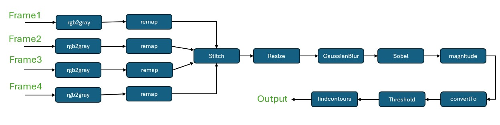

.. 
   Copyright 2023 Advanced Micro Devices, Inc
  
.. `Terms and Conditions <https://www.amd.com/en/corporate/copyright>`_.

AVFIRS 4-Stream Pipeline:
=========================

The ``AVFIRS_4stream_accel`` function is a multi-camera image processing
accelerator designed for hardware implementation on an FPGA. It ingests four
independent RGB input streams, dewarps and stitches them into a single panorama,
then performs edge detection and contour extraction on the resized panorama. A
duplicate of the resized grayscale panorama is also written to device memory for
host verification.

.. rubric:: AVFIRS Pipeline Diagram

This AVFIRS 4-stream pipeline includes the following processing stages:

-  **RGB to Grayscale:** Converts each of the four 8-bit RGB input streams
   (``XF_8UC3``) to single-channel grayscale (``XF_8UC1``) before dewarp.

-  **Remap (Dewarp):** Applies per-stream lookup-table remapping using precomputed
   ``map_x`` and ``map_y`` tables. Bilinear interpolation is used by default
   (``XF_REMAP_INTERPOLATION_TYPE = 1``).

-  **waitMat:** Synchronizes each mask image with its corresponding remapped
   output so stitch receives aligned mask and image data.

-  **Stitch:** Blends the four remapped tiles and their feathering masks into a
   single stitched panorama (``HEIGHT_DST`` x ``WIDTH_DST``).

-  **Resize:** Scales the stitched panorama down to the active processing
   resolution (``rows`` x ``cols``).

-  **duplicateMat:** Copies the resized panorama to two internal streams so
   edge processing and host readback can proceed in parallel within the dataflow
   region.

-  **Gaussian Blur:** Smooths the resized image before gradient computation.

-  **Sobel:** Computes horizontal and vertical gradients.

-  **Magnitude:** Combines gradient components using L2 norm (``XF_L2NORM``).

-  **convertTo:** Converts 16-bit signed magnitude to 8-bit unsigned.

-  **Threshold:** Binarizes the image (``XF_THRESHOLD_TYPE_BINARY``).

-  **findcontours:** Detects contours in the binary image and writes packed
   ``(x, y)`` points, per-contour offsets, and the contour count to device
   buffers.

.. table:: Table: Runtime Parameters for the Pipeline

    +---------------------------+-----------------------------------------------------------+
    | **Parameter**             | **Description**                                           |
    +===========================+===========================================================+
    | points_packed             | Output buffer for packed contour vertex coordinates.      |
    +---------------------------+-----------------------------------------------------------+
    | contour_offsets           | Output buffer of start indices into ``points_packed``.    |
    +---------------------------+-----------------------------------------------------------+
    | num_contours              | Output: number of contours detected (single element).     |
    +---------------------------+-----------------------------------------------------------+
    | sigma                     | Standard deviation for the 5x5 Gaussian blur kernel.      |
    +---------------------------+-----------------------------------------------------------+
    | shift                     | Bit-shift applied during ``convertTo`` (16S to 8U).       |
    +---------------------------+-----------------------------------------------------------+
    | thresh                    | Threshold value for binary thresholding.                  |
    +---------------------------+-----------------------------------------------------------+
    | maxval                    | Maximum value assigned to pixels above ``thresh``.        |
    +---------------------------+-----------------------------------------------------------+
    | rows                      | Active height of each input stream and processing ROI.    |
    +---------------------------+-----------------------------------------------------------+
    | cols                      | Active width of each input stream and processing ROI.     |
    +---------------------------+-----------------------------------------------------------+
    | img_sizes[8]              | Remap output sizes: ``[h0,w0,h1,w1,h2,w2,h3,w3]``.        |
    +---------------------------+-----------------------------------------------------------+
    | mask_corners[8]           | Top-left placement of each tile on the stitch canvas.     |
    +---------------------------+-----------------------------------------------------------+
    | dst_height                | Active height of the stitched panorama before resize.     |
    +---------------------------+-----------------------------------------------------------+
    | dst_width                 | Active width of the stitched panorama before resize.      |
    +---------------------------+-----------------------------------------------------------+

.. table:: Table: Compile Time Parameters

    +-----------------------------+----------------------------------------------+
    | **Parameter**               | **Description**                              |
    +=============================+==============================================+
    | HEIGHT                      | Maximum height of input streams              |
    |                             | (default 800).                               |
    +-----------------------------+----------------------------------------------+
    | WIDTH                       | Maximum width of input streams               |
    |                             | (default 1280).                              |
    +-----------------------------+----------------------------------------------+
    | HEIGHT_DST / WIDTH_DST      | Maximum stitched panorama size               |
    |                             | (default 1076 x 1326).                       |
    +-----------------------------+----------------------------------------------+
    | HEIGHT_1                    | Maximum remap output height for stream 1     |
    +-----------------------------+----------------------------------------------+
    | WIDTH_1                     | Maximum remap output width for stream 1      |
    +-----------------------------+----------------------------------------------+
    | HEIGHT_2                    | Maximum remap output height for stream 2     |
    +-----------------------------+----------------------------------------------+
    | WIDTH_2                     | Maximum remap output width for stream 2      |
    +-----------------------------+----------------------------------------------+
    | HEIGHT_3                    | Maximum remap output height for stream 3     |
    +-----------------------------+----------------------------------------------+
    | WIDTH_3                     | Maximum remap output width for stream 3      |
    +-----------------------------+----------------------------------------------+
    | HEIGHT_4                    | Maximum remap output height for stream 4     |
    +-----------------------------+----------------------------------------------+
    | WIDTH_4                     | Maximum remap output width for stream 4      |
    +-----------------------------+----------------------------------------------+
    | IN_TYPE                     | Input pixel type (``XF_8UC3``).              |
    +-----------------------------+----------------------------------------------+
    | OUT_TYPE                    | Grayscale output type                        |
    |                             | (``XF_8UC1``).                               |
    +-----------------------------+----------------------------------------------+
    | XF_NPPCX                    | Pixels per clock (``XF_NPPC1``).             |
    +-----------------------------+----------------------------------------------+
    | MAX_CONTOURS                | Maximum contours (4096).                     |
    +-----------------------------+----------------------------------------------+
    | MAX_TOTAL_POINTS            | Maximum contour points (10000).              |
    +-----------------------------+----------------------------------------------+
    | GAUSSIAN_FILTER_WIDTH       | Gaussian kernel size (5).                    |
    +-----------------------------+----------------------------------------------+
    | SOBEL_FILTER_WIDTH          | Sobel kernel size (3).                       |
    +-----------------------------+----------------------------------------------+
    | XF_USE_URAM_REMAP_1         | Enable URAM for remap instance 1.            |
    +-----------------------------+----------------------------------------------+
    | XF_USE_URAM_REMAP_2         | Enable URAM for remap instance 2.            |
    +-----------------------------+----------------------------------------------+
    | XF_USE_URAM_REMAP_3         | Enable URAM for remap instance 3.            |
    +-----------------------------+----------------------------------------------+
    | XF_USE_URAM_REMAP_4         | Enable URAM for remap instance 4.            |
    +-----------------------------+----------------------------------------------+
    | XF_USE_URAM_RESIZE          | Enable URAM for resize.                      |
    +-----------------------------+----------------------------------------------+
    | XF_USE_URAM_SOBEL           | Enable URAM for Sobel.                       |
    +-----------------------------+----------------------------------------------+

The following example demonstrates the top-level AVFIRS 4-stream pipeline:

.. code:: c

    void AVFIRS_4stream_accel(ap_uint<INPUT_PTR_WIDTH>* img_in1,
                              ap_uint<INPUT_PTR_WIDTH>* img_in2,
                              ap_uint<INPUT_PTR_WIDTH>* img_in3,
                              ap_uint<INPUT_PTR_WIDTH>* img_in4,
                              ap_uint<MAPXY_TYPE_PTR_WIDTH>* map_x1,
                              ap_uint<MAPXY_TYPE_PTR_WIDTH>* map_y1,
                              ap_uint<MAPXY_TYPE_PTR_WIDTH>* map_x2,
                              ap_uint<MAPXY_TYPE_PTR_WIDTH>* map_y2,
                              ap_uint<MAPXY_TYPE_PTR_WIDTH>* map_x3,
                              ap_uint<MAPXY_TYPE_PTR_WIDTH>* map_y3,
                              ap_uint<MAPXY_TYPE_PTR_WIDTH>* map_x4,
                              ap_uint<MAPXY_TYPE_PTR_WIDTH>* map_y4,
                              ap_uint<MASK_INPUT_PTR_WIDTH>* mask_img1,
                              ap_uint<MASK_INPUT_PTR_WIDTH>* mask_img2,
                              ap_uint<MASK_INPUT_PTR_WIDTH>* mask_img3,
                              ap_uint<MASK_INPUT_PTR_WIDTH>* mask_img4,
                              ap_uint<INPUT_PTR_WIDTH>* points_packed,
                              ap_uint<INPUT_PTR_WIDTH>* contour_offsets,
                              ap_uint<INPUT_PTR_WIDTH>* num_contours,
                              float sigma,
                              int shift,
                              unsigned char thresh,
                              unsigned char maxval,
                              int rows,
                              int cols,
                              int img_sizes[8],
                              int mask_corners[8],
                              int dst_height,
                              int dst_width,
                              ap_uint<OUTPUT_PTR_WIDTH>* resizedOutput_duplicate_2_stream) {
 // clang-format off
     #pragma HLS INTERFACE m_axi      port=img_in1         offset=slave  bundle=gmem0 
     #pragma HLS INTERFACE m_axi      port=img_in2         offset=slave  bundle=gmem1 
     #pragma HLS INTERFACE m_axi      port=img_in3         offset=slave  bundle=gmem2 
     #pragma HLS INTERFACE m_axi      port=img_in4         offset=slave  bundle=gmem3 
     #pragma HLS INTERFACE m_axi      port=map_x1          offset=slave  bundle=gmem4 
     #pragma HLS INTERFACE m_axi      port=map_y1          offset=slave  bundle=gmem5 
     #pragma HLS INTERFACE m_axi      port=map_x2          offset=slave  bundle=gmem6 
     #pragma HLS INTERFACE m_axi      port=map_y2          offset=slave  bundle=gmem7 
     #pragma HLS INTERFACE m_axi      port=map_x3          offset=slave  bundle=gmem8 
     #pragma HLS INTERFACE m_axi      port=map_y3          offset=slave  bundle=gmem9  
     #pragma HLS INTERFACE m_axi      port=map_x4          offset=slave  bundle=gmem10  
     #pragma HLS INTERFACE m_axi      port=map_y4          offset=slave  bundle=gmem11  
     #pragma HLS INTERFACE m_axi      port=mask_img1       offset=slave  bundle=gmem12
     #pragma HLS INTERFACE m_axi      port=mask_img2       offset=slave  bundle=gmem13
     #pragma HLS INTERFACE m_axi      port=mask_img3       offset=slave  bundle=gmem14
     #pragma HLS INTERFACE m_axi      port=mask_img4       offset=slave  bundle=gmem15
     #pragma HLS INTERFACE m_axi      port=points_packed   offset=slave  bundle=gmem16
     #pragma HLS INTERFACE m_axi      port=contour_offsets offset=slave  bundle=gmem17 
     #pragma HLS INTERFACE m_axi      port=num_contours    offset=slave  bundle=gmem18 
     #pragma HLS INTERFACE m_axi      port=img_sizes    offset=slave  bundle=gmem19
     #pragma HLS INTERFACE m_axi      port=mask_corners    offset=slave  bundle=gmem20             
     #pragma HLS INTERFACE s_axilite  port=sigma     
     #pragma HLS INTERFACE s_axilite  port=shift     
     #pragma HLS INTERFACE s_axilite  port=thresh     
     #pragma HLS INTERFACE s_axilite  port=maxval 			      
     #pragma HLS INTERFACE s_axilite  port=rows 			      
     #pragma HLS INTERFACE s_axilite  port=cols 		
     #pragma HLS INTERFACE s_axilite  port=dst_height 	
     #pragma HLS INTERFACE s_axilite  port=dst_width
     #pragma HLS INTERFACE m_axi      port=resizedOutput_duplicate_2_stream offset=slave  bundle=gmem21
     #pragma HLS INTERFACE s_axilite  port=return
   }

Create and Launch Kernel in the Testbench:

The L3 testbench programs the ``krnl_AVFIRS_4stream`` container, writes all four
input images, dewarp maps, stitch masks, and configuration arrays to device
memory, then launches a single kernel execution. OpenCL event profiling reports
end-to-end wall time. Contour results are read back from ``points_packed``,
``contour_offsets``, and ``num_contours``; the resized panorama is read from
``resizedOutput_duplicate_2_stream``.

.. code:: c

    std::string binaryFile = xcl::find_binary_file(device_name, "krnl_AVFIRS_4stream");
    cl::Program::Binaries bins = xcl::import_binary_file(binaryFile);
    OCL_CHECK(err, cl::Program program(context, devices, bins, NULL, &err));

    OCL_CHECK(err, cl::Kernel kernel(program, "AVFIRS_4stream_accel", &err));

    OCL_CHECK(err, cl::Buffer buffer_inImage1(context, CL_MEM_READ_ONLY, image_in_size_bytes, NULL, &err));
    // ... buffers for img_in2..4, map_x/y, masks, img_sizes, mask_corners, outputs ...

    OCL_CHECK(err, err = kernel.setArg(0, buffer_inImage1));
    OCL_CHECK(err, err = kernel.setArg(1, buffer_inImage2));
    OCL_CHECK(err, err = kernel.setArg(2, buffer_inImage3));
    OCL_CHECK(err, err = kernel.setArg(3, buffer_inImage4));
    OCL_CHECK(err, err = kernel.setArg(4, buffer_mapx1));
    OCL_CHECK(err, err = kernel.setArg(5, buffer_mapy1));
    // ... setArg through mask buffers, contour outputs, sigma, shift, thresh, maxval ...
    OCL_CHECK(err, err = kernel.setArg(25, buffer_img_sizes));
    OCL_CHECK(err, err = kernel.setArg(26, buffer_mask_corners));
    OCL_CHECK(err, err = kernel.setArg(27, dst_height_host));
    OCL_CHECK(err, err = kernel.setArg(28, dst_width_host));
    OCL_CHECK(err, err = kernel.setArg(29, buffer_resizedOutput_duplicate_2));

    OCL_CHECK(err, err = ocl_cmdq.enqueueWriteBuffer(buffer_inImage1, CL_TRUE, 0,
                                                     image_in_size_bytes, img[0].data));
    // ... write remaining inputs, maps, masks, and config arrays ...

    cl::Event event;
    OCL_CHECK(err, err = ocl_cmdq.enqueueTask(kernel, NULL, &event));
    clWaitForEvents(1, (const cl_event*)&event);

    event.getProfilingInfo(CL_PROFILING_COMMAND_START, &start);
    event.getProfilingInfo(CL_PROFILING_COMMAND_END, &end);
    diff_prof = (end - start) / 1000000;
    std::cout << "INFO: Kernel wall (profiling) ~ " << diff_prof << " ms" << std::endl;

    OCL_CHECK(err, err = ocl_cmdq.enqueueReadBuffer(buffer_outPoints, CL_TRUE, 0,
                                                    image_out_points_size_bytes, points));
    OCL_CHECK(err, err = ocl_cmdq.enqueueReadBuffer(buffer_resizedOutput_duplicate_2, CL_TRUE, 0,
                                                    image_size_bytes, resizedOutput_duplicate_2.data));

.. rubric:: Resource Utilization

The following table summarizes the resource utilization of ``AVFIRS_4stream_accel``
generated using Vitis HLS 2025.2 on Versal AI Edge (vek385, xc2ve3858) at
100 MHz. Values are from post-synthesis implementation reports.

.. table:: Table: AVFIRS 4stream Resource Utilization Summary

    +----------------+---------------------------+------------+-----------+-----------+------------+----------+
    | Operating Mode | Operating Frequency (MHz) |            Utilization Estimate                            |
    +                +                           +------------+-----------+-----------+------------+----------+
    |                |                           |    BRAM    |    DSP    | CLB       |    CLB     |   URAM   |
    |                |                           |   (tiles)  |           | Registers |    LUT     | (tiles)  |
    +================+===========================+============+===========+===========+============+==========+
    | 1 Pixel        |            100            |    342     |    267    | 57689     |   56109    |   118    |
    +----------------+---------------------------+------------+-----------+-----------+------------+----------+

URAM utilization for this configuration is 118 (100% of available URAM on the
target device).

.. rubric:: Performance Estimate

The following table summarizes the performance of the AVFIRS 4-stream pipeline
in 1-pixel mode as generated using Vitis HLS 2025.2 on Versal AI Edge (vek385) at
100 MHz. The default configuration processes four 800 x 1280 RGB input streams.

.. table:: Table: AVFIRS 4stream Performance Estimate Summary

    +-----------------------------+---------------------------------------------------------+
    |                             | Latency Estimate                                        |
    +      Operating Mode         +---------------------------------------------------------+
    |                             | Max Latency (ms)                                        |
    +=============================+=========================================================+
    | 1 pixel operation (100 MHz) | 66.7 ms                                                 |
    +-----------------------------+---------------------------------------------------------+
