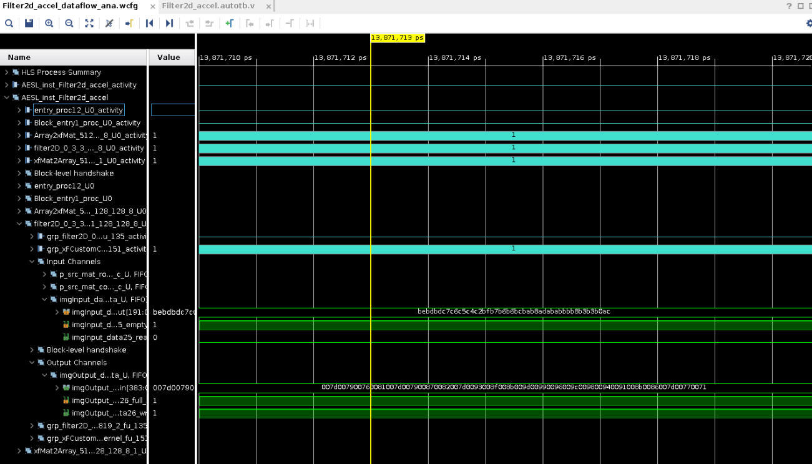

.. 
   Copyright 2023 Advanced Micro Devices, Inc
  
.. `Terms and Conditions <https://www.amd.com/en/corporate/copyright>`_.

Getting Started with Vitis Vision Libraries
############################################

The Vitis vision library has been designed to work in the Vitis development environment, and provides a software
interface for computer vision functions accelerated on an FPGA device.
Vitis vision library functions are mostly similar in functionality to their
OpenCV equivalent.

Get Vitis Libraries
====================

First, clone the Vitis Libraries into local path.

The Vitis Library repo is located at this link:
https://github.com/Xilinx/Vitis_Libraries. Assuming you are using ``$/home/project`` as working directory, use following command to clone the Vitis Library repository into the working directory:

.. code:: c

	cd /home/project
	git clone https://github.com/Xilinx/Vitis_Libraries.git

This might take a few minutes to download, depending on network speed.
After it is downloaded, browse into the sub folders to get familiar with the file structure.

Vitis_Libraries/

├── Jenkinsfile

├── LICENSE.txt

├── README.md

├── blas/

├── codec/

├── data_analytics/

├── data_compression/

├── database/

├── dsp/

├── graph/

├── hpc/

├── quantitative_finance/

├── security/

├── solver/

├── sparse/

├── utils/

└── vision/

There are many different categories of libraries under the top-level folder. In this lab, you will use the **vision** library. So, enter the sub-directory **vision**, and you will find following directory structure.

vision/

├── Jenkinsfile

├── L1/

│   ├── README.md

│   ├── examples/

│   ├── include/

│   ├── lib/

│   └── tests/

├── L2/

│   ├── README.md

│   ├── examples/

│   └── tests/

├── L3/

│   ├── README.md

│   ├── benchmarks/

│   ├── examples/

│   └── tests/

├── data/

├── LICENSE.txt

├── README.md

├── docs/

│   ├── images/

│   ├── include/

│   ├── Makefile

│   ├── Makefile.sphinx

│   ├── rst files

│   ├── conf.py

│   ├── conf_bhp.py

│   ├── env.csh

├── ext/

│   ├── make_utility/

│   └── xcl2/

└── library.json

This library is written in C++ and it contains three levels of abstraction:

**L1**: Examples that evaluate the Vitis Vision kernels and demonstrate the kernels' use model in HLS flow.

**L2**: Examples that evaluate the Vitis Vision kernels and demonstrate the kernels' use model in Vitis flow.

**L3**: Applications formed by stitching a pipeline of Vitis Vision functions.

In the first section, this tutorial focuses on how to leverage the Vitis Vision Libraries to build your own design. The tutorial will use L1 library *custom convolution* as an example.

L1 functions are targeted for Vitis HLS flow, where C-Simulation, Synthesis, Co-Simulation and RTL implementation can be performed. 

OpenCV-4.4.0 x86 version libs need to be installed beforehand. Refer to this `page <https://support.xilinx.com/s/article/Vitis-Libraries-Compiling-and-Installing-OpenCV?language=en_US>`__ for details on installation.

This section contains instructions for cloning the library, compiling, and simulating the top-level design.

Before You Begin
-----------------

Prerequisites
~~~~~~~~~~~~~~~
#.  Valid installation of `Vitis™ 2022.2 <https://docs.xilinx.com/r/en-US/ug1393-vitis-application-acceleration/Installing-the-Vitis-Software-Platform>`__ or later version and the corresponding licenses.
#.  Xilinx Runtime `XRT <https://docs.xilinx.com/r/en-US/ug1393-vitis-application-acceleration/Installing-Xilinx-Runtime-and-Platforms>`__ must be installed. XRT provides the software interface to AMD FPGAs.
#.  Install `OpenCV-4.4.0 <https://github.com/opencv/opencv/tree/4.4.0>`__ x86 libraries (with compatible ``libjpeg.so``). x86 libs have to be used for:

		a) L1 flows, irrespective of the target FPGA device being PCIe or embedded.
		b) L2/L3 flows when the target device is PCIe-based.
		c) L2/L3 flows when performing hardware emulation for an embedded platform.
		
	For L2/L3 flows targeting embedded platforms (for hardware emulations and hardware build), the aarch32/aarch64 version of OpenCV shipped with their *sysroot* should be used.	
#. libOpenCL.so must be `installed <https://docs.xilinx.com/r/en-US/ug1393-vitis-application-acceleration/OpenCL-Installable-Client-Driver-Loader>`_ if not already present.
#. `Install the card <https://www.xilinx.com/support/documentation/boards_and_kits/accelerator-cards/1_9/ug1301-getting-started-guide-alveo-accelerator-cards.pdf>`_ for which the platform is supported in Vitis 2022.2 or later versions.
#. If targeting an embedded platform, `install <https://docs.xilinx.com/r/en-US/ug1393-vitis-application-acceleration/Installing-Embedded-Platforms?tocId=hfE7LFeS8mU4dexvgPL31Q>`_ it and set up the `evaluation board <https://xilinx-wiki.atlassian.net/wiki/spaces/A/pages/444006775/Zynq+UltraScale+MPSoC>`_.

Set up the Environment
~~~~~~~~~~~~~~~~~~~~~~~~
Before playing with the libraries, you need to set up Vitis environment. For instructions on how to set up the Vitis environment, refer to https://docs.xilinx.com/r/en-US/ug1393-vitis-application-acceleration/Setting-Up-the-Vitis-Environment.

Below are the example scripts to configure environment settings for L1 functions:

.. code:: c

   source < path-to-Vitis-installation-directory >/settings64.sh
   source < part-to-XRT-installation-directory >/setup.sh
   export PLATFORM=< path-to-platform-directory >/< platform >.xpfm
   export OPENCV_INCLUDE=< path-to-opencv-include-folder >
   export OPENCV_LIB=< path-to-opencv-lib-folder >
   export LD_LIBRARY_PATH=$LD_LIBRARY_PATH:< path-to-opencv-lib-folder >
   make run CSIM=< 1/0 > CSYNTH=< 1/0 > COSIM=< 1/0 > VIVADO_IMPL=< 1/0 >

Running the Tutorial
=====================

Create and run a Vitis HLS project
-----------------------------------

In this step, you will create an HLS project by using the files provided in Vitis Library at this link: https://github.com/Xilinx/Vitis_Libraries/tree/main/vision/L1/examples/customconv. 
The source files and script file are all located in this folder. It is assumed that you have cloned the Vitis Libraries into the ``/home/project/Vitis_Libraries`` directory.

1. Navigate to the ``/home/project/Vitis_libraries/vision/L1/examples/customconv`` folder and run the following command to create the HLS project.

.. code:: c

	make run CSIM=1 CSYNTH=1 COSIM=1

Executing this command will run through the project creation, C simulation, C synthesis, and Co-simulation flows. You can modify the parameter to skip certain steps. After 
the execution, the console window will print out the verification results and show ***PASS*** at the end of simulation.

.. code:: c

	INFO: Verification results:
        Minimum error in intensity = 0
        Maximum error in intensity = 1
        Percentage of pixels above error threshold = 0

	INFO: [COSIM 212-1000] *** C/RTL co-simulation finished: PASS ***

Once your job is complete, the minimum error in intensity, maximum error in intensity, percentage of pixels above error threshold is displayed on screen. The testbench uses an image as input to the customconv and produces the kernel output image, the OpenCV reference image and a difference image, which are shown below:

Input image:

|in_img|

OpenCV Reference Image:

|ref_img|

HLS Output Image:

|out_img|

Difference Image:

|diff_img|

2. Now you will open the project in the Vitis HLS GUI. Navigate to ``/home/project/Vitis_libraries/vision/L1/examples/customconv`` and run the following command:

.. code:: c

	vitis_hls -p customconv.prj &

You can browse the source files, synthesis report, or waveform viewer by selecting them from the *Explorer* and *Flow Navigator* windows.

The ``xf_custom_convolution_tb.cpp`` calls the ``Filter2d`` accel and the parameters are defined in the ``xf_custom_convolution_config.h`` and ``xf_config_params.h`` files. For detailed instructions about how to use *custom convolution*, refer to the github page at: https://docs.xilinx.com/r/en-US/Vitis_Libraries/vision/api-reference.html#custom-convolution.

3. Export IP in HLS project

Now you have verified that the library IP is working properly, you will export it to a Vivado IP. To do so, click **Export RTL** from the **IMPLEMENTATION** item in **Flow Navigator**. In the pop-up window, leave every settings unchanged and click **OK** to export the IP.
By default, the IP will be exported to  ``<project folder>/solN/impl``; in this case it is in following directory:

.. code:: c

	/home/project/Vitis_Libraries/vision/L1/examples/customconv/customconv.prj/sol1/impl

However, you may customize the path in the export pop-up menu.

4. View Co-Simulation Waveform

You can either modify the co-simulation related command lines in the file ``./run_hls.tcl`` (around line 46) as below to turn-on the xsim waveform dump switch:

.. code:: c

	if {$COSIM == 1} {
		cosim_design -wave_debug <other existing flags>
	}

Then re-run the command:

.. code:: c

	make run COSIM=1 

Or

You can also perform this operation in the GUI, by clicking **Run Co-Simulation** in the **Flow Navigator** and selecting the **Wave debug** option. In this way you get the simulation waveform, as shown in following example image:

|cosim|

5. Implement the top-level project

Click **Run Implementation** from the **Flow Navigator** panel and click **OK** in the pop-up window. This will run through the Vivado synthesis and implementation flow which will generate both timing and resource reports for this IP.

Create and Run a Vitis Project
===============================

In this section, you will create a Vitis project using an L2 example.
L2/L3 functions are targeted for Vitis flows where hardware-emulation, and hardware build (to generate FPGA binaries) can be performed. 
OpenCL is used in the testbench for calling the accelerator in L2/L3.

You will use the files provided in the Vitis Library at this link: https://github.com/Xilinx/Vitis_Libraries/tree/main/vision/L2/examples/customconv. 
The source files and script file are all located under this folder. It is assumed that you have cloned the Vitis Libraries into the ``/home/project/Vitis_Libraries`` directory.

Navigate to ``/home/project/Vitis_libraries/vision/L2/examples/customconv`` and run the following command to create the Vitis project for a DC platform like U200.

.. code:: c

	make run TARGET=hw_emu

Here, `TARGET` decides the FPGA binary type:

* `hw_emu` is for hardware emulation
* `hw` is for deployment on physical card. (Compilation to hardware binary often takes hours.)

**Note** : For embedded devices, platforms and common images have to downloaded separately from the 
AMD official `download center <https://www.xilinx.com/support/download/index.html/content/xilinx/en/downloadNav/embedded-platforms.html>`__

* If targeting an embedded platform, `install <https://docs.xilinx.com/r/en-US/ug1393-vitis-application-acceleration/Installing-Embedded-Platforms?tocId=hfE7LFeS8mU4dexvgPL31Q>`__  it and set up the `evaluation board <https://xilinx-wiki.atlassian.net/wiki/spaces/A/pages/444006775/Zynq+UltraScale+MPSoC>`__

For an embedded device like ZCU102, the command would be 

.. code:: c

	make run TARGET=hw_emu 

Besides ``run``, the Vitis case makefile also allows ``host`` and ``xclbin`` as build targets.
At the end of the flow, the console window will print out the verification results and show **Test Passed .... !!!** at the end of simulation. The output image is saved in the working directory.

.. code:: c

	INFO: Verification results:
        Minimum error in intensity = 0
        Maximum error in intensity = 1
        Percentage of pixels above error threshold = 0

	Test Passed .... !!!

Running L3 examples is the same as L2. The difference between L2 and L3 in the Vitis Vision library is that the former generally calls a single kernel in the accelerator, whereas the latter has multiple kernels called in
a pipeline fashion to form a definite end application. Below is an example L3 application formed by stitching multiple kernels in Dataflow.

.. code:: c

  void color_detect(ap_uint<PTR_IN_WIDTH>* img_in,
        unsigned char* low_thresh,
        unsigned char* high_thresh,
        unsigned char* process_shape,
        ap_uint<PTR_OUT_WIDTH>* img_out,
        int rows,
        int cols) {

   #pragma HLS INTERFACE m_axi      port=img_in        offset=slave  bundle=gmem0
   #pragma HLS INTERFACE m_axi      port=low_thresh    offset=slave  bundle=gmem1
   #pragma HLS INTERFACE s_axilite  port=low_thresh 			     
   #pragma HLS INTERFACE m_axi      port=high_thresh   offset=slave  bundle=gmem2
   #pragma HLS INTERFACE s_axilite  port=high_thresh 			      
   #pragma HLS INTERFACE s_axilite  port=rows 			      
   #pragma HLS INTERFACE s_axilite  port=cols 			      
   #pragma HLS INTERFACE m_axi      port=process_shape offset=slave  bundle=gmem3
   #pragma HLS INTERFACE s_axilite  port=process_shape			      
   #pragma HLS INTERFACE m_axi      port=img_out       offset=slave  bundle=gmem4
   #pragma HLS INTERFACE s_axilite  port=return

   xf::cv::Mat<IN_TYPE, HEIGHT, WIDTH, NPC1, XF_CV_DEPTH_IN_1> imgInput(rows, cols);
   xf::cv::Mat<IN_TYPE, HEIGHT, WIDTH, NPC1, XF_CV_DEPTH_RGB2HSV> rgb2hsv(rows, cols);
   xf::cv::Mat<OUT_TYPE, HEIGHT, WIDTH, NPC1, XF_CV_DEPTH_HELP_1> imgHelper1(rows, cols);
   xf::cv::Mat<OUT_TYPE, HEIGHT, WIDTH, NPC1, XF_CV_DEPTH_HELP_2> imgHelper2(rows, cols);
   xf::cv::Mat<OUT_TYPE, HEIGHT, WIDTH, NPC1, XF_CV_DEPTH_HELP_3> imgHelper3(rows, cols);
   xf::cv::Mat<OUT_TYPE, HEIGHT, WIDTH, NPC1, XF_CV_DEPTH_HELP_4> imgHelper4(rows, cols);
   xf::cv::Mat<OUT_TYPE, HEIGHT, WIDTH, NPC1, XF_CV_DEPTH_OUT_1> imgOutput(rows, cols);

   // Copy the shape data:
   unsigned char _kernel[FILTER_SIZE * FILTER_SIZE];
   for (unsigned int i = 0; i < FILTER_SIZE * FILTER_SIZE; ++i) {
    #pragma HLS PIPELINE
    _kernel[i] = process_shape[i];
   }

   #pragma HLS DATAFLOW

   // Retrieve xf::cv::Mat objects from img_in data:
   xf::cv::Array2xfMat<PTR_IN_WIDTH, IN_TYPE, HEIGHT, WIDTH, NPC1>(img_in, imgInput);

   // Convert RGBA to HSV:
   xf::cv::bgr2hsv<IN_TYPE, HEIGHT, WIDTH, NPC1>(imgInput, rgb2hsv);

   // Do the color thresholding:
   xf::cv::colorthresholding<IN_TYPE, OUT_TYPE, MAXCOLORS, HEIGHT, WIDTH, NPC1>(rgb2hsv, imgHelper1, low_thresh,
                       high_thresh);

   // Use erode and dilate to fully mark color areas:
   xf::cv::erode<XF_BORDER_CONSTANT, OUT_TYPE, HEIGHT, WIDTH, XF_KERNEL_SHAPE, FILTER_SIZE, FILTER_SIZE, ITERATIONS,
        NPC1>(imgHelper1, imgHelper2, _kernel);
   xf::cv::dilate<XF_BORDER_CONSTANT, OUT_TYPE, HEIGHT, WIDTH, XF_KERNEL_SHAPE, FILTER_SIZE, FILTER_SIZE, ITERATIONS,
         NPC1>(imgHelper2, imgHelper3, _kernel);
   xf::cv::dilate<XF_BORDER_CONSTANT, OUT_TYPE, HEIGHT, WIDTH, XF_KERNEL_SHAPE, FILTER_SIZE, FILTER_SIZE, ITERATIONS,
         NPC1>(imgHelper3, imgHelper4, _kernel);
   xf::cv::erode<XF_BORDER_CONSTANT, OUT_TYPE, HEIGHT, WIDTH, XF_KERNEL_SHAPE, FILTER_SIZE, FILTER_SIZE, ITERATIONS,
        NPC1>(imgHelper4, imgOutput, _kernel);

   // Convert _dst xf::cv::Mat object to output array:
   xf::cv::xfMat2Array<PTR_OUT_WIDTH, OUT_TYPE, HEIGHT, WIDTH, NPC1>(imgOutput, img_out);

   return;

  }
	
You can create custom applications similar to the above example by calling a set of desired kernels from the library.

Summary
========

This tutorial explained how to run L1 and L2 examples and leverage individual Vitis library kernels to build your own L3 model designs. The *custom convolution* example is selected for explanation for L1, L2, and *color detection* for L3.
You can follow similar flows when using other library elements.

Reference
==========

Documentation on Vitis Libraries: https://docs.xilinx.com/r/en-US/Vitis_Libraries/index.html

.. |in_img| image:: ./images/128x128.png
   :class: image 
   :width: 1000

.. |ref_img| image:: ./images/ref_img.jpg
   :class: image 
   :width: 1000

   

   

